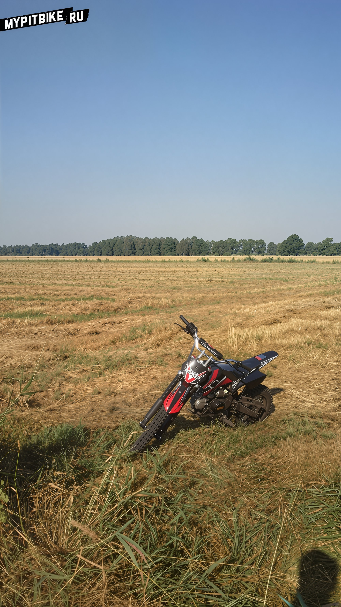
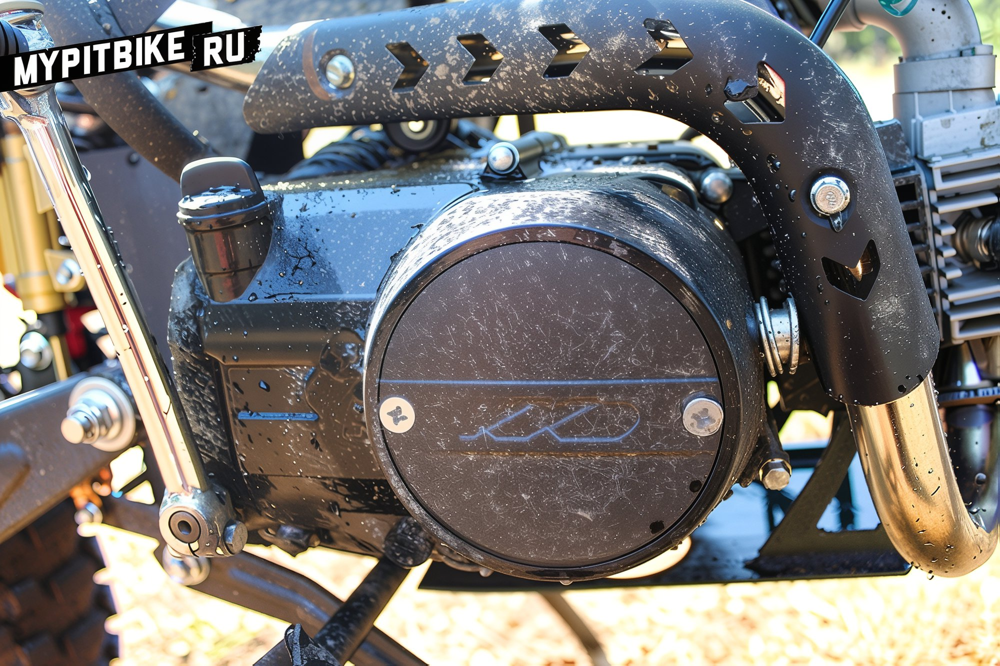

# My brief review of the kxd 608

## My Experience with the 124 cc Pit Bike

I acquired this steed in early July.

- **Engine Capacity:** 124 cc
- **Fuel Tank:** 5 liters
- **Load Capacity:** Up to 90 kg (though assured by the store it could handle 120 kg)
- **Speed:** Up to 90 km/h (promised 110-120 km/h)
- **Wheels:** 14/17 inches
- **Weight:** Approximately 70 kg

Having ridden it for two months now, I can say it has generally pleased me. Not overwhelmingly impressive, as some parts broke or got lost, but it justifies its cost.

### Let's Start with the Drawbacks:

- The chain lock was the first to fail, popping out on sand (it kept happening, especially when the bike was laid on its side).
- After 5 hours of riding, the threads on the chain tensioners stripped (solved by installing long nuts).
- Approximately after 10 hours of riding, the rear wheel bearings failed.
- The plastic chain guard was worn down to almost nothing by the footpeg.
- The seat was mounted on a flimsy bracket, causing the plastic to quickly deform.
- Tighten the bolts a bit too much, and the threads are gone.
- The chain tensioner quickly stretches and starts to make noise.
- The fuel tank vent hose is constantly getting lost.

### On a Positive Note:

I mostly rode on sand, mud, peat, and water—no issues, just had to clean the air filter regularly.

It tears through the ground in both first and fourth gear.

It climbs any hill.

The gearbox operates flawlessly, without jerks, jolts, or gear slips.

I ran the first three tanks in break-in mode.

I use 92-95 octane gasoline and 5w-40 oil.

And I've ordered some goodies for the fall.

