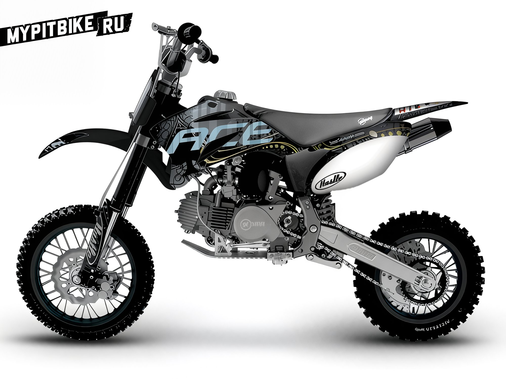
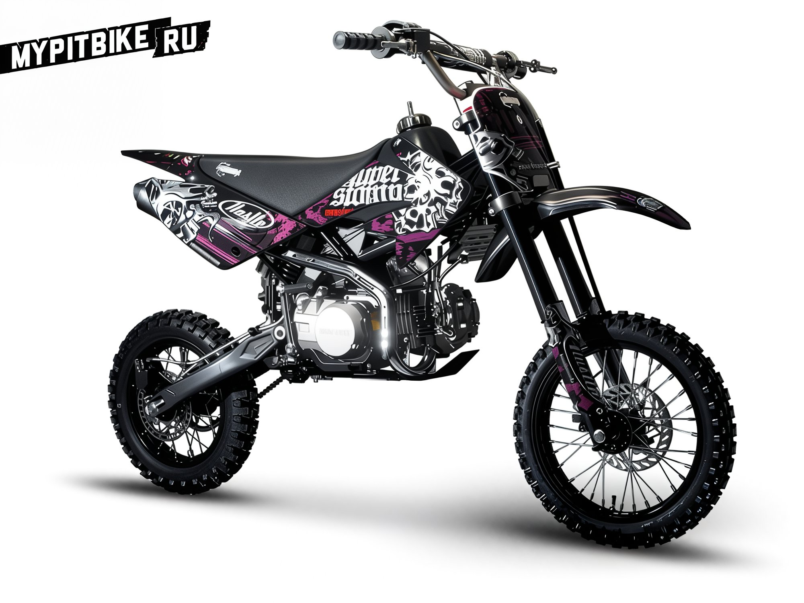

# Pit bikes by stomp

Currently, the company **Stomp** stands as the largest manufacturer of pit bikes in Europe, boasting an extensive network of distributors across Ireland, the Czech Republic, Finland, Estonia, the Netherlands, Italy, and Portugal.  The company is owned by two engineers, **Mark Meredith** and **Mark Bratherton**. Together, they possess over 16 years of experience in the automotive industry, having worked with companies such as Ford, Mazda, Renault, and Mitsubishi. Additionally, the company includes a design studio based in London and an engineer from the USA located in China, who is responsible for quality control and participates in motorcycle development. The main pit bike manufacturing facility was established by a former process engineer from Honda, who spent over five years working in Japan.  The company **Stomp** does not limit its range to pit bikes alone but also produces bicycles and scooters for children. At present, the company is actively engaged in developing new products, including an electric pit bike for children. Recently, they launched the successful **Stompee** project – a training bicycle.  In addition to pit bike production, the company **Stomp** has a division called **HustleMods**. Under this brand, they produce parts and tuning components. http://www.youtube.com/watch?v=P38LdC-w6ag