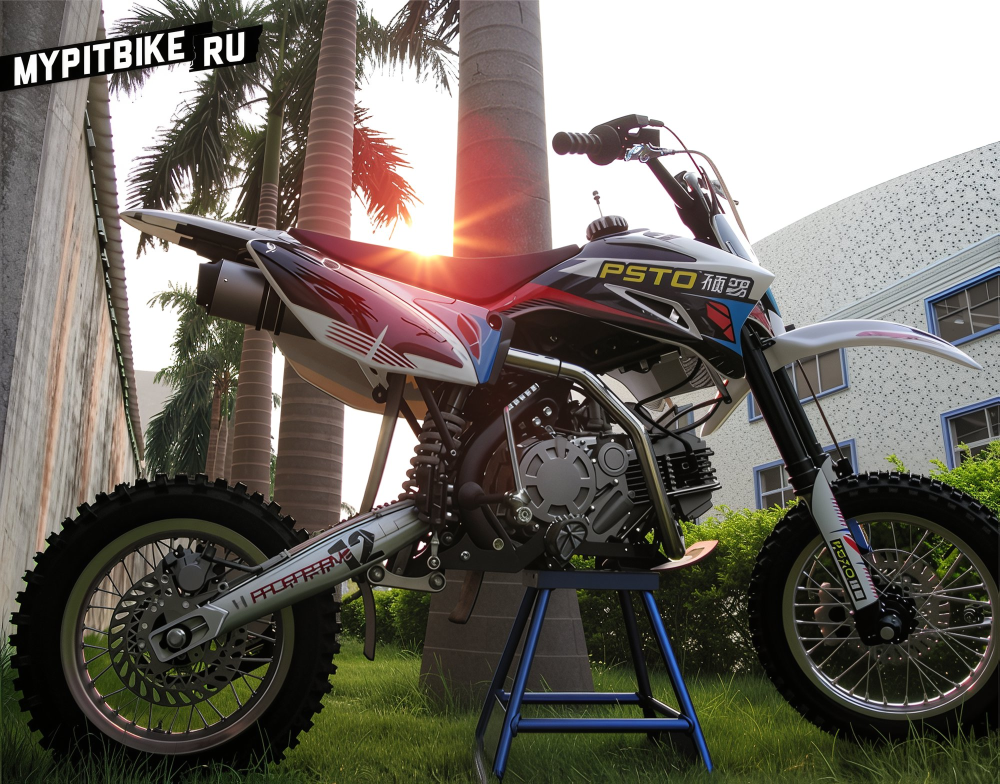

# What is the pitsterpro from pitmoto?

It is well-known that there are differences between the American **PitsterPro** (made in USA) and the Russian imports sold at Pitmoto. How significant is the difference and what does it entail? Let's delve into the distinctions between the American and Russian PitsterPro. After conversing with representatives from the American company PitsterPro and inquiring about the possibility of shipping the top model **LXR** from the States to Russia, I was denied due to the presence of official dealers in Russia. Continuing the discussion on the differences, I was assured that everything is manufactured at the same factory using the same blueprints. To begin with, it is unlikely that the company would deliberately distort facts by passing off other motorcycles as their own. However, differences do exist. They are external.

01. Frame. The material is the same - steel. Geometry and mounting holes, distances, all are identical. However, there is a difference in the engine and swingarm mounting. The frame bend where the swingarm is attached has an oval cross-section, not square. The engine mount is welded to the frame, not removable, as in the American version. Plus, a couple of stamped logos are missing.
02. Swingarm. The material is steel, whereas the original should be aluminum. Here, an aluminum swingarm is offered as an option for an additional fee.
03. DNM shock absorber without an expansion chamber.
04. Further differences are purely cosmetic.
05. Color and texture of the seat.
06. No stamped PitsterPro logos on the sides of the plastic fuel tank.
07. A different model range name and consequently a different design on the plastic.
08. Oil cooler mounting under the frame, not on the sides. Although all mounting holes are in place.
09. Skid plate without a cut-out logo.
10. Absence of rear caliper protection with a logo.

That is probably all the differences. Next, the question arises, who manufactures these pit bikes and at which factory are they made? The Australian subsidiary **PST Power Product**, part of the **Shuopu Science &amp; Technology Development** group, produces such pit bikes under the **PSTO** brand.   Do you not find similarities with the PitsterPro pit bikes from Pitmoto? Now look at the logo on your pitster's seat. It turns out the parent company **Shuopu** is a professional manufacturer of pit bikes. Since the beginning of 2001, pit bikes have been produced at their facilities under the brands: Extreme, SDG, **PitsterPro**, **PitPro**, **Motovert** in ODM (own design) and OEM (standard components) versions. Here is a list of pits: EXTREME50, SDG110, SDG125, **PITSTERPRO** GPX125, X2, X4, **LXR**, from 50 to 160 cc. Thus, the company Shopu has the most extensive experience in pit bike production, accumulated over more than 10 years. The emergence of the PSTO brand is associated with the desire to launch new motorcycle lines for the Australian market. [**PSTO Company Catalog**](http://www.psto.com.au/userfiles/pdf/20101018131040PSTO20bike.pdf)  The photograph above shows the Shuopu stand under the PitsterPro brand at the Milan exhibition. The situation is similar to everyday products, like the artificial competition between Mars and Snickers chocolate bars, Whiskas and Kitekat pet foods, produced at the same factory owned by MARS. It turns out American pitsters are notable only for the doubled number of logos per square centimeter, more meticulous assembly, and pre-sale preparation. We, receiving our pit bikes from boxes, must perform all assembly and initial setup manipulations ourselves.