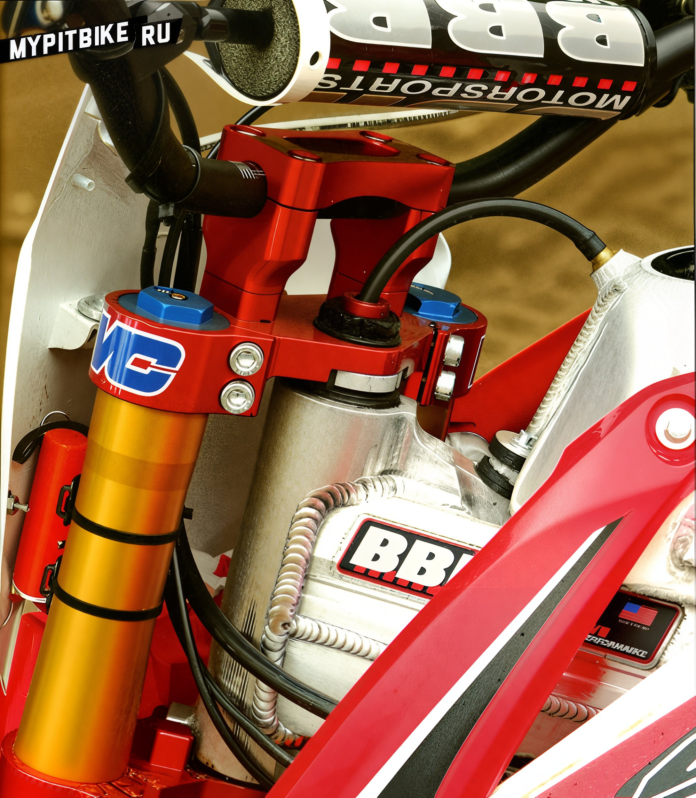

# Bbr pit bike priced at $25,000

It's amusing to consider how fun backyard **pit bike rides** with friends could evolve into full-scale motorsport. The journey from backyard gatherings to spectator-filled arenas marked a considerable leap for this class. In 2004, riders worldwide competed in the inaugural Mini Moto Supercross event in Las Vegas. Over the years, participant numbers swelled to the point that organizers capped entrants to 700. From this point, a small group of top riders could make a living solely through mini moto competitions.

*As seen in the image, the pit bike packs sufficient power to dig into the ground with its rear wheel and is easily managed by an adult rider.*

Recognizing the burgeoning mini-bike craze, BBR seized the vacant niche, pursuing this avenue. The Brown brothers invested everything in the sport, driven by their passion for motorcycles rather than profit. **When the economic crisis suddenly struck, the Browns' "adventure" morphed into a rollercoaster with constant ups and downs.**

BBR’s 14-year-old prodigy Carsten Brown, son of Duane, clinched a victory in his class at the Mini Moto Supercross Championship in Vegas hours before MXA (Motocross Action magazine) was set to test the new **BBR CRF190**. Ryan Abrigo, competing on a similar **BBR pit bike** in Mini Moto Vegas, triumphed in the pro class, establishing BBR as a standard in the mini moto realm. Carsten is the leading test pilot at BBR, justifiably so. He joined the family business during his diaper days, testing company products as soon as he could twist the throttle. Carsten is now the top test pilot, outshining most pro riders. He melds seamlessly with the bike, understanding precisely what to enhance for optimal performance.

During mini-moto’s golden era, business flourished, and BBR constructed fully **custom pit bikes** priced between **$10,000 and $25,000**. Interest in mini-moto sports and pit bike production seemed insatiable. Economic downturns, however, turned the Brown brothers' journey into a classic American rollercoaster. At the recession’s nadir, BBR sales nearly halved. Most pit bikers came to mini-moto from motocross—when they couldn't sustain both, they switched to the latter (full-size motocross), leaving the pit bike market to languish.

Remarkably, the crisis didn’t break the BBR team; instead, they forged ahead, diligently enhancing their pit bike lineup to remain leaders.

Surprise! The $25,000 pit bike has returned. We're testing the **BBR CRF190**, built to the minimalist rules governing Mini Moto Las Vegas. Our bike fits the 12-inch class with these restrictions:

1. The pit bike must have a 12” rear wheel.
2. The engine must be air-cooled.
3. The pit bike must feature an open frame design (engine mounts only at rear points).
4. There’s no restriction on engine displacement.

Given near-total freedom from restrictions, constructing an exotic race-ready mini bike can exceed all expectations.

**The longer we marveled at this pit bike marvel, the more we understood the $25,000 price tag.**

Enthusiasm for two wheels explains why the MXA team wanted to test the **BBR pit bike**. When Duane showcased the **factory pit bike** for detailed review, the craftsmanship left us in awe. Every BBR pit bike component is handcrafted.

The bike features a hand-made aluminum fuel tank (50 man-hours), a Japanese **Daytona Anima 190** cc engine producing 20 hp, fitted with a decompression camshaft, CNC-fabricated perimeter frame, aluminum swingarm, among other components too numerous to list. Only some bolts and plastic mimic the 2013 **Honda CRF110**. 

The more we gazed at this pit bike marvel, the clearer the $25,000 price tag became. Duane grinned when asked about hours devoted to perfecting this bike, "Honestly, our journey began in 1979 in the juniors class with a custom XR75 that earned us high school credits. We continually self-educated, refining our processes. The BBR pit bike demanded about 8 months of development, tuning every component, a task helmed by Carsten."

Initially, when the test team rolled out the pit bike on the mini-moto track, apprehension filled the air. The team lacked mini moto test experience, and this bike was tuned for a swift 14-year-old weighing 54 kg.

The pit bike possesses a four-speed gearbox, all gears shifting upwards. On the track with an adult rider, starting from first or second gear worried us, given the power-to-weight ratio. Thanks to the sheer torque of the Daytona 190, fourth gear dominated the test. Wanting more speed into corners, downshifts to third before turning cut lap times. Harmonizing remarkable engine power and transitioning to standing compared to squatting at supersonic speeds.

The chosen track mimicked a supercross course. It bristled with whoops, jump sequences, and high takeoffs keeping us alert. The **pit bike came with BBR-modified Marzocchi forks** and a **Elka rear shock**. After starting small, testing suspension control, we moved to larger jump sequences. Confidence in the bike surged with every lap. Cleared every jump, the suspension delivered precise performance. "Whips" felt just like riding a full-sized bike.

**MXA hailed it as a "factory mini-bike," a hand-built masterpiece refined to perfection.**

As with larger bikes, faster speeds extended stability and improved handling. The **BBR pit bike** managed superbly. MXA dubbed it a "factory mini-bike," a hand-built wonder fine-tuned to perfection. On and off the track, the pit bike impresses. To justify such a price tag, you must experience it firsthand. We wish everyone could test ride these remarkable BBR creations because words fall short. But for now, you'll take our word on its uniqueness.

BBR isn't just a tuning shop. They sell any desired part for pit bikes. Their most popular products include handlebar kits, exhaust systems, and engine tuning kits. If an upgrade is your goal, BBR proves their dedication to quality. For more information, visit the company's website at [www.bbrmotorsports.com](http://www.bbrmotorsports.com).
