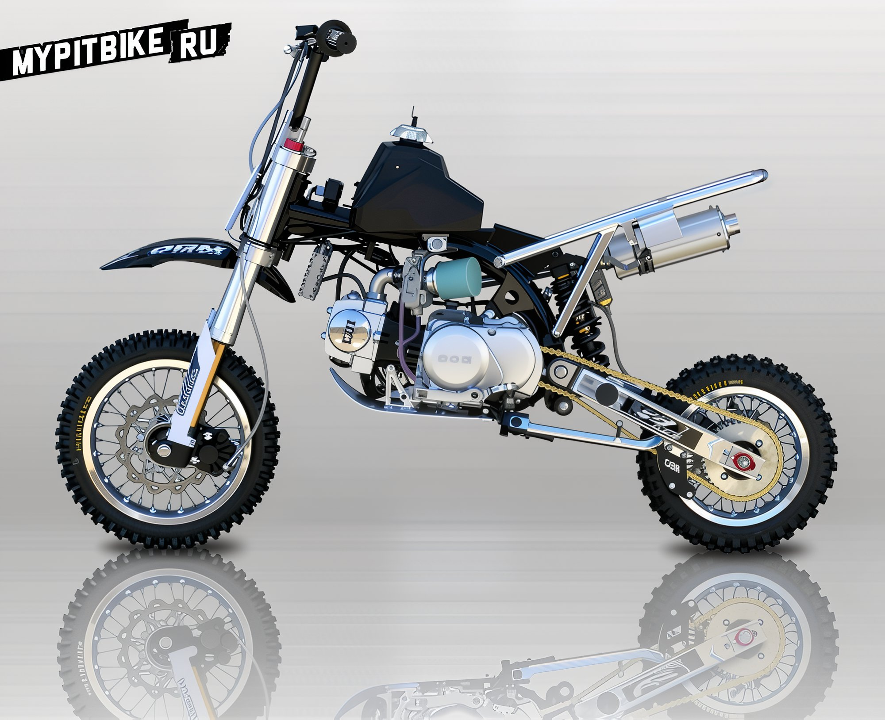
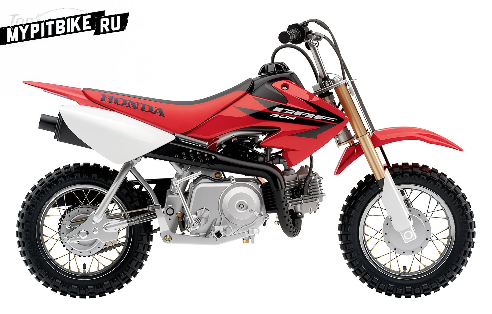
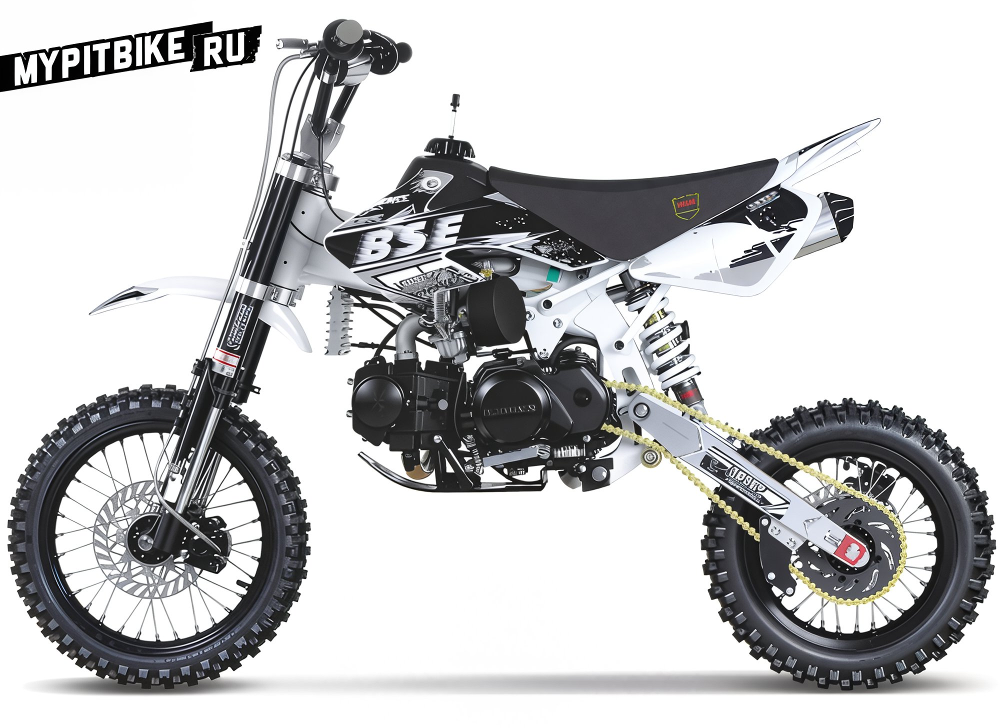
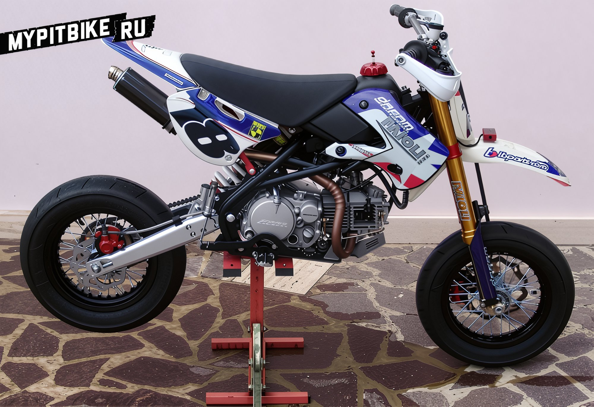
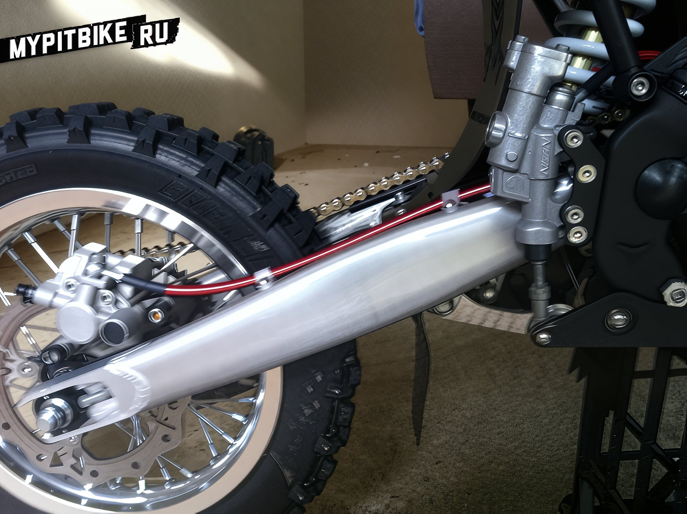
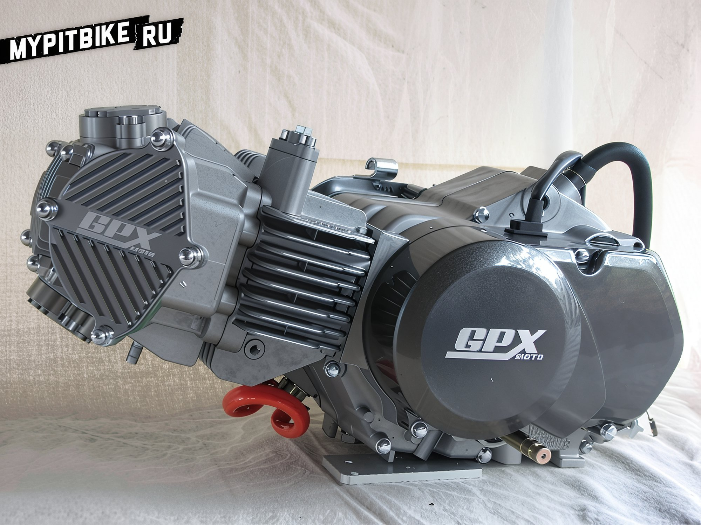
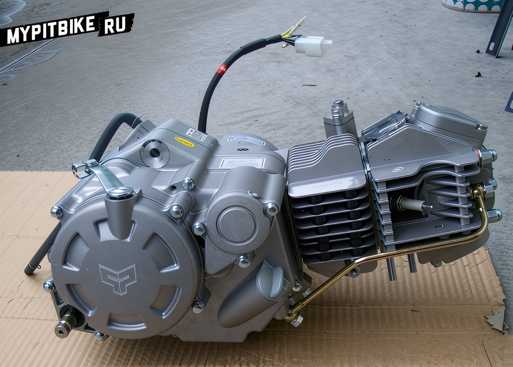
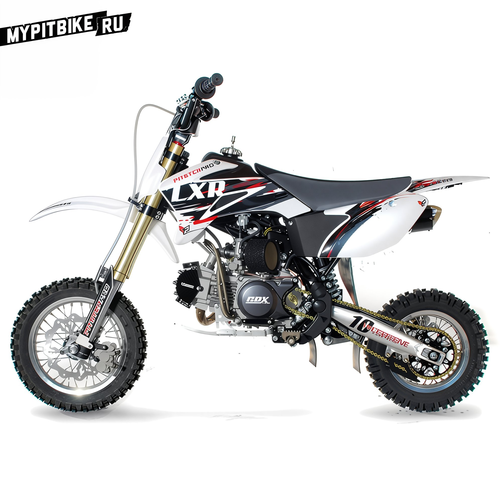
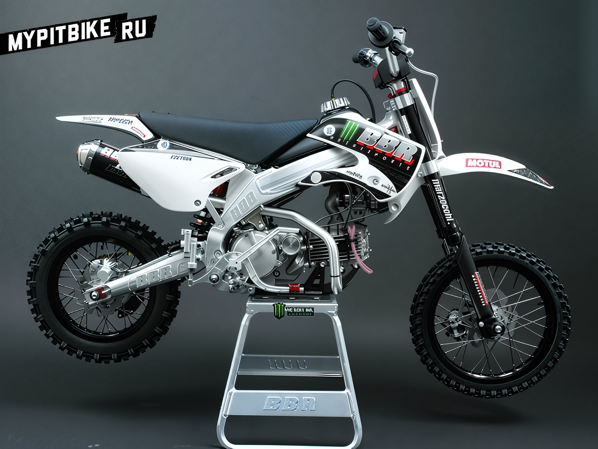
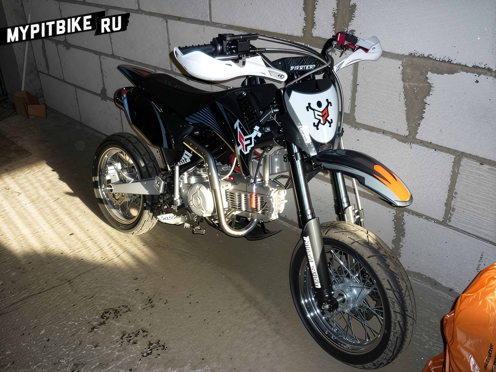

# Comparison of Pit Bikes

As you are already aware, there are numerous manufacturers of pit bikes, each offering its own range of models. Delving into the complexities of choosing a pit bike, buyers often find themselves overwhelmed. Ultimately, they may select the one that visually appeals to them the most. So, which pit bike is the best? To begin with, it's essential to understand that regardless of the number of manufacturers, pit bikes primarily differ in:

- Frame type (including bodywork)
- Engine type and capacity
- Wheel size
- Quality of components (country of origin, Europe or Asia)

## Frame Type

This is the most crucial element of the entire structure, influencing both the seating position and the overall appearance of the pit bike. As we will primarily discuss large-displacement Chinese pit bikes, a brief note is warranted. All pit bikes available on the market are clones of entry-level Japanese motocross bikes, hence the characteristic features of the plastic bodywork and overall appearance. Frames are generally categorized as follows:

### CRF50 / CRF70

The most common frame type among pit bikes, based on the design of the **Honda CRF50**. It includes a distinctive swingarm, longitudinal shock absorber mounting, a 3.5-liter fuel tank, and recognizable plastic bodywork. The **CRF70** features increased ground clearance, a straight swingarm, and seating more comfortable for adults. This type is considered classic in the pit bike world.

### KLX

The second most popular frame type among pit bikes, based on the design of the **Kawasaki KLX110**. It features a straight swingarm, with seating roughly identical to the **CRF70**. A distinctive feature is the plastic bodywork, which helps classify the motorcycle.

### TTR

The most technologically advanced and less common variant, loosely based on the design of full-sized **Yamaha** models rather than the smaller ones. Distinctive features include a straight swingarm with internal frame mounting, progressive rear suspension, a 5-liter fuel tank, plastic bodywork with characteristic side slits, and seating closest to adult motorcycles. **TTR** type pit bikes have the highest seat height in the class. This type first appeared with **PitsterPro** in the **LXR** model, considered top-of-the-line.

## Engine Type and Capacity

Since we are primarily discussing mass-produced Chinese pit bikes, we will omit original engines from companies like **Honda, Kawasaki, Daytona, Takegawa**, and other handmade projects such as [**Bucci Moto**](http://mypitbike.ru/blog/tuning/37.html).

### YX - Manufactured by YINXIANG, also Lifan

### ZS - Manufactured by ZONGSHEN

They can be distinguished externally by engine covers and markings on the crankcase. Both companies offer engines for pit bikes of various capacities, up to **160 cc**. There are also two types of gear shifting patterns: **1-N-2-3-4** and **N-1-2-3-4**. Typically, the engine type is specified in the pit bike's specifications, and knowing it along with the working volume is necessary **for ordering spare parts and tuning components**.

## Wheel Size

Front and rear wheel size

**12” x 10”** – Entry level

**12” x 12”** – Classic size. Supermoto.

**14” x 12”** – Classic size. Minicross.

**14” x 14”** – Supermoto.

**17” x 14”** – New size. Recently introduced. Found on the most powerful pit bikes. Minicross.

## Quality of Components

This is quite straightforward. There are renowned manufacturers of various pit bike components (chains, sprockets, forks, shock absorbers, handlebars, etc.). Naturally, branded parts are made with high precision, have excellent build quality, and undergo rigorous quality control. Paying for brand and quality comes at a cost (in rubles, dollars, euros).

**Marzocchi, Ohlins, Elka, Paioli, Showa, Fox, Reiger** - produce excellent suspension components for pit bikes. **ProTaper, Renthal** - manufacture high-strength handlebars. **Mikuni, Keihin** – produce carburetors for pit bike engines. Chains and sprockets by **Renthal**, rims by **Excel**, hubs by **Talon**, bearings by **SKF** and **NTN**, exhaust systems by **Doma, Akrapovic, FMF, Leovince**, and so on.

Thus, the cost of a pit bike composed of quality components from renowned manufacturers can reach **several tens of thousands of euros**. At the same time, there are **budget Chinese replicas** of all major components, not significantly inferior in quality, but cheaper than original parts by two or even three times. For example, companies **DNM** and **Fastace** produce quite good suspension elements for pit bikes.

In summary, when comparing and choosing a pit bike, it is advisable to consider the appearance of the bodywork (frame type), engine capacity, its manufacturer, and the quality of other components. In the price range of **1500-2000 USD**, one can find a good motorcycle from a well-known company, combining a sturdy frame, powerful engine, and quality components.
