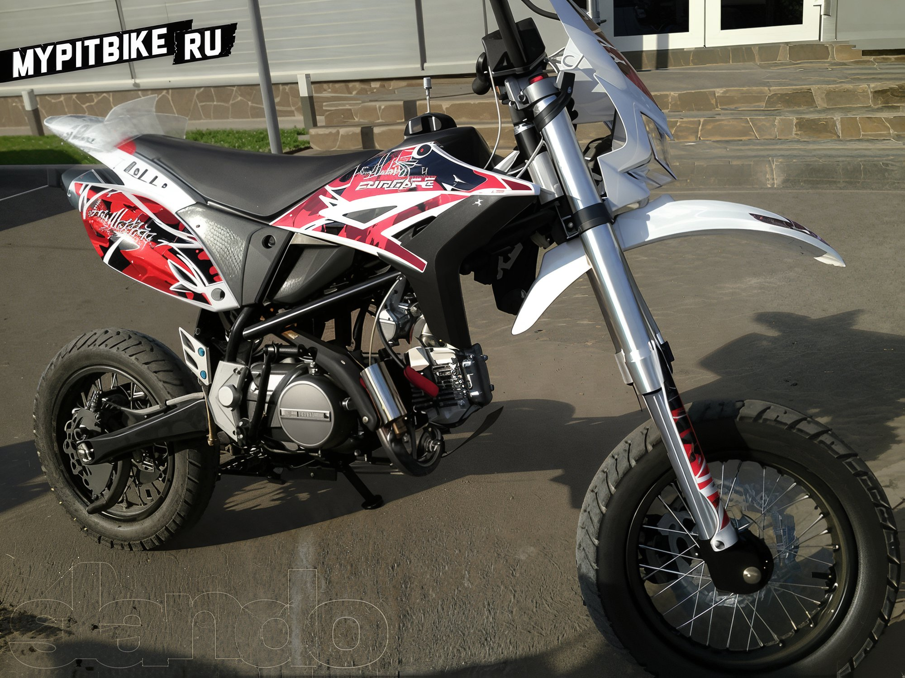

# Forsage 125: 2012 model - review and feedback

## Forsage 125 Cross / Super Moto: An Overview

In 2012, the Russian pioneer in pit bike manufacturing, **Forsage**, unveiled an updated lineup of their mini motorcycles, beginning with their junior model, the **Forsage 125 Cross / Super moto**. While an official press release is unavailable, we offer a synthesis of information from various sources and owner reviews for this pit bike model.

### Appearance

The **Forsage 125 pit bike** distinguishes itself remarkably with its exclusive plastic fairing and protective overlay design. The styling closely mirrors models like the ttr. The frame consists of a tubular steel "birdcage" structure similar to the **Irbis TTR 125**, with the swingarm internally mounted and lacking a progression-mounted mono shock. Noteworthy is its plethora of factory-installed guards, mud flaps, and plastic protection. While a rubber mudguard shielding the shock absorber is standard, a chain curtain remains rare, and rear brake disc guards typically feature on premium European-American models like **YCF** and **PitsterPro**. Additionally, the pit bike comes with a front guard equipped with a headlight, eliminating makeshift lighting needs.

### Specifications

Engine-wise, the setup is conventional. A Chinese engine, likely **Lifan/YX**, rebranded under the manufacturer's name, powers the bike. It features an inverted fork, disc brakes, and classic wheel sizes.

- **Length / Wheelbase:** 1700 mm / 1260 mm
- **Weight:** 75 kg
- **Engine Capacity:** 124 cc
- **Power:** 8.2 hp
- **Wheels:** 12"/14"
- **Disc Brakes**

### Reviews

For riders around 185-190 cm tall, the seated position is quite comfortable, though standing requires a slight forward lean towards the handlebars. The handlebars are wide, lightweight, and afford a comfortable grip. The brakes function smoothly and predictably, locking the wheels effectively. Fuel consumption is low, assisted by the factory-installed **Mikuni** carburetor. The front headlight, while not highly illuminating, garners attention and acts as a marker light.

This pit bike is assembled domestically at the **Stels** factory. With a listed price under 40,000 rubles, its configuration and aesthetic appeal position it as a potential bestseller, possibly supplanting the somewhat overfamiliar **Irbis TTR**.
