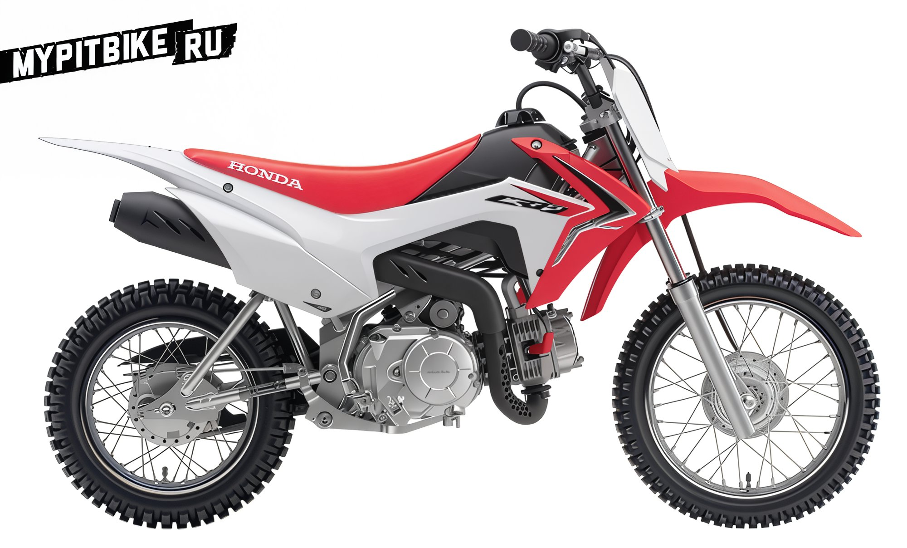
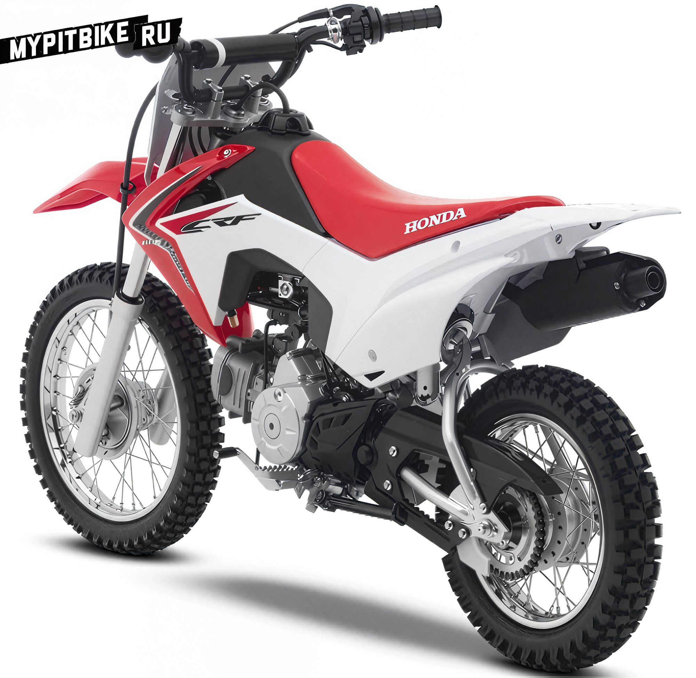

# New honda crf110f pit bike

Honda unveils the new CRF110F pit bike.

The new CRF110F arrives as the successor to the legendary CRF70F, an entry-level motocross bike in the Honda family. Key features of the Honda CRF110F include a low seat height, compact dimensions, and a four-speed transmission with an automatic clutch. The new 110cc engine will meet the needs of any novice just getting behind the handlebars of a pit bike, while the new traction control system (throttle limiter) offers additional customization options for different riders. Furthermore, the CRF110F is equipped with a new convenient electric starter. The motorcycle's design is inspired by the updated, sleek CRF450R.
With this new model, Honda expands its range of entry-level motocross bikes.

Features and Benefits:

-

- Updated 110cc air-cooled four-stroke engine, perfectly suited for beginner riders.
-

- Four-speed transmission with automatic clutch
-

- Throttle limiter adjustment screw
-

- Electric starter
-

- Low seat height, just 26.3 inches.
-

- Appearance mirrors the 2013 CRF450R model
-

