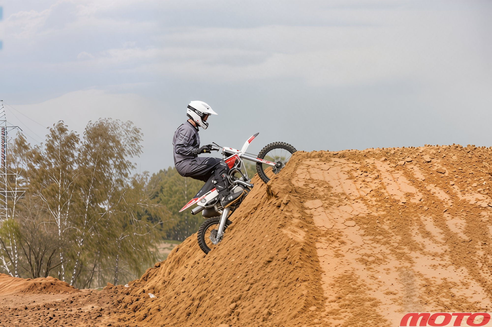
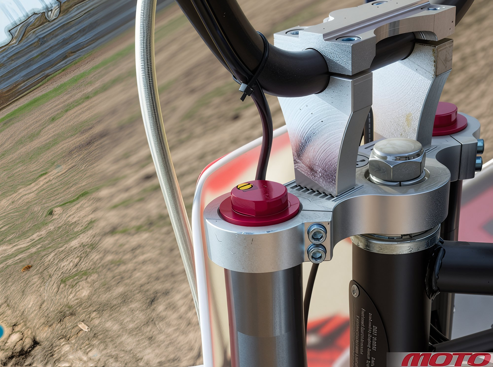
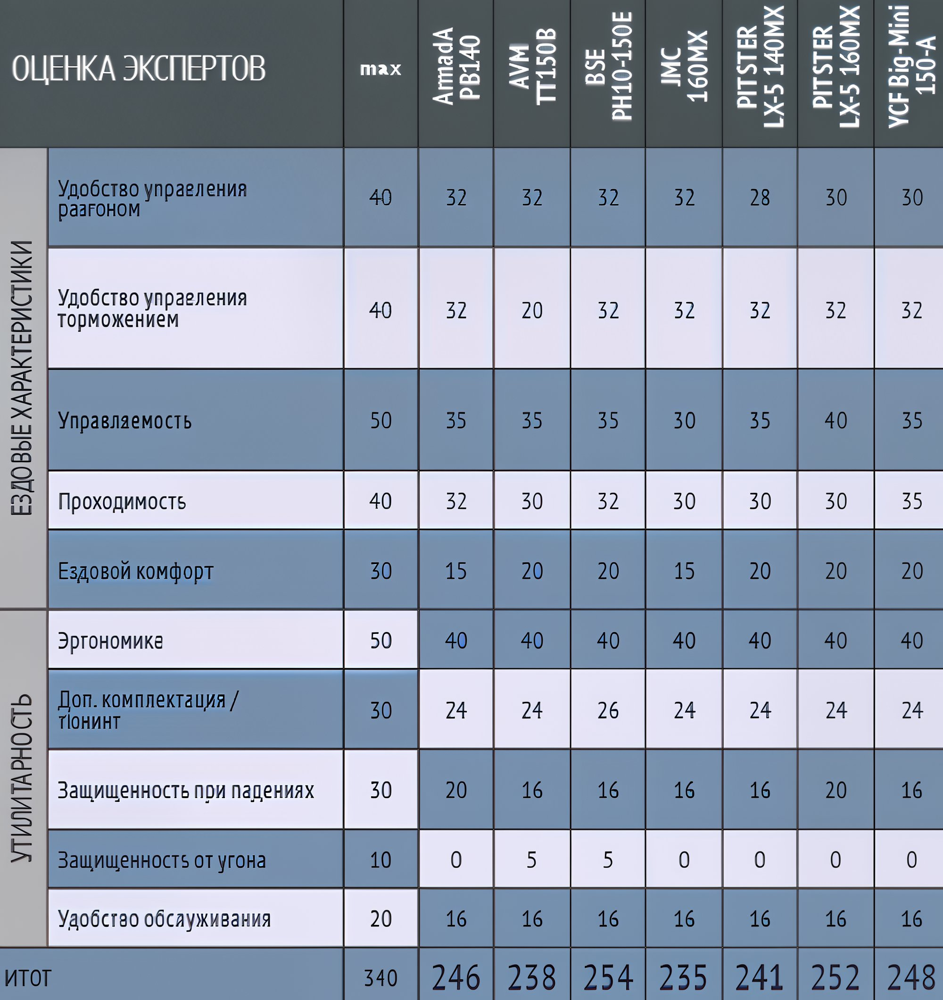
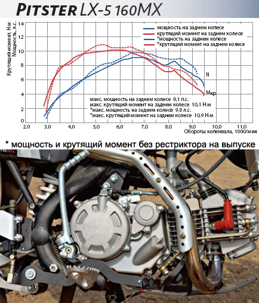
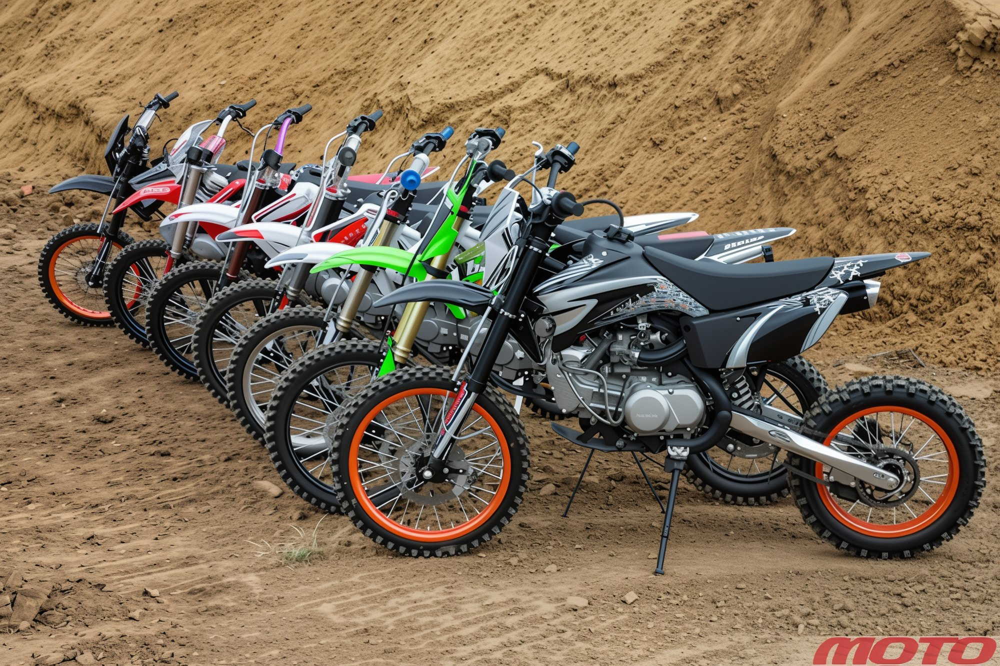

---
tags:
- review
- engine
- chassis
- suspension
- ycf
- pitsterpro
- bse
---

# Overview of large pit bikes

## Tests of Pit Bikes: Armada PB140, AVM TT150B, BSE PH10-150E, JMC 160MX, PitsterPro LX-5 140MX, PitsterPro LX-5 160MX, and YCF Big Mini 150-A

These pit bikes are among the largest in their class with 17/14-inch wheels and the highest seat elevations.

In the mid-20th century, Soichiro Honda hoped the Honda Super Cub would become a bestseller. His vision materialized, with the engine's reliability and numerous derivatives leading in production numbers in China. We decided to explore one progression of the "Super Cub"—the pit bikes.

Approximately six years ago, what has now become one of the most prevalent subcultures began emerging in Russia, though its roots extend far beyond the country to the United States. There, the pit bike's origins link closely with two models: the Honda Monkey and its successor, the XR50 (later the CRF50F). Originally designed as vehicles for race crews (hence the name), these bikes later morphed into "toys" for serious fun.

Both models share a power unit—a horizontal, air-cooled four-stroke engine, first seen on the Super Cub in the mid-20th century, which brought Honda resounding success. This engine type is the defining characteristic of a pit bike.

Today, pit bikes are produced at several factories in China and sold under various names. Some of these successfully market in the US and Europe and arrive in Russia almost unchanged. Others integrate ideas from Russian customers to varying degrees.

The most common are 125-, 140-, 150-, and 160-cc clones of "Cub" engines, nestled into chassis with 14/12 and 17/14-inch off-road tires. Comparable supermoto versions with either 12- or 14-inch wheels are also available. Consistent with engine size, each pit bike possesses unique features, but the general trend is clear: larger engines have richer equipment and correspondingly higher prices.

We decided to test mid-displacement cross-country pit bikes with 17/14-inch wheels—a segment sellers claim is the most popular in Russia. The test venue was a village near Moscow, Gorki, a landmark location in Russian pit bike history. Unfortunately, KAYO's popularity prevented it from joining the test—dealer stocks were empty at the start of May. The test thus includes seven participants.

### Overview of the Armada PB140 Pit Bike

The most budget-friendly in the test, yet well-equipped, the Armada PB140 is manufactured alongside BSE models. Its frame and plastic are borrowed from the Kawasaki KLX, fitted with adjustable handlebar clamp positions and foldable levers—a useful feature to prevent damage in falls. Additionally, it boasts custom oil coolers and gear shift lever. The suspensions are non-adjustable, with a rear shock featuring a compensating reservoir and spring preload adjustment.

*The low-end engine was particularly impressive. I didn't need to downshift before turns; simply opening the throttle caused the "Armada" to accelerate steadily and confidently out of corners. A few laps were enough to understand: this pit bike is cut from a different cloth. It favors dirt roads over harsh terrain, bumps, and jumps. Among the others, it looked like a diligent veteran, faithfully executing simple commands. The short wheelbase is fairly comfortable for pilots up to 180 cm tall, but taller riders might find the seating cramped, with knees bent dramatically and a short seat meaning aggressive riding puts you almost beyond the rear wing.*

*The adjustable positions on the "Armada's" crossbar can alleviate the tall rider accommodation issues slightly.* 

*Only the "Armada" has a single-piston front caliper (pictured left), while others have dual-piston, yet braking efficiency is unaffected. Brake issues on the track were exclusive to the AVM: excessive lever travel without wheel lockup.*

### Overview of the AVM TT150B Pit Bike

The AVM TT150B is also produced at BSE's facilities and shows little distinction from the two-year-old BSE CS150XL. Among our test, it ranks high in price-to-quality. It uses the same engine as the YCF Big-Mini 150-A, but features an oil cooler and a more effective carburetor. Additionally, the bike comes stock with lightweight aluminum rims, a trait more often found in costly racing models. There's an ignition lock stealthily mounted on the bar riser, though missing on our unit—dealers assure it will be present in future shipments.

*Riding the TT150B standing is comfortable, with no need to reach for the bars. The wide plastic sides flow into the frame's "cage," which can be easily squeezed by the knees. Aggressive off-road runs induced some instability. It eagerly tackled bumps and survived extensive jumps, yet the apparent lack of necessary frame rigidity rendered the bike less cohesive compared to the JMC 160MX.*

Nothing superfluous exists on the bike; it's simple and austere. Basic, non-adjustable suspensions handled my hard landings gracefully; high bar with a crossbar and "CRF-style" plastic. Initially, the Chinese models were rudimentary, but this landscape changed over time. Modern pit bikes arrive with durable and flexible bodywork that endure repeated shocks. The only failure in our test arose with the BSE due to an ill-conceived rear section.

*An oil filter is standard on all models except the YCF, "junior" Pitster, and "Armada." Regardless, installing a magnetic drain plug on all pit bikes is advisable for capturing minute debris (standard on JMC).

### Conclusion

An ideal pit bike wasn't found in this test, but imagine crafting one by amalgamating the best features from each: the frame from JMC with an increased rake angle to prevent front-wheel snagging on engine protection and minimize wandering on rugged terrain, YCF's front fork and LX-5 160MX's rear suspension with filter box, an engine from Armada with an electric starter and BSE's plastics, wheels from AVM TT150B, culminating in a competitively priced machine.

*In summary, the elastic engine of the "Armada" allows forgetting about the clutch entirely, as it performs remarkably on any gear. "Pitsters," however, lack adequate low-end power even to initiate movement yet excel at high RPMs. Except for the Armada, all bikes share uniform braking systems, which perform adequately; the "Armada" brake system included. AVM was docked due to the ineffective rear brake.*

The pinnacle of handling belongs to the Pitster LX-5 160MX; the rest, except JMC, approximate this performance. Maneuvering JMC demands constant steering vigilance, which quickly exhausts the rider. YCF boasts the most ground clearance at 370 mm, followed by Armada and BSE. Despite comfortable seating, JMC's chassis geometry misses the mark. "Armada's" short seat presents another sinner's tale. The remaining pit bikes necessitate crouched riding akin to minibikes.

While controls are consistently placed across the models, BSE notably arrives with a shield for converting to a cross-country version. The "Armada" excels at minimizing damage in falls—levers pivot to absorb impact—while "Pitsters" afford extra rear brake protection. Ignition locks appear exclusively on BSE and AVM.

In the scoring bout, no knockouts occurred, but the points victory favored BSE.

*The senior "Pitster" failed the power test, with neither displacement nor a 26-millimeter carburetor saving it; it bottomed out on the dyno. Despite removing the restrictor from the LX-5 160, the power slightly increased (curves marked with an asterisk) and settled into second place behind the Big-Mini.*

*Journal "MOTO" – June 2014; Author: Mikhail KOFMAN, photos by Eugenia LYUBIMOVA*
