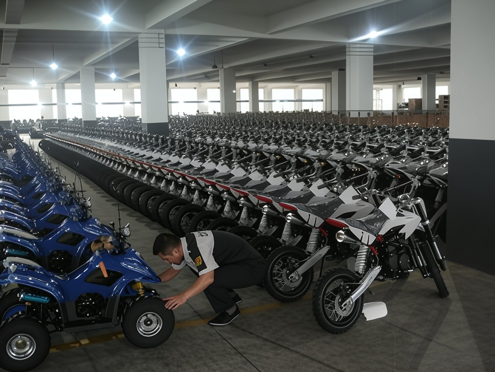
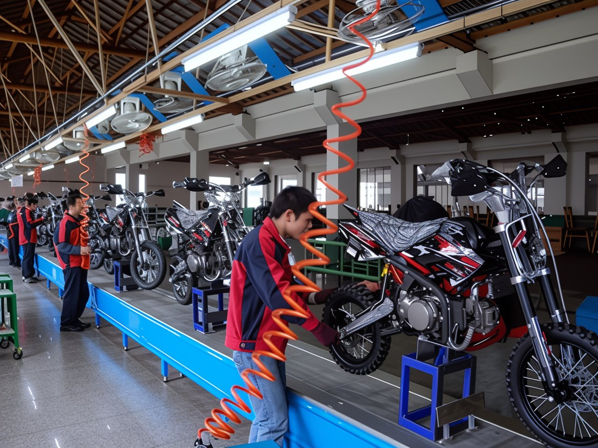
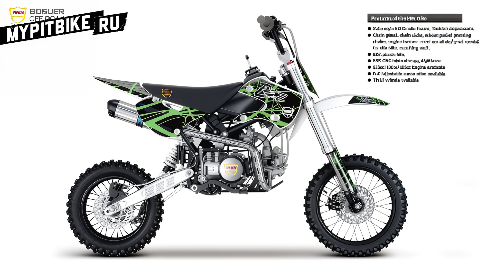
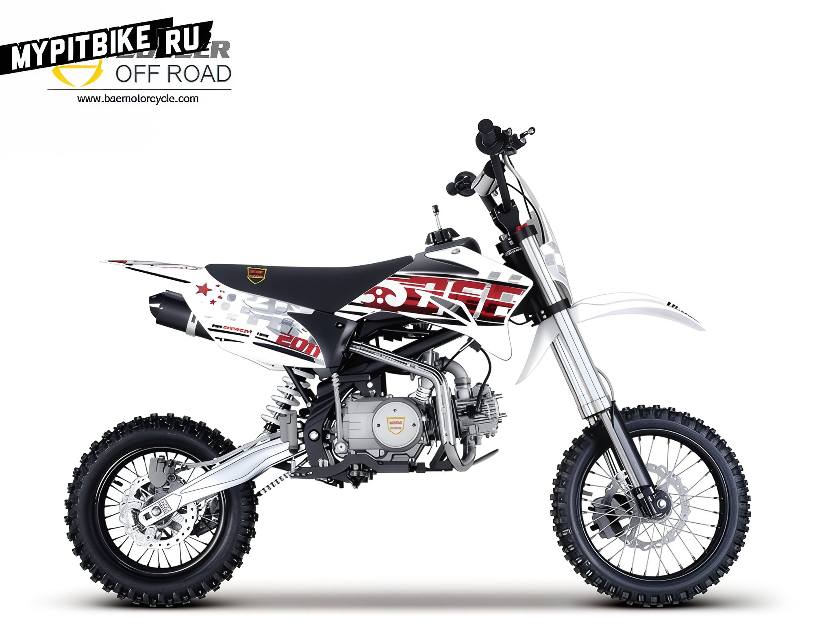
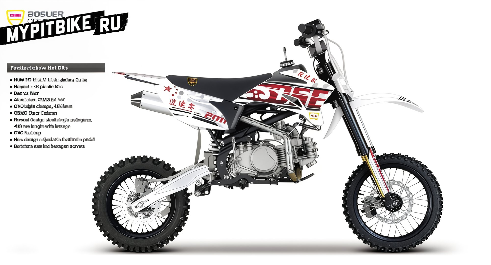
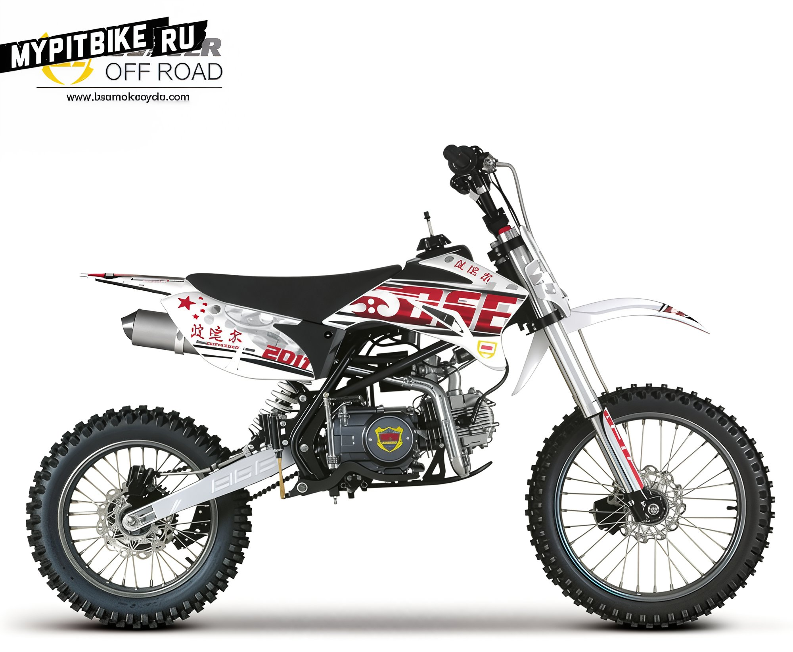
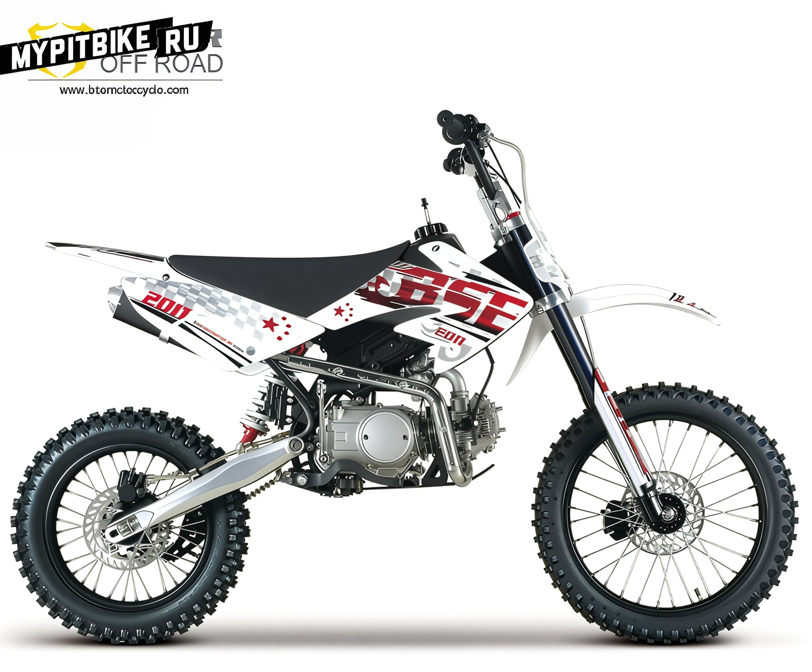
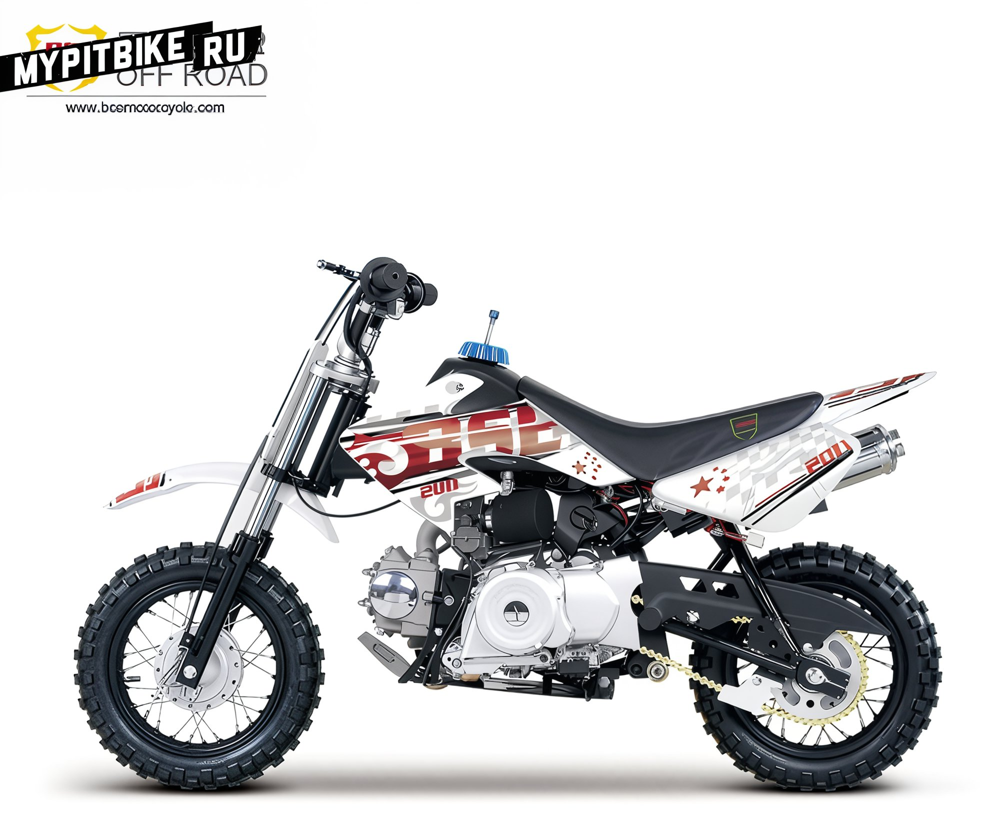
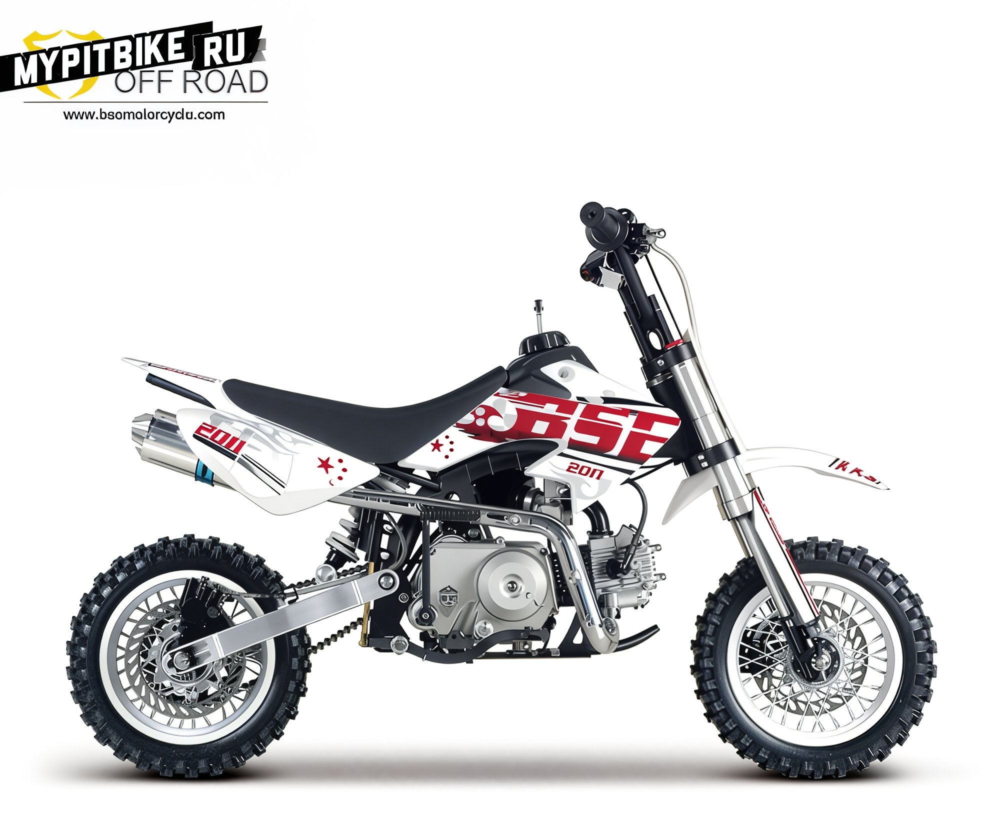

---
tags:
- review
- bse
---

# Pit bikes by BSE

## BSE Pit Bikes: A Renowned Brand in Russia

Today, we discuss another prominent pit bike manufacturer in Russia, the company **BSE**.

## History

Established in 2002, **Zhejiang Bosuer Motion Apparatus CO., LTD** is a professional engineering factory located in Zhejiang, a flourishing city in southeastern China. The factory manufactures, develops, and exports motocross bikes, ATVs, scooters, pit bikes, and MiniGP models.

Since 2003, to meet market demands, the company has increasingly focused on the pit bike segment. BSE pit bikes draw from frames like the Honda CRF50, CRF70, KLX110, and Yamaha TTR. The skillful mechanics continually explore and develop new pit bike models. High quality, competitive pricing, and production control make BSE pit bikes an excellent choice in the Chinese motorcycle sector. Renowned for quality and reliability, these motorcycles have earned a solid reputation among customers. Export markets include Europe, Canada, Australia, New Zealand, South Africa, and more.

## Market

BSE targets the European, Australian, and Canadian markets, where bikers are highly interested in racing pit bikes. Other regions, such as Africa, South America, **Russia**, the Middle East, and Southeast Asia, actively show interest in BSE pit bikes. Many start their racing careers with these pit bikes, given BSE's vigorous collaboration and support for racing teams. As the Chinese market expands, Bosuer anticipates stable demand for its pit bikes.

## Assembly

The company operates a specialized assembly line for pit bike production in China. A designated quality control supervisor oversees each assembly phase, ensuring all parts are properly installed in sequence and without errors. After assembly, a quality-control engineer conducts a comprehensive check, test-driving every motorcycle to evaluate the engine, brakes, and other systems. The front wheel is detached and secured inside a metal frame, housing the pit bike before dispatch to stores.

## Product Branding

At Bosuer’s factory, each pit bike undergoes customer-tailored branding. This could mean applying customer logos on parts like seats, engine covers, swingarms, and plastic trim. BSE can create completely unique pit bikes tailored to customer specifications.

## Design Works

Each year, BSE engineers design new pit bike models tailored to diverse markets. The factory can customize pit bikes to specific client needs. BSE remains open to collaboration and consistently seeks new partners.

## BSE Pit Bikes: 2012 Model Lineup

### Model: BSR

**Features:**

- KSR Plastic
- Lighting Equipment
- Rearview Mirrors
- Engines 110-140 cc
- Electric Starter
- NGK Spark Plug
- Mikuni Carburetor
- Aluminum "Knife" Swingarm with Pro-Link
- Load Capacity up to 100 kg

### Model: BSE-PH08C

**Features:**

- Tubular Frame
- BBR Plastic
- Special Protection, Chain Slider, Skid Plate
- Engines 125-160 cc
- Fully Adjustable Suspension
- 17"/14" Wheels

### Model: BSE-PH10A

**Features:**

- 410 mm Swingarm with Pro-Link
- TTR Style Frame
- 12" Aluminum Wheels with Innova Street Tires
- Enclosed Filter Box
- Fully Adjustable Suspension
- YX 160 cc Engine

### Model: BSE-PH10C

**Features:**

- 410 mm Swingarm with Pro-Link
- TTR Style Frame
- 22mm Steel Handlebar
- Steel Driver Footpegs
- Adjustable Brake Pedal
- 125 cc Engine
- 12"/14" Wheels

### Model: BSE-PH10B

**Features:**

- Enclosed Filter Box
- TTR Style Frame and Plastic
- 28mm Aluminum "Fatbar" Handlebar
- CNC Fuel Cap
- Adjustable Brake Pedal
- YX 150 cc Engine
- 12"/14" Wheels

### Model: BSE-PH09A

**Features:**

- Tubular Frame
- TTR Style Plastic
- Steel Handlebar
- New Frame Design
- Engines 125-160 cc
- Fully Adjustable Suspension
- 17"/14" Wheels

### Model: BSE-PH09B

**Features:**

- New Frame
- Specially Designed Protection, Chain Slider, Skid Plate
- TTR Style Plastic
- Steel Handlebar
- Engines 125-160 cc
- Fully Adjustable Suspension
- 17"/14" Wheels

### Model: BSE-PH08D

**Features:**

- KLX Style Plastic
- YX 160 cc Engine
- Tubular Frame
- 17"/14" Wheels

### Model: BSE-PH02D

**Features:**

- CRF50 Style Plastic
- Steel Handlebar
- 125 cc Engine
- 14"/12" Wheels

### Model: BSE-PH07C

**Features:**

- CRF70 Style Plastic
- 125 cc Engine
- 17"/14" Wheels

### Model: BSE-PH06A

**Features:**

- CRF50 Style Plastic
- 50 cc Engine
- 10"/10" Wheels
- 4-Speed Manual Clutch

### Model: BSE-PH06B

**Features:**

- Specially Designed Swingarm for 10" Wheel
- 50 cc Engine
- 10"/10" Wheels
- Automatic Clutch
