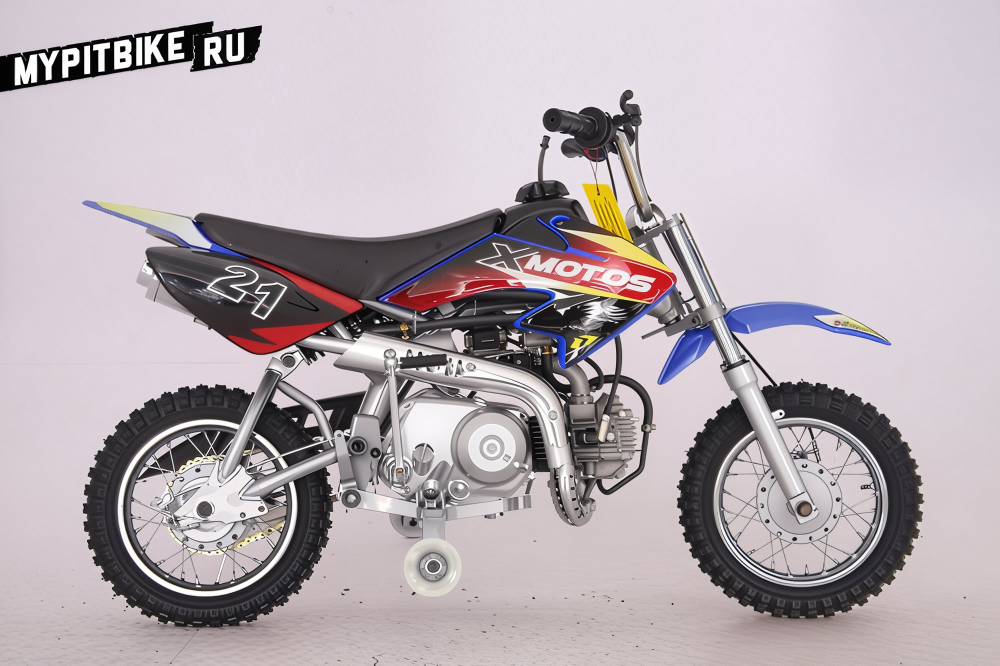
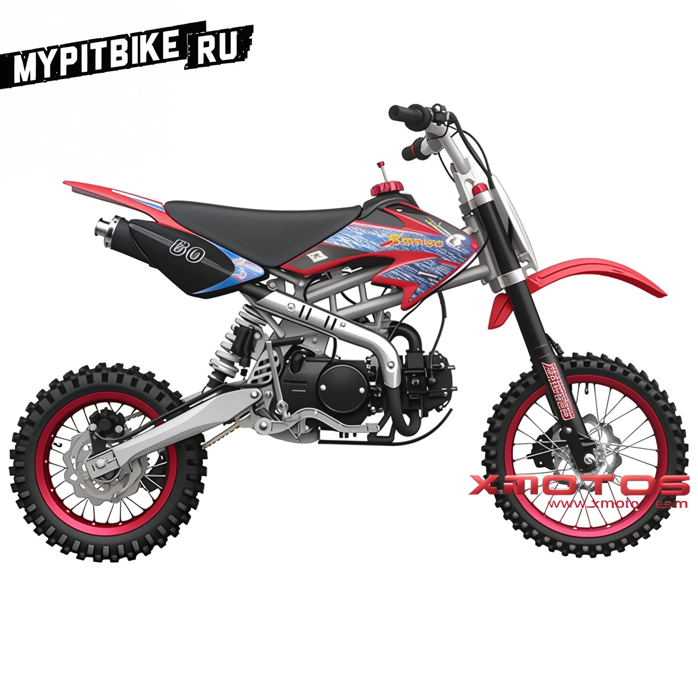
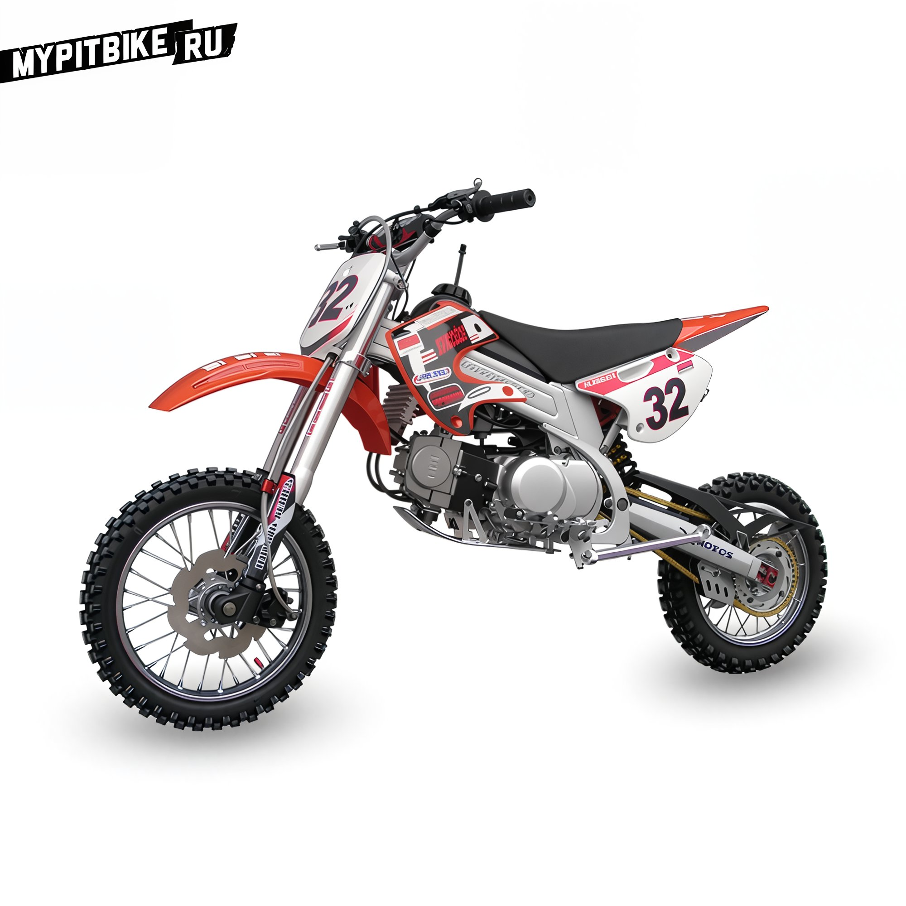
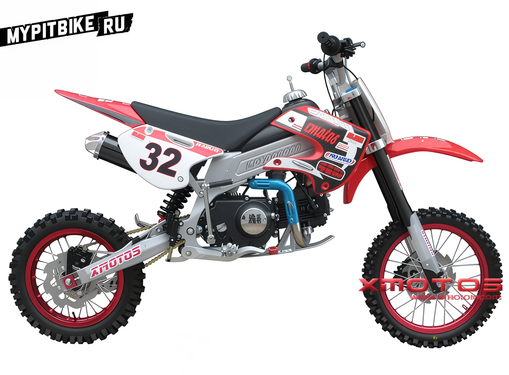

import YouTubeEmbed from '@site/src/components/YouTubeEmbed';

# Pit bikes by Xmotos

## Company Xmotos

The brand **Xmotos** is owned by the holding company **XGROUP CORPORATION**, established in 2006 in China. Over seven years, the company has operated in three areas: motorcycle manufacturing, garden equipment, and specializing in powder coating. **Xmotos** is a subsidiary focused on motorcycle production and currently maintains a significant market share among motorcycle manufacturers in China. The workforce comprises over 500 employees, working on a production area of approximately 60,000 square meters. All models leaving the factory are designed and engineered by an in-house team of 50 engineers, who bring extensive professional experience and innovative ideas. At present, all motorcycles undergo standardization for CE, EEC, EPA, Carb, ISO9001, WMI. Additionally, under the **Xmotos** brand, you can find ATVs, pit bikes, and electric bicycles.

A well-established production line has enabled the company to join the ranks of the best motorcycle manufacturers in China. Outstanding quality, advanced management, and excellent service have all contributed to achieving a positive reputation worldwide. The company's products are sold in more than 30 countries, including Australia, Africa, France, the USA, and Canada. Since 2006, the creation of affordable motorcycles has become foundational for the company. Moreover, **XGROUP CORPORATION** is ready to assemble motorcycles according to specific customer requirements. Currently, the production line includes motorcycles for children, adults, and professionals, allowing everyone to enjoy riding two-wheeled vehicles without exception.

## Xmotos Pit Bikes

### XB-21

The junior model, designed for children, is crafted in the likeness of the Honda CRF50.

- Equipped with a four-stroke engine with a capacity of 50 cc, featuring an electric starter, available with both automatic and semi-automatic transmissions (depending on the modification)
- Can be equipped with engines ranging from 70 to 125 cc (depending on the model)
- Brakes: disc/drum (depending on the modification)
- Wheel size: 10"/10" - 12"/14" (depending on the modification)
- Weight: 54/63 kg (depending on the modification)
- Training wheels for children (optional)

### XB-80

The mid-range model, designed for teenagers.

- Equipped with engines ranging from 125 to 140 cc (depending on the modification) without an electric starter
- Four-speed gearbox. Pattern N-1-2-3-4. Manual clutch
- Disc brakes
- Wheels: 12"/14"
- Weight: 66 kg
- Available colors: Red, Yellow, Blue, Green, Black, White, Orange, carbon styling

### XB-32

An advanced model. The frame largely replicates that of the American manufacturer **BBR**.

- Equipped with engines ranging from 125 to 140 cc (depending on the modification)
- Four-speed gearbox. Manual clutch
- Inverted fork
- Disc brakes
- Wheels: 12"/14" - 14"/17" (depending on the modification)
- Weight: 73 kg
- Available colors: Red, Yellow, Blue, Green, Black, White, Orange, carbon styling

### XB-33

The flagship model in the lineup. Exclusive frame and swingarm design. Unusual plastic bodywork. The prototype may have been the **Aprilia RXV**, as the front plastic and swingarm design are very similar. Apart from the unique design, standard components are used.

- The model is equipped with engines from 125 to 250 cc, with or without an electric starter.
- Wheels: 12"/14" - 14"/17" (depending on the modification)
- Inverted fork
- Rear swingarm with or without progression (depending on the modification)
- Disc brakes, hydraulic
- Seat height: 750 mm
- Fuel tank capacity: 3.3 liters
- Weight: 79 kg
- Available colors: Red, Yellow, Blue, Green, Black, White, Orange, carbon styling

<YouTubeEmbed videoId="9SVhJ4VECMg" />
