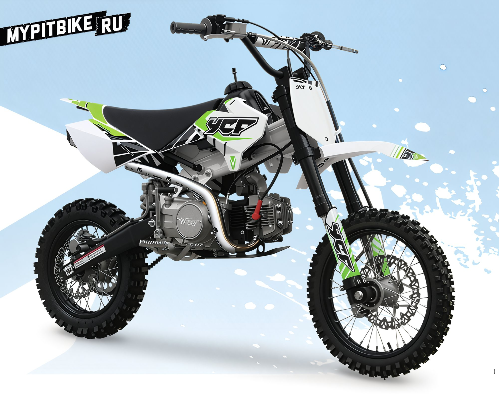
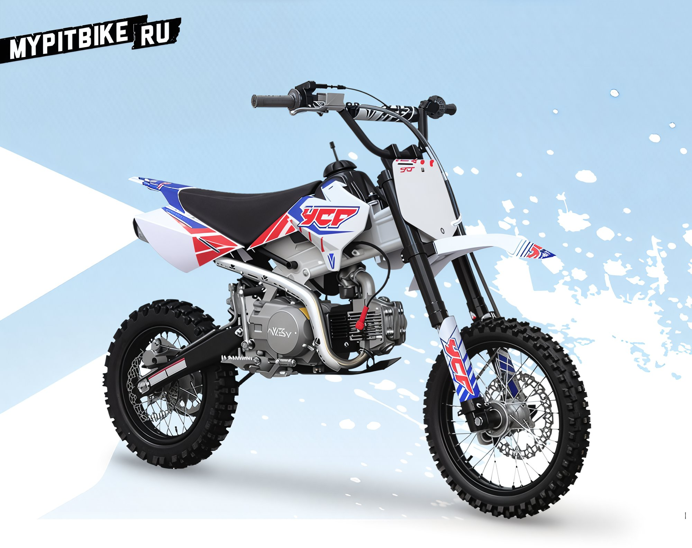
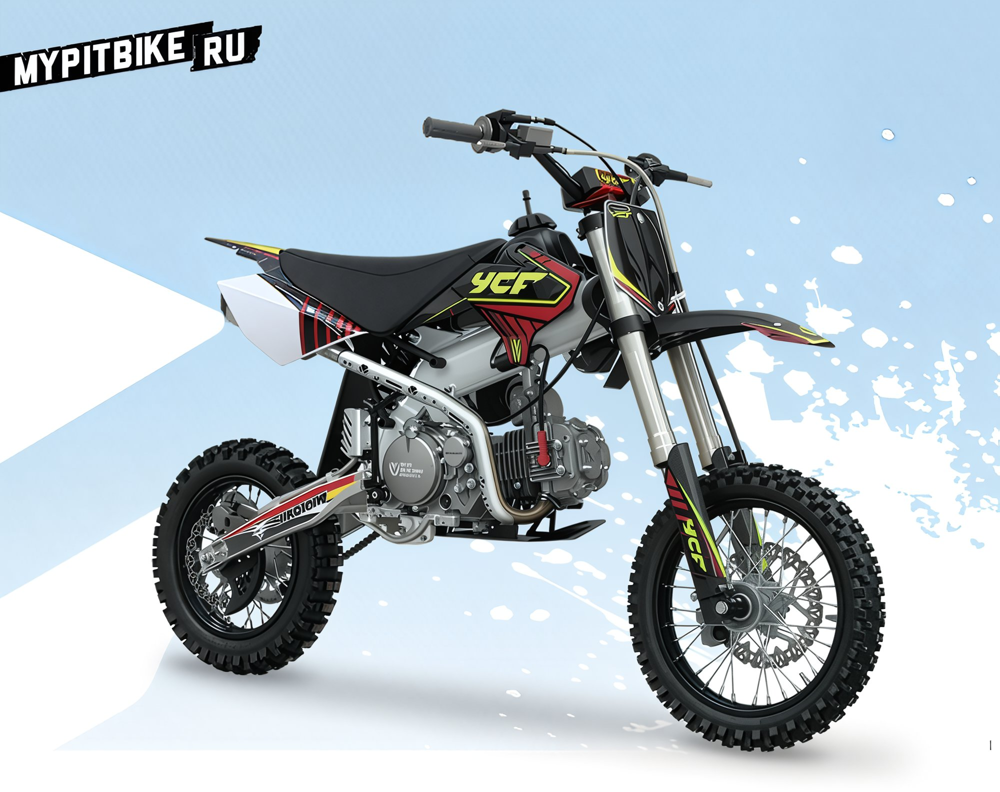

---
tags:
- review
- ycf
---

# Pit bikes by YCF

## Company's History

- **2004** – Company founded
- **2005** – Initial model lineup
- **2006** – Collaboration with **Marzocchi** Italy begins
- **2007** – YCF logo update and new graphics
- **2008** – Brand development
- **2009** – Factory established in China
- **2010** – Establishment of CNC component production facility in China
- **2011** – New company building in France
- **2012** – Collaboration with European importers **Daytona** and **ENGI**
- **2013** – Anticipating international growth prospects

**YCF** traces its roots to the collaboration between French motocross rider **Yannick Coquard** and French minibike enthusiast engineer **Dimitri Bera**, currently residing in China. Together, they developed the first YCF pit bike with the goal of providing affordable motorcycles accessible to all. The first pit bikes were imported into France for testing and subsequent performance and reliability improvements.

#### 2004 Pit Bikes Debut in France

Thanks to several advantages over full-sized motorcycles, pit bikes quickly gained popularity in France:

- Lightweight for easy transport
- Affordable pricing
- Simple and inexpensive maintenance
- Ideal for beginners learning to ride
- A fun sport accessible to everyone
- Great for improving driving skills
- Train year-round, even during winter

#### 2005/2006 First Model Lineup

The initial lineup consisted of three models. In 2005, David joined the company, taking responsibility for the technical development of pit bikes and revamping spare part shipping and after-sales service processes.

#### 2006 Collaboration with Marzocchi

Partnership with Italian suspension kit supplier **Marzocchi** bolstered YCF's reputation and trustworthiness. The motorcycle lineup grew to six models, expanding the dealer network.

#### 2007 Model Lineup

#### 2008 Best Year for the Company

Collaboration with French video director **François Alaux**, who won an Oscar for the short film "Logorama" in 2009, led to significant changes:

- Company logo redesign
- Development of unique plastic fairings

- Development of a frame with an integrated filter box (a world first)

- Updated suspension design
- First freestyle rotor for a pit bike

YCF also teamed up with **One Industries** for graphics preparation on plastics. The export range expanded to Austria and Morocco.

#### 2009 China Factory Formation

YCF becomes a full-fledged pit bike manufacturer.

A factory spanning 2,500 square meters was built, establishing spare part production for post-warranty service and repair. An assembly line was set up for maximum quality. The workforce consists of 30 employees. The motorcycle lineup expanded to seven models.

#### 2010 Brand Establishment

Two new importers appeared in Finland and Spain. The lineup expanded to nine pit bikes. All parts are produced in-house. Collaboration with **Elka**, a Canadian suspension element manufacturer, began.

YCF created its own testing ground in China.

The factory area expanded to 5,000 square meters, and staff grew to 50. Land was leased for a CNC parts production plant (subframes, triple clamps, etc.).

#### 2011 Establishment of CNC Parts Production

YCF invests in a CNC parts manufacturing plant, occupying 600 square meters at the Chinese factory. The trained staff numbers six. Investments in equipment procurement commenced, leading to the production of anodized aluminum parts (hubs, pegs, shift levers, fuel caps, triple clamps, sprockets).

#### 2011 New Premises in France

The product range swelled to ten pit bikes. A new 1,500-square-meter warehouse stores assembled pit bikes and individual parts. The premises feature three tracks and a showroom where dealers can test new pit bike models on-site.

#### 2012 Growth Prospects

New 2012 pit bike models:

- 88 YCF Pilot
- 50cc YCF aimed at children aged 5+, a lightweight bike featuring an electric starter, handlebar-mounted rear brake lever, and adjustable throttle for parental speed limiting.
- Newly designed top motorcycle lineup with semi-perimeter frames and new filter boxes, establishing a new benchmark for high-quality pit bikes.
- YCF 150 Factory Pilot with a new four-valve Japanese engine Daytona ANIMA, rear Elka shock, and new ENGI forks priced at €2,799, including all taxes (price valid in Europe).

YCF becomes the exclusive importer of Japanese **Daytona** engines and **Engi** forks.

 

Long-term goals: achieve sales of **6,000 pit bikes in France and 10,000 worldwide over three years.**

#### Limited Edition YCF Pit Bikes

## YCF in Numbers

China:
- 50 employees
- Facilities totaling 5,000 square meters designated for pit bike development and production
- A 600-square-meter section for CNC processing

France:
- 8 employees
- 1,500-square-meter administrative building for pit bike and parts storage
- Pit bike development and preparation workshop
- Three test tracks (mini motocross, enduro, supermoto)
- Shop and showroom
- YCF Museum
- 200 dealers across France

#### Sales Chart

#### Top Riders Choose YCF Pit Bikes

- Jeremy Van Horebeek
- Livia Lancelot
- Loïc Larrieu
- Marvin Musquin
- Michaël Maschio
- Nicolas Aubin
- Thomas Chareyre
- Sébastien Guillaume
- Steven Frossard
- Arnaud Adam
- Matt Rebeaud
- Sébastien Loeb
- Jeremy McGrath

## YCF 2012 Product Lineup

### YCF 50

- Electric starter
- Telescopic fork
- Weight: 43 kg
- Handlebar-mounted rear brake
- Adjustable throttle
- Automatic transmission

### YCF 88

- New front and rear brakes
- New plastic graphics
- New throttle handle
- New forks
- New rear shock
- New sprockets
- Muffler mounting springs
- New front brake hose connection
- New grip colors

### YCF 88 PILOT

- 10" rear wheel
- 12" front wheel
- Adjustable fork
- Adjustable rear shock

### 125 RSTART

- New chain guard
- Rear brake hose protector
- New graphics
- New throttle handle
- New engine

### 125 RSTART SEMI AUTOMATIQUE

 

- New chain guard
- Front brake hose protector
- New sticker set
- New throttle handle
- New sprockets
- Muffler mounting springs
- New grip colors

### 140 RSTART PILOT

- High frame
- Long fork
- New throttle handle
- New graphics
- New chain guard
- New sprockets
- Muffler mounting springs
- New grip colors

### 150 CLASSIC

- New graphics
- New muffler tip
- New throttle handle
- New sprockets
- New grip colors
- New handlebar pad

### 150 CLASSIC PILOT

- New frame
- Aluminum subframe and swingarm
- New geometry
- YCF 330mm shock
- Filter box

### 150 FACTORY PILOT

- New engine Daytona ANIMA
- New frame
- Aluminum subframe and swingarm
- New geometry
- Elka 330mm shock
- ENGI fork
- Filter box

### 125 SUPERMOTO

### 150 SUPERMOTO

- High frame
- Long seat
- 735mm fork
- New exhaust
- New graphics
- New shock
- New sprockets
- Muffler springs
- New grip colors
- New throttle handle
- New handlebar guard
