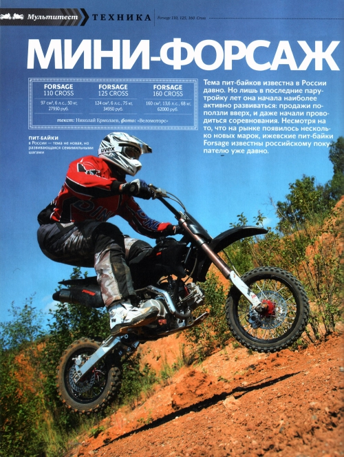
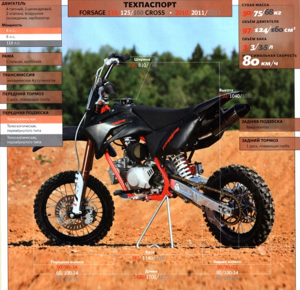

---
tags:
- review
---

# Review of Forsage 110, 125, 160 Cross Pit Bikes

The topic of pit bikes has been known in Russia for a long time. However, it is only in the past couple of years that it has begun to develop more actively: sales have surged, and competitions have even started to be held. Despite the emergence of several new brands in the market, the Izhevsk pit bikes **Forsage** have been familiar to Russian buyers for quite some time.

At a recent presentation at the X-Arena track, the company "Velomotors" unveiled a complete lineup of pit bikes, consisting of three models: **110 Cross, 125 Cross, and 160 Cross**. Despite their external similarity, the motorcycles differ not only in engines.

The **Forsage 110 Cross** model has been known for a long time. Essentially, it is the first Russian pit bike. Moreover, since 2007, there has been a national class "Forsage 110," where young champions compete on these bikes.

The chassis of the 110 is entirely designed by Izhevsk specialists. From 2011, the frame will be manufactured at the Zhukovsky motorbike plant in the Bryansk region, which belongs to the company "Velomotors." Although the frame is designed for lightweight children, rather hefty journalists were invited to the presentation test drive, who were almost forcibly made to participate in the first Forsage mini-bike cup the next day. It should be noted that all the frames conscientiously withstood quite inhumane jumps on the ramps.

However, the suspensions were not only bottoming out on every landing but also in tight turns. But in fairness, it should be said that this only happened under adults. Under children, the shock absorber and fork work as they should, and their energy capacity is enough to land softly on any jumps.
Many good words can be said about the engine. Despite the fact that my weight in gear exceeds a centner, the engine, albeit with difficulty, managed to pull me even out of loose sand, which the track was saturated with. The main thing is not to yawn and to shift to a lower gear in time.

Personally, I found the Forsage 110 Cross to be the most comfortable in terms of footpeg placement – subjectively, it has the largest distance between them and the seat, which is much more convenient for an adult.
The **125 Cross** and **160 Cross** models cannot yet be found in motorcycle showrooms – these are prototypes of the two models that will soon be available for sale. They were provided for testing to give an extra chance to identify design flaws that journalists might uncover.

The ergonomics did not allow for a full assessment of the "125." The handlebars are positioned so low that the knees simply support them from below, making even the slightest movement of the handlebars almost impossible. This motorcycle simply needs a high BMX bicycle handlebar, then the seating will be fine.

The engine has the same power as the younger 110 model – six horsepower. But due to the increased volume, the torque has increased, which much more confidently pulls a heavy rider out of the sand, and in general accelerates the pit bike faster. And if the 110 Cross has a classic gear shift pattern: first down, the rest up, then the 125 Cross has a slightly different pattern – neutral down, the rest up. This requires time to get used to.

The suspension on this pit bike is already more serious. The inverted fork handles landings much better. And to bottom it out, you have to try very hard. Moreover, it has rebound and compression hydraulic adjustments.

The most "adult" pit bike, the **Forsage 160 Cross**, is a very serious sports motorcycle. The engine delivers a robust **13.6 horsepower** and has a very lively character. You have to use the gearbox, which has the same pattern as the 125 Cross, much less frequently than on previous pit bikes. It provides quite adult acceleration, and if you consider that the center of gravity for such a base is relatively high (a problem for all pit bikes), you have to control the front wheel no less diligently than on an adult motocross bike.

The suspension here is also the best. It was never bottomed out. According to company representatives, in the future, the motorcycle will be equipped either with a Chinese fork with a full set of adjustments or an Italian **Marzocchi** with unchangeable factory settings. In my opinion, it is worth choosing the Italian product, as there is an opportunity to purchase cartridges with adjustments.

In terms of convenience, the 160 Cross is the **golden mean** – the footpegs are positioned quite high, but this is compensated by the high handlebars. Therefore, there are no problems with the knees when handling.
As a result of the test and competitions, I can confidently assert that the motorcycles, which at first glance seem "childish" and look like toys, are capable of providing quite adult sensations. During the competitions, the riders' emotions in case of failure were no less intense than in any championship.

## Motorcycle Specifications

### Forsage 110 Cross

**Engine:** 4-stroke, 1-cylinder, 2 valves, air-cooled, carburetor  
**Displacement:** 97 cc  
**Power:** 6 hp  
**Fuel tank capacity:** 3 liters  
**Frame:** Steel backbone  
**Transmission:** Manual 4-speed  
**Front brake:** 1 disc, floating caliper  
**Front suspension:** Telescopic  
**Rear brake:** 1 disc, floating caliper  
**Rear suspension:** Shock absorber  
**Width:** 736 mm  
**Height:** 710 mm  
**Length:** 1430 mm  
**Wheelbase:** 965 mm  
**Front wheel:** 90/90 – 14  
**Rear wheel:** 90/90 - 12  
**Weight:** 50 kg  
**Maximum speed:** 80 km/h  
**Price:** 27,950 rubles

### Forsage 125 Cross

**Engine:** 4-stroke, 1-cylinder, 2 valves, air-cooled, carburetor  
**Displacement:** 124 cc  
**Power:** 6 hp  
**Fuel tank capacity:** 3 liters  
**Frame:** Steel backbone  
**Transmission:** Manual 4-speed  
**Front brake:** 1 disc, floating caliper  
**Front suspension:** Telescopic  
**Rear brake:** 1 disc, floating caliper  
**Rear suspension:** Shock absorber  
**Width:** 810 mm  
**Height:** 1040 mm  
**Length:** 1700 mm  
**Wheelbase:** 1140 mm  
**Front wheel:** 60/100 - 14  
**Rear wheel:** 80/100 - 14  
**Weight:** 75 kg  
**Maximum speed:** 80 km/h  
**Price:** 34,950 rubles

### Forsage 160 Cross

**Engine:** 4-stroke, 1-cylinder, 2 valves, air-cooled, carburetor  
**Displacement:** 160 cc  
**Power:** 13.6 hp  
**Fuel tank capacity:** 3.5 liters  
**Frame:** Steel backbone  
**Transmission:** Manual 4-speed  
**Front brake:** 1 disc, floating caliper  
**Front suspension:** Telescopic  
**Rear brake:** 1 disc, floating caliper  
**Rear suspension:** Shock absorber  
**Width:** 730 mm  
**Height:** 1030 mm  
**Length:** 1670 mm  
**Wheelbase:** 1200 mm  
**Front wheel:** 60/100 - 14  
**Rear wheel:** 80/100 - 14  
**Weight:** 68 kg  
**Maximum speed:** 80 km/h  
**Price:** 62,000 rubles

*Moto Expert Magazine 11/11*
