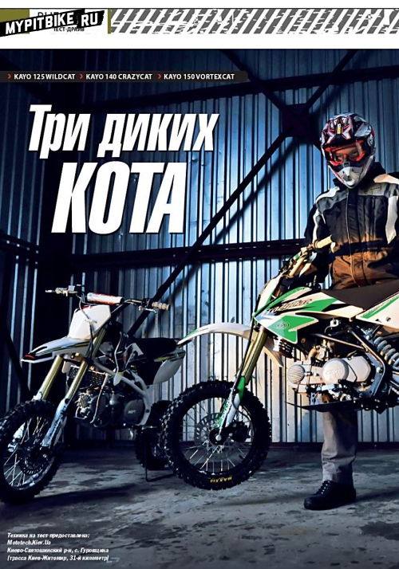
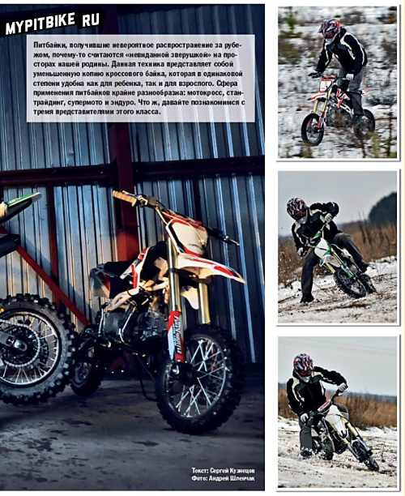
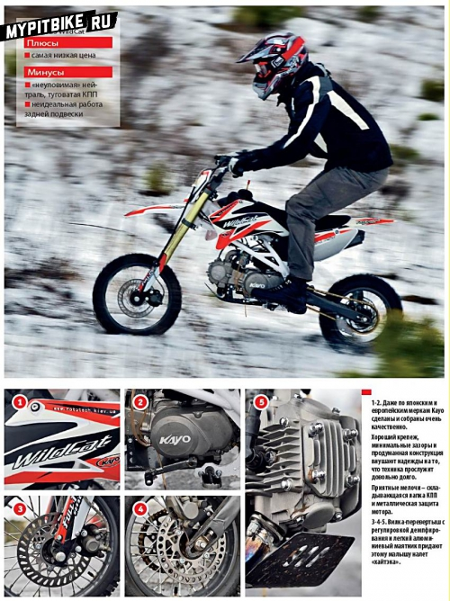
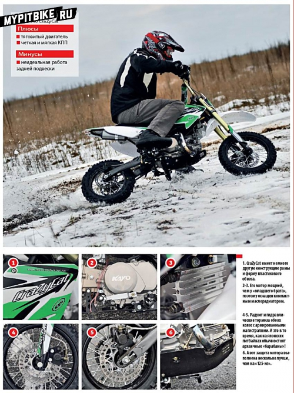
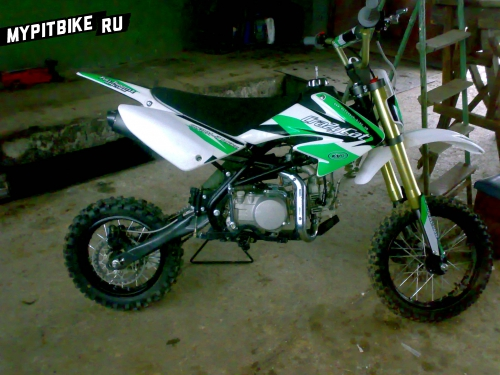
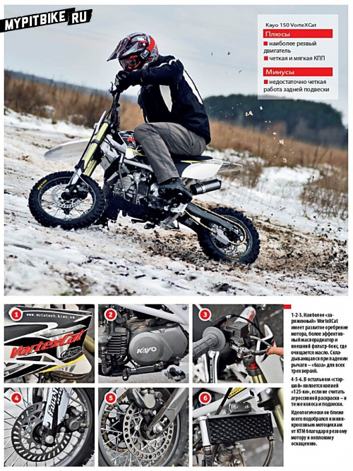

# Review of kayo pit bikes

## Three Wild CATS: Kayo 125 WildCat, Kayo 140 CraZyCat, Kayo 150 VorteXCat

Pit bikes, though wildly popular abroad, strangely remain a rare breed on home ground. These miniatures of motocross bikes suit both children and adults equally well. Their diverse applications span motocross, stunting, supermoto, and enduro. Let's meet three representatives of this class.

My first encounter with this fascinating technology happened online. Admiring charming photographs of these "wonders," I had little sense of a pit bike's proportions, let alone how it would behave beneath an 85-kilogram tester. Nevertheless, interest was born.

I had the opportunity to test three models from the same brand: **Kayo 125 WildCat**, **Kayo 140 CraZyCat**, and **Kayo 150 VorteXCat**. As their names suggest, their engines are 125, 140, and 150 cc, respectively. Beyond engine size, these bikes share almost identical chassis.

Their foundation is a spatial tubular steel frame, boasting commendable welding quality and an intelligent design, likely borrowed from European pit bikes. The front suspension features an adjustable upside-down fork, complemented by a rear cast aluminum swingarm supported by a mono shock. Notably, the shock includes a pre-load adjustment ring for fine-tuning spring compression.

Additional features include foldable brake, clutch, and gear levers for durability amid frequent falls. Extra touches encompass thick, white vinyl decals strategically placed on plastic panels likely to contact the ground, silicone handlebar grips, and a valve cap on the fuel cap to prevent fuel spillage during falls.

I began with the youngest, the 125 cc model. Contrary to my apprehensions, the bike ignited on the first kick-starter thrust. Wow, what a sound! This bike defies its engine size. Unencumbered by legal noise and emission restraints, the Chinese fitted the bike with a straight-through exhaust! This "eighth-litre" sounds no less fierce than a 450 motocross model (adjusted for decibels).

Seated behind the handlebars, I felt surprisingly comfortable. The seating ergonomics seem explicitly designed for adult riders, as evidenced by the seat height at 835 mm! I squeezed the clutch, pressed the gear lever... yet remained stationary. It turns out the gearshift pattern on these pit bikes is **N-1-2-3-4** (instead of the more common 1-N-2-3-4). I wouldn’t call this configuration ideal. Imagine hitting a turn at speed, downshifting but accidentally landing in neutral—a missed first gear means the bike won't accelerate dramatically out of the apex, hurling earth from the rear. Also, "catching neutral" while stationary on the **Kayo 125** is a puzzle lover's joy. Well, that's why it's the series' most affordable.

Having sufficiently mastered the gearbox, I started. First gear felt too short, but after some thought, I considered this an advantage. With such a gear ratio, even a motor lacking Herculean kinship can generate decent pulling power—enough, for instance, to haul an 85-kilogram rider up a steep incline.

Upon reaching open spaces, I cranked the throttle and accelerated through the gears. The two-valve four-stroke engine offering **8.3 hp at 7500 RPM** shows commendable torque at low and mid-revs but falters at high RPMs. Consequently, I didn't attempt max speed runs (especially on icy dirt roads). Despite its unimposing size, the pit bike accelerates briskly. You can imagine what an offroad tumble at 50-60 km/h might entail.

The suspension impressed me. Initially, I thought it was merely decorative, but both the front fork and rear monoshock proved fully functional. Their energy capacity suffices for sizable jumps or bounding across "washboard" terrain without losing a cruising speed of 50-60 km/h. For off-roading, that's substantial—far more than 120 km/h on tarmac.

Still, there were shortcomings. The front fork functioned well (though impacted by cold, thickened oil), but the rear suspension's performance was lackluster, occasionally leaving the rider uncertain about the rear wheel's status.

Conversely, hydraulic brakes evoke no complaints. For a 71-kilogram bike maxing at 80 km/h, their efficacy suffices substantially. If fitted with alloy road wheels and slick tires, even then, the stock brake system's capability would broadly cover a freshly converted minimoto's needs.

Having parked the "125" to cool, its air-cooled bearings audibly clicking, I switched to the 140 cc model. This pit bike features a slightly different frame, different plastic profiles, and a creative white-green paint scheme. The plastic across all three models proved "proper"—soft, very flexible, and non-breaking during falls.

**CraZyCat** is 20 mm shorter and the same height reduction compared to its siblings, but this difference exists solely on paper. After riding them, I noted no perceptible ergonomic or handling differences.

The **Kayo 140** engine represents another **Honda Super Cub** clone. This power unit produces nearly **10 hp at 8000 RPM**, hence the oil cooler inclusion. Despite lingering doubts, this engine also started on the first "kick," announcing its presence with a bass-filled roar. Flicking the shifter while stationary, I was surprised to find precise gear transitions and effortless neutral find.

Given the short first gear, careless throttle maneuvering may easily lift the **Kayo 140 CraZyCat** into a wheelie—or worse, unseat a casual rider. A lesson noted.

Packed with a nimbler engine and precise gearbox, this pit bike suits various daredevil exploits. Circling the vicinity, thoughts of an indoor BMX park filled my mind. There, amid variously configured ramps, real fun awaited.

The 140 cc power unit operates—how shall I say—more expressively than the "125." It follows throttle input better, displaying stronger pull across rev ranges.

Thoroughly pleased with my **Kayo 140** experience, I switched to the **150 cc VorteXCat**, which, engine aside, equates to the 125 cc WildCat. But in engine design, developers did more than expand displacement. By raising the compression ratio, the engine now yields **13.6 hp at 9500 RPM** and **11.2 Nm at 7500 RPM**. Remembering the pit bike’s dry weight remains 71 kg hints at a capability exceeding the **Yamaha YBR-125** and similar road motorcycles from launch.

Expectedly, the engine started smoothly. Its exhaust voice is sharper than its younger siblings. Let's see how it fares in action.

Engaging first gear, releasing the clutch, then throttle on! The pit bike surged, casting roadside slush and grass skyward. The **Kayo 150** engine revs with speed and enthusiasm. This machine aligns itself closest to **KTM minicross bikes** and **Polini pit bikes**. The favorable engine impression amplified by a precise gearbox featuring an easily captured neutral.

Increased compression sacrifices some elasticity compared to the 140 cc model, yet its spirited top-end nature compensates.

The trio’s handling merits the term "bicycle-like"—a **Kayo** can pivot on a dime barely over a meter, trajectory shifts guided by mere thought. Spinning the pit bike in power slides for the photographer's delight, I felt unprecedented confidence. Its low weight and modest seat height excuse numerous piloting errors, perhaps even bestowing lessons. No wonder international riding schools commence stunt riding with such machinery.

Were it feasible to adapt pit bikes for public road use, they would likely become bestsellers among unrestrained youth. Affordable, light, spirited engines, and superb handling would form perfect urban transport alternatives.

Yet, in reality, these devices offer excellent active recreation and amateur motorsport instruments.

Concluding the test drive, I finally answered the timeless question: "Would you see this machinery in your garage?" As I pen these words, the white-green **Kayo 140 CraZyCat** prepares for an honored spot beside my **KTM 990 Adventure**.
