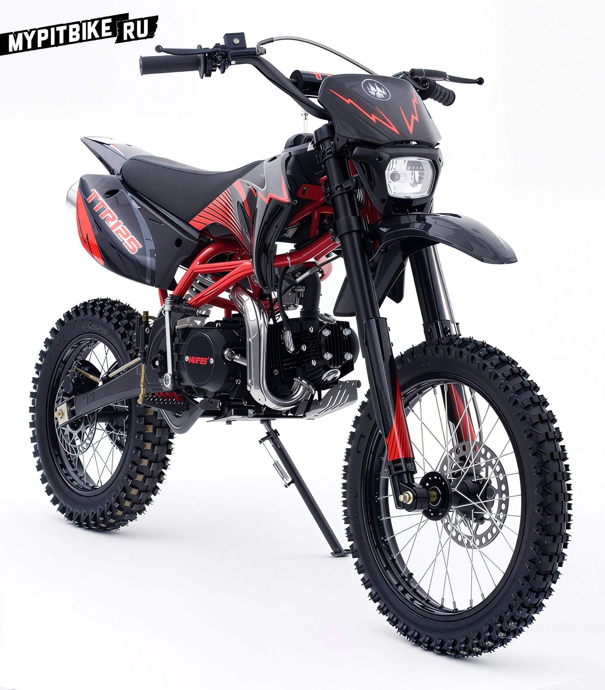

---
tags:
- review
---

# Review of the Irbis TTR 125 Pit Bike

Recently, this particular pit bike has been vying for the title of "people's choice," and not without reason. Its large wheels, simple design, availability in stores, and affordability are its main selling points. Most buyers are unfamiliar with the term "pit bike" and purchase the TTR 125 as their first motorcycle for learning or as a moped for the countryside, for trips along trails in search of mushrooms or for fishing. They are not chasing after brand names, aesthetics, colorful anodized aluminum parts, or the classic form factor (with 14/12 wheels). What most people seek is the lowest price on the market, simplicity of design, the ability for field repairs with basic tools, and the availability of spare parts. Judging by the prevalence of this model, the latter should not pose a problem. But is the Irbis TTR truly as good as it seems?

## Technical Specifications of the IRBIS TTR 125

- **Engine Type and Capacity:** 4-stroke, 125cc
- **Engine Power:** 8.2 hp
- **Transmission:** 4-speed manual, chain
- **Fuel Tank Capacity:** 3.2 liters
- **Dimensions:** 1700x780x1100 mm
- **Dry Weight:** 67 kg
- **Tires (front/rear):** 17 / 14
- **Brakes (front/rear):** disc / disc
- **Features:** powerful 125cc engine, off-road tires 14/17', engine protection

### Engine

The engine is a replica of the reliable Honda CUB engine. In the TTR 125, the clutch disconnects the kickstarter from the engine, so it can only be started in "neutral" – a good safeguard against mistakes. However, during testing, it was necessary to resort to the old method of push-starting, as the shiny kickstarter lever detached after the second start along with its accompanying parts. The parts were found, but reassembling the mechanism with its stiff spring in the field was impossible. This component clearly requires improvement.

The TTR 125 engine performs excellently, easily lifting the front wheel in first gear with throttle alone, and allows starting in second and even third gear. It's unclear why such trial skills are needed for this "little one," but some will surely enjoy "popping wheelies." The "125" encourages spirited riding. However, the fact that "neutral" in its four-speed gearbox is at the very bottom, rather than between first and second, was somewhat disconcerting. It's not just about habit – which develops quickly – but the reason why designers worldwide use the intermediate "neutral" scheme. Imagine switching down on a steep incline and suddenly hitting "neutral." Often, there's no time to re-engage the gear.

### Suspension

The TTR 125's suspension was frankly disappointing: too soft on compression and too stiff on rebound (especially the rear), turning the seat into a wooden stool on even slightly uneven roads, forcing the rider to stand on the footpegs. Moreover, when hitting bumps, the front suspension bottoms out – and this with a rider weighing only 70 kg in gear!

### Brakes

The brakes are hydraulic with reinforced hoses but proved to be not particularly effective, especially the front. It was faulty – the "floating caliper" barely moved on its guides. Thus, apart from squeaking, it was hard to get anything coherent from it, although by the end of the test it had somewhat developed.

### Electrics

When purchasing a new motorcycle, pay close attention to checking the electrics, as these bikes have only one electrical component – the headlight, which is easy to turn on. Unfortunately, Chinese manufacturers often have the issue of disconnected wires, so to avoid puzzling over this in the garage, it's better to check everything at the time of purchase. [The wiring diagram has been added to the Manuals section](http://mypitbike.ru/page/manual/)

### Conclusion

Overall, the motorcycles left a pleasant impression. The quality is at a level that allows for a discussion of its value for money. And today, that is the main trump card of these machines. Upon detailed inspection, the TTR 125 proved to be prepared for off-road: the headlight is secured with convenient and sturdy rubber fasteners, the frame is protected from wear by motorcycle boots with neat plastic covers, and the gear lever is foldable. But the main feature is the motorcycle's mass and dimensions. There aren't many teenage "enduros" available. This one will suit those aged 14–16, but adults can also fit, albeit with less comfort.

Among the minor shortcomings are the need for kickstarter improvement, instability on the stand, and a weak chain. Our advice to buyers: tightening threaded connections and clamps is a mandatory procedure!

### Most Common Failures According to Statistics

- After just a few rides, the pit bike's hub breaks, spokes fly out, or the rear wheel simply falls apart
- On a motocross track with serious jumps, the pit bike's suspension fails, and the rear shock absorber bends into an arc
- The upper engine mount lugs on the Irbis TTR frame often break off. This is resolved with simple on-site welding.

### Tuning the Irbis TTR 125 Pit Bike

Upon disassembling the engine, it was discovered to our dismay that the pit bike is equipped with the maximum allowable piston group, as the crankcase is bored to the limit, and a wider cylinder sleeve simply won't fit. Installing a high-compression piston did not significantly improve engine performance, with only a barely noticeable increase in torque.

Installing a lightweight generator on the IRBIS TTR 125 also did not result in a noticeable power increase, only causing difficulties in starting the pit bike. Installing a different carburetor is possible; with a flat-slide carburetor or an original Japanese one, the pit bike performs better.

*Based on materials from "Za Rulem" and Pit Bike Club*
