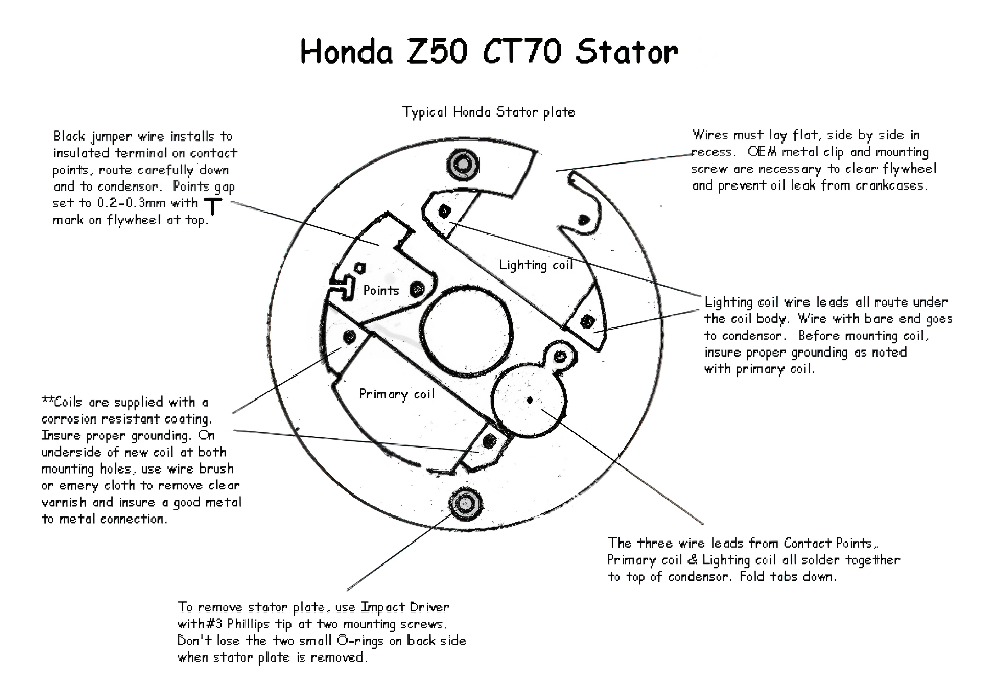

---
tags:
- wiring
---

# 6V Stator Replacement Guide for CT70 and Z50

Typical Honda stator plate

Black jumper wire installs to insulated terminal on contact points. Route carefully down and to the condenser. Points gap set to 0.2-0.3mm with mark on flywheel at top.

Coils are supplied with a corrosion-resistant coating. Ensure proper grounding. On the underside of the new coil at both mounting holes, use a wire brush or emery cloth to remove clear varnish and ensure a good metal-to-metal connection.

To remove the stator plate, use an impact driver with #3 Phillips tip at two mounting screws. Don't lose the two small O-rings on the backside when the stator plate is removed.

Wires must lay flat, side by side, in recess. OEM metal clip and mounting screw are necessary to clear flywheel and prevent oil leaks from crankcases.

Lighting coil wire leads all route under the coil body. The wire with the bare end goes to the condenser. Before mounting the coil, ensure proper grounding as noted with the primary coil.

The three wire leads from Contact Points, Primary coil & Lighting coil all solder together to the top of the condenser. Fold tabs down.

