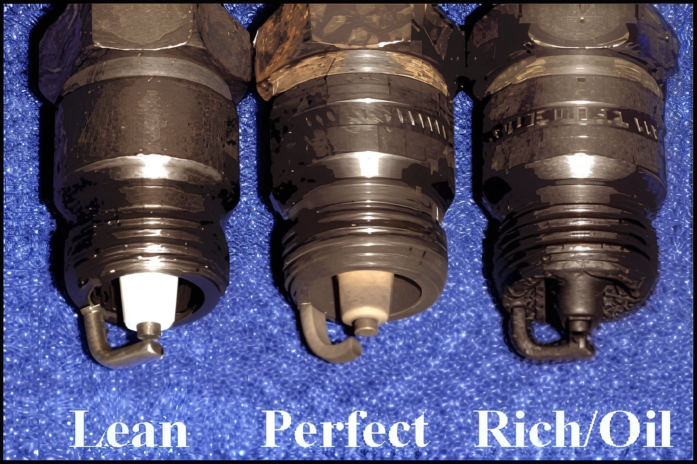

---
tags:
- carb
- spark
---

# A Simple Guide to Jetting

Step-by-Step Guide to Jetting Your New Motorcycle

## Obtain a Spark Plug Reading

To begin, operate your motorcycle in the highest gear possible and then abruptly cut the engine while maintaining the throttle fully open. Avoid idling the engine. Proceed to remove the spark plug and examine the insulator, the white porcelain section. Ideally, it should resemble the color of coffee with cream (TAN). A dark brown or sooty black appearance indicates a rich mixture, while a gray, ashy, or white hue suggests a lean mixture. A spark plug reading provides a general overview of the engine's performance.

**Note:** This procedure should be conducted with a new spark plug after the motorcycle has been adequately warmed up.

## The Main Jet

The carburetor's main jet influences performance from half to full throttle. After conducting a test run with the stock jetting, install a main jet that is two sizes richer (indicated by a higher number on the jet). Perform another test run, paying close attention to the motorcycle's response. If the engine hesitates to rev as before, it is too rich, necessitating a leaner (smaller) jet. Continue this process until a noticeable enhancement in power is achieved.

## Pilot Jet

The pilot jet predominantly affects performance from idle to 1/4 throttle. If the motorcycle is sluggish or unresponsive until surpassing 1/4 throttle, the pilot jet may be too rich or too lean. To evaluate the pilot jet, follow the same procedure as with the main jet: remove the stock pilot jet and install a richer (larger) pilot jet, then repeat the test. A correctly tuned pilot jet will enhance acceleration from a standstill and out of corners. Continue adjusting richer or leaner until the throttle response is sharp and precise.

## The Air Screw

To adjust the air screw, ensure the engine is warmed up. Once warm, maintain a steady throttle setting (approximately 1800 RPMs) with assistance. With the engine running steadily, turn the air screw clockwise until the RPMs decrease. Then, gradually turn the air screw counterclockwise until the RPMs increase. Cease turning once the RPMs reach their peak, indicating the engine is running at its cleanest and fastest. The typical air screw setting ranges from 1/2 to 2 turns out.

**Note:** If the air screw is more than 2 turns out, consider switching to a leaner pilot jet. Conversely, if the engine peaks before 1/2 turn out, opt for a richer pilot jet.

## Needle Setting

The carburetor needle affects throttle settings from 1/4 to 3/4 turn. Begin with the clip in the middle position, conduct several test runs, and then adjust the clip downward (to enrich the mixture) by two positions. This adjustment offers the quickest and most significant improvement in jetting. Do not hesitate to move the clip upward (to lean the mixture). The needle setting is crucial as most riders spend the majority of their time within this range. Experiment with all clip positions to determine the optimal performance. If the clip is positioned at the very top or bottom, revisit and adjust the main and pilot jets.

A properly jetted carburetor will have the clip on the needle in one of the middle three notches.

## Quick Tips for Small 4-Stroke Engines

- **Begin tuning with a clean and properly oiled air filter in place.**
- **Test ride the motorcycle; jetting cannot be accurately performed while stationary.**

* If the engine bogs or stalls immediately from idle when the throttle is opened, the pilot jet is too lean. Ensure the pilot is correctly tuned to achieve a clean response from idle **before** proceeding with other adjustments.
* The primary adjustment is the **Main Jet**. Once the spark plug is close to optimal with the main jet, proceed with fine-tuning.
* When fine-tuning adjustment screws, turn them fully in, then back out 1 and a half turns as a starting point.

## Preliminary Steps Before Adjusting the Carburetor

- **Ensure the carburetor is impeccably clean.**
- **Verify that light is visible through all jets.**
- **Confirm the air filter is clean.**
