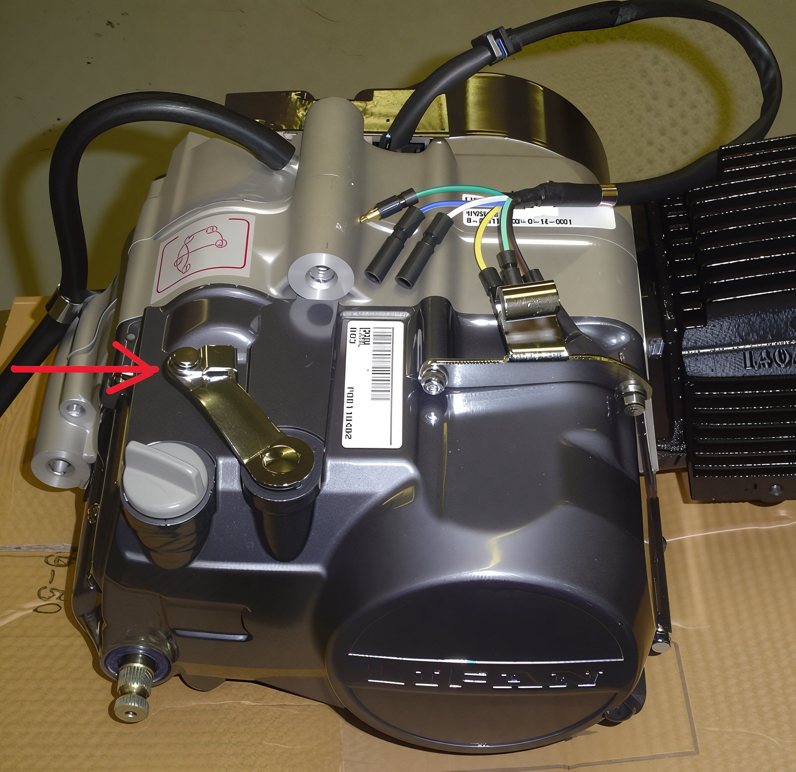

---
tags:
- engine
- controls
- clutch
---

# Adjusting Rear Clutch Cable & Resolving Clutch Disengagement Issues

**Clutch Installation and Adjustment Guide**

## Important Notice

Since 2004, we have never encountered an engine delivery where the clutch was non-functional. It is imperative that before proceeding with any adjustments, the engine must be installed with the drive chain properly fitted and adjusted, and the clutch cable securely attached. Never attempt to operate the clutch with the engine on a bench or with any cable other than the appropriate one.

## Understanding Clutch Free Play

Once the clutch is adjusted, it is essential to ensure there is free play at the lever.

## Installing the Rear Clutch Cable

### At the Engine:

1. Remove one nut and let it rest on the inner cable.
2. Move the other nut all the way up the adjuster towards the black outer cable and attach the cable end to the arm.
3. Slide the inner cable through the slot in the bracket and begin threading the second nut onto the cable.

### At the Clutch Lever:

1. Run the adjuster all the way in and align the slot.
2. Attach the cable end into the adjuster and slide it into the slot.

If this proves challenging, unfasten the pivot bolt, attach the cable end into the adjuster, slide it into the slot, and then refasten the pivot bolt.

## Adjusting the Rear Clutch Cable

Ensure you have the correct type of clutch cable and that it is adjusted properly. Push the arm (indicated by the red arrow) until it surpasses the mild spring tension and reaches the hard spot. Begin adjustment at this hard spot. Take up almost all the slack in the adjusters, leaving only a minimal amount of free play at the handle.

Once the cable is attached to the clutch arm on the engine, remove the clutch lever from the perch. Thread in the adjuster and lockring completely on the perch, align the opening for the inner cable, insert the cable barrel into the lever, place the outer cable into the adjuster on the perch, and maneuver the lever into place in the perch. Install the lever mounting bolt and nut to secure it. Squeeze the clutch lever 5-6 times, release it, and then slowly pull it in until you feel it just starting to engage the cable. Adjust any space more than the thickness of a nickel between the lever and perch seat by turning the adjuster out as needed.

## Rare Adjustments

In exceptional cases, the following steps may be necessary:

1. Drain the motor oil.
2. Remove the clutch cover.
3. Inspect the engine interior; ensure the small round button at the center is positioned in the notch for proper function.
4. Cock the lever arm back until the button is set in the notch.
5. Replace the cover.
6. The process is complete. Enjoy your ride!
7. If the clutch remains stuck, disassemble the clutch and oil the plates. This condition can occur in any motorcycle engine that has been inactive for an extended period.

