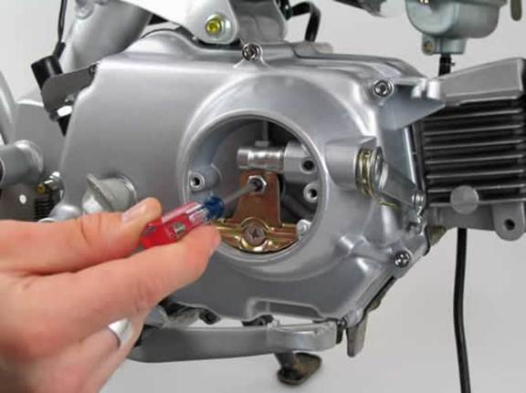

---
tags:
- engine
- clutch
---

# Adjusting the Front Manual Clutch on a Pit Bike

Loosen the locknut on the clutch adjuster screw. Proceed to tighten the screw until there is minimal to no play in the clutch actuator plate. Attach the provided clutch cable to the clutch arm and guide the cable up to the clutch lever. Ensure that there is a slight amount of play at the clutch lever. If this is not the case, loosen the clutch adjuster locknut and readjust the clutch adjuster screw.

