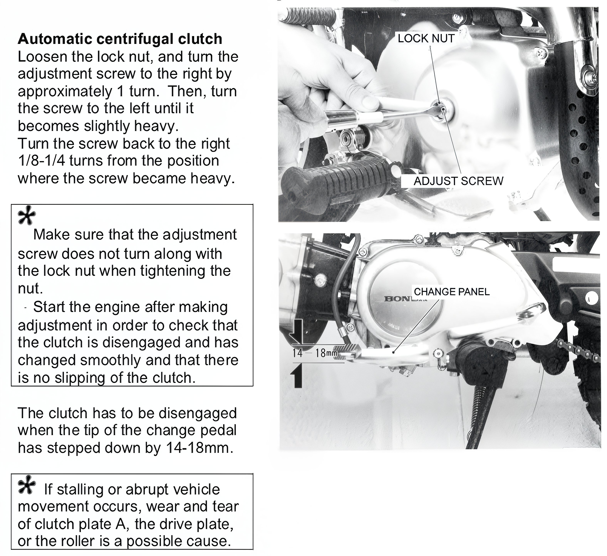

---
tags:
- engine
- clutch
---

# Adjusting the Semi-Automatic Clutch on a Pit Bike

1. Loosen the lock nut and turn the adjustment screw to the right by approximately 1 turn. Then, turn the screw to the left until it becomes slightly heavy. Turn the screw back to the right 1/8-1/4 turns from the position where the screw became heavy.
2. Make sure that the adjustment screw does not turn along with the lock nut when tightening the nut.
3. Start the engine after making the adjustment to check that the clutch is disengaged and has changed smoothly, and that there is no slipping of the clutch.
4. The clutch has to be disengaged when the tip of the change pedal has stepped down by 14-18mm.
5. If stalling or abrupt vehicle movement occurs, wear and tear of clutch plate A, the drive plate, or the roller is a possible cause.

