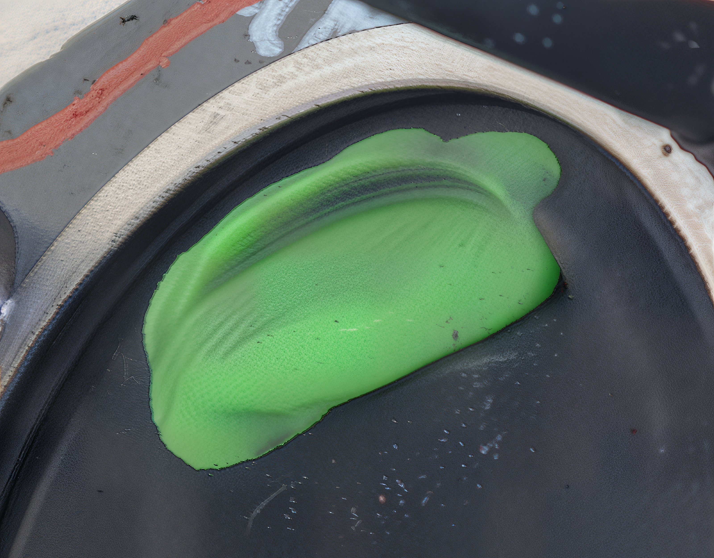
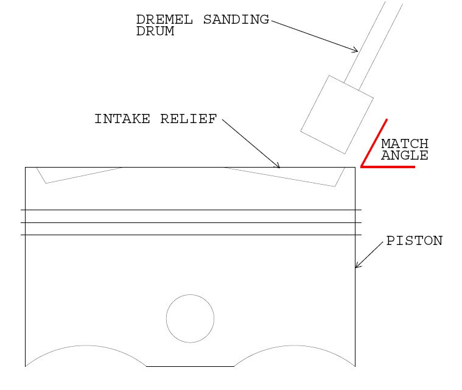

---
tags:
- piston
---

# Checking Valve-to-Piston Clearance

**Exercise extreme caution and patience. This is not a detailed instruction manual but rather a concise overview of how an advanced engine build can be executed.**

Over the years, with the development of various components and engines, you may encounter the necessity to verify the valve-to-piston clearance. It might be essential to create additional relief in a piston to ensure the valves have sufficient clearance to function correctly, thereby eliminating any risk of contact and subsequent damage. "Claying" the engine involves using a small amount of oil-based modeling clay within the engine to ascertain the valve-to-piston clearance.

Begin by checking the piston-to-combustion chamber clearance to ensure the piston does not make contact with the head.

Most aftermarket kits are tested in this manner and perform adequately on specific engines. However, when we exceed these parameters, a clay test becomes necessary. A minimum clearance of 1/8 inch or 3.175 mm is required. One effective method to increase clearance is by employing a thicker head gasket. Additionally, some may opt to machine small amounts of metal from the piston top, as illustrated below.

The image above depicts a very thin layer of clay after the engine was assembled and rotated several times. This thickness is insufficient, and further valve relief must be incorporated into the piston.

