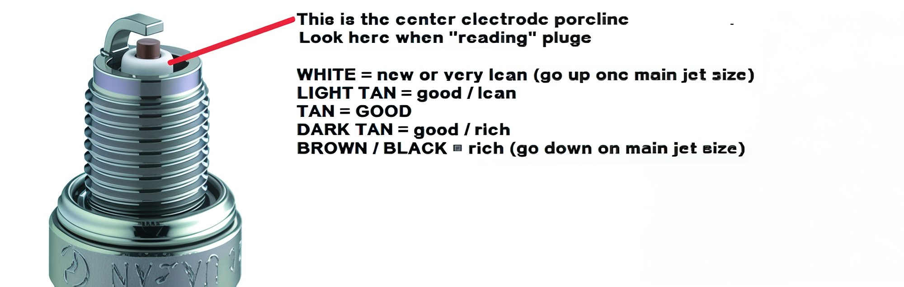

---
tags:
- carb
- engine
---

import YouTubeEmbed from '@site/src/components/YouTubeEmbed';

# Carburetor tuning for pit bikes

## Basics

Checking if the carburetor of your pit bike is correctly tuned can be easily determined by examining the spark plug color. Remove the spark plug and observe the color:

1. Brick color – the mixture is correct
2. Whitish – the mixture is lean
3. Black and sooty – the mixture is rich

Furthermore, the mixture quality can also be assessed by the sound and throttle response. If you hear popping sounds when off-throttle – **the mixture is lean**. When accelerating sharply, if the engine seems to sputter and lacks proper pickup – **the mixture is too rich**. Additionally, a lean mixture can cause the engine to overheat and the exhaust pipe to glow **red-hot**.

Once the mixture quality is identified, start adjusting the carburetor. In practice, this involves raising or lowering the needle by one or two notches, taking a test ride, and if there's an immediate difference, continue adjusting until the desired result is achieved. Remember the choke. Carburetor tuning must be done **on a warmed-up engine with the choke off.** If no immediate difference is perceived, ride longer and assess the results based on the spark plug color. If adjusting the needle doesn't work, return the clip to the default middle position and select the appropriate jets.

A set of jets in different sizes should accompany the carburetor. Jets have two sizes: the first being the thread diameter (m5, m6, etc.), and the second the jet’s flow rate in cm3/min (numbers engraved on the jet). To change or check the jet size, remove the carburetor from the pit bike, **drain all the gasoline**, and open the float chamber by unscrewing two bolts. The jet appears like a bolt with a flat screwdriver slot and a central hole.

If **the mixture is lean** (white spark plug, red pipe, overheating engine) – raise the needle, and if that doesn't help, increase the jet size (higher numbers).

If **the mixture is rich** (black spark plug, engine bogs when throttling rapidly) – lower the needle, and if that doesn't help, decrease the jet size (lower numbers).

Once the mixture is tuned, there will be another screw with a spring on the carburetor to adjust **idle speed.** If the pit bike stalls when the throttle is released, the idle speed is too low – turn the screw clockwise (tighten). If the pit bike roars while on the stand – turn the screw counterclockwise.

Ideally, perform these adjustments on a warmed-up and running engine to determine adequacy immediately. Sometimes no adjustment seems effective, possibly due to dirt and sand entering the carburetor. In such cases, cleaning and blowing through all channels in the carburetor will help. In summary, tuning requires patience and time. While some professional skill can expedite the identification of poor mixture issues and carburetor tuning on a pit bike, it is manageable even without experience. However, in more complicated cases, **it's best to call an expert.**

**Mikuni Carburetor Reassembly for Pit Bikes**

<YouTubeEmbed videoId="V7BkXAml2AA" />

## Step-by-step guide

**An Ultra-Concise Course on Carburetor Tuning for Pit Bikes.**

01. Remove the carburetor and filter
02. Disassemble the carburetor piece by piece, wash all parts in gasoline, and blow through all openings with a compressor.
03. Reassemble the carburetor in reverse order in surgical cleanliness. Turn the mixture screw two turns out, and almost fully tighten the idle screw. Position the needle in the middle.
04. Clean the filter with a special agent, Fairy, or if it's just foam (from the filter box), soak it in gasoline.
05. Dry the filter and thoroughly oil it with special oil, let it soak, and gently squeeze out excess oil.
06. Reassemble everything back onto the pit bike.
07. Install a new, clean spark plug.
08. Check the fuel hose and filter (if installed). Ensure there are no kinks or pinches, as the filter should allow free airflow without resistance.
09. Make sure there's fuel in the tank.
10. After these procedures, find a deserted straight road. Start the pit bike. Warm it up. Lower the idle with the idle screw to stable levels. Ride full throttle on a straight road actively for about 5-10 minutes. Turn off the engine at full throttle.
11. Remove the spark plug and observe the insulator

    - **If it's ashen white** – the mixture is too lean.
    - **If it's pale with a brownish hue** – the mixture is slightly lean.
    - **If it’s coffee with milk or brick-colored** – the mixture is just right!
    - **If it's darker** (coffee with a small amount of milk ;) ) – the mixture is slightly rich.
    - **If it's dark brown or black** – the mixture is too rich.
    - If the spark plug observations are unclear, continue riding full throttle for another 5-10 minutes.

### Jet

Based on the spark plug color, change the jet.

- **If it’s rich** – reduce the jet size by two steps.
- **If it’s lean** – increase the jet size by two steps.
- If you’re close to the mark, change the jet within a range of +/- 1.

After each change, ride back and forth at full throttle, then check the spark plug. Shut down the engine without releasing the throttle. **The process can be tedious and lengthy.** Upon achieving the desired color (coffee with milk), proceed to adjust the idle mixture quality. A correctly chosen jet can also be determined by the following symptoms:

- If the engine seems to hang at high RPMs for a few seconds after quick throttle blips, then slowly returns to idle, this indicates a lean mixture.
- If after a quick throttle blip, the RPMs drop and nearly stall the engine before recovering to idle, this indicates a rich mixture.

With a properly tuned mixture, releasing the throttle should result in the engine dropping to idle within a second and maintaining stability.

### Quality Screw

The quality screw regulates the fuel mixture.

- **Tightening** – leans the mixture.
- **Loosening** – enriches the mixture.

Remember, the screw is currently set out to two turns. Begin slowly tightening it, listening to the engine's operation. *It's crucial not to increase the idle RPMs excessively; otherwise, the adjustment won't be discernible. Idle should be such that the engine runs stably but would stall if decreased.*

- Tighten the quality screw while listening to the engine and counting turns. Stop as soon as the RPMs begin to drop. Memorize the position and fully tighten while counting turns. **We now have one boundary value (e.g., at 1.5 turns from the stop, engine RPMs began to decline).**
- Now, turn the screw in the opposite direction (loosen) while counting screwdriver turns. Initially, RPMs should rise as we enrich the mixture, then fall again when the mixture becomes too rich. Note the quality screw turns when the RPMs begin to fall. **We now have the second boundary value (e.g., at 4 turns from the stop, engine RPMs began to decline).**

**Set the midpoint between these two boundary points.** If planning to ride in the city, in the heat, with frequent stops, consider leaning the adjustment towards a richer mixture. **If you’re too lazy to adjust and count.** Tighten the quality screw to where the engine still runs stably but is close to stalling. Slowly start loosening the screw. As the screw adjustment ceases affecting RPMs, stop turning. There you go. The idle mixture is set.

### Needle

Move on to adjusting the needle position. Ride the pit bike, observing its behavior. Raise the needle by two notches (set the clip in the lower groove), enriching the mixture. Ride it, watch the pit bike's behavior. Then lower the needle to the bottom (set the clip in the upper groove), leaning the mixture. Ride again. Adjust the needle position based on personal perception. No stalling should be felt during acceleration. **If after adjustment the needle finds itself at extreme positions** – the main jet might have been chosen incorrectly.

**For 26-27mm carburetors, the approximate range is 102 - 110 jets.**
