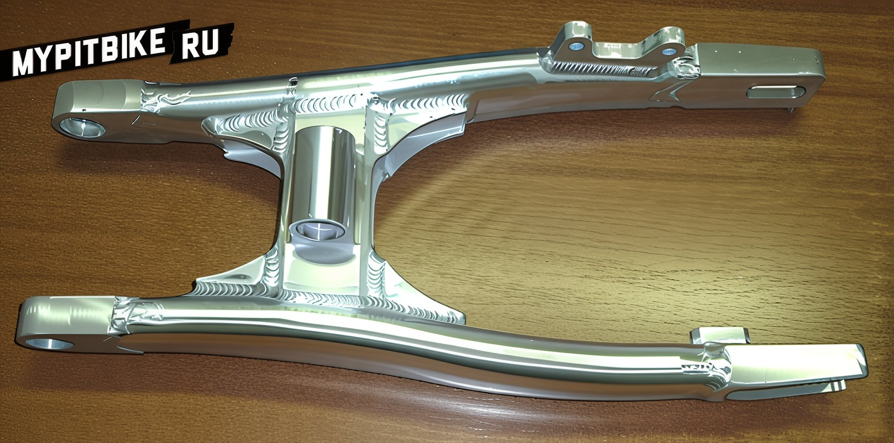
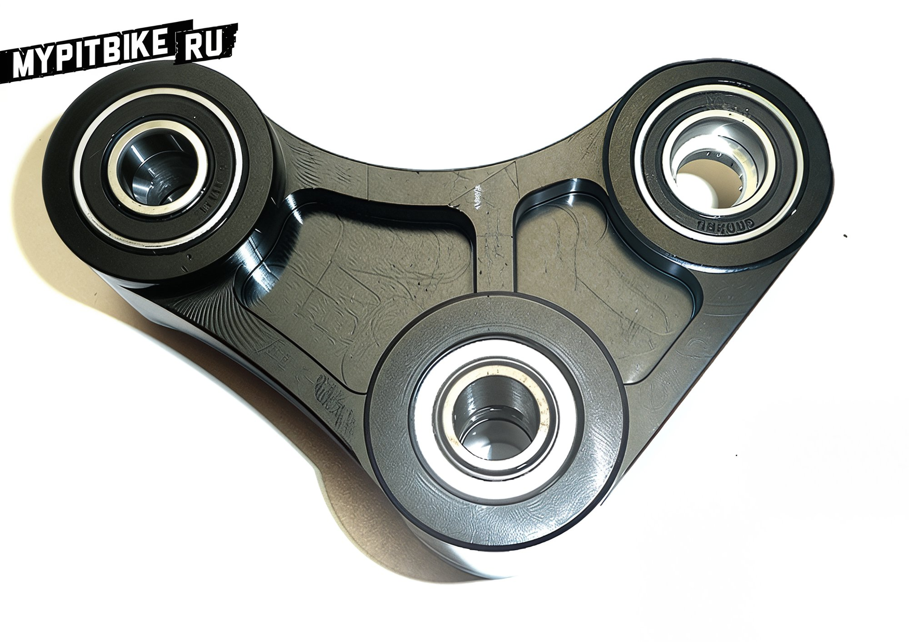
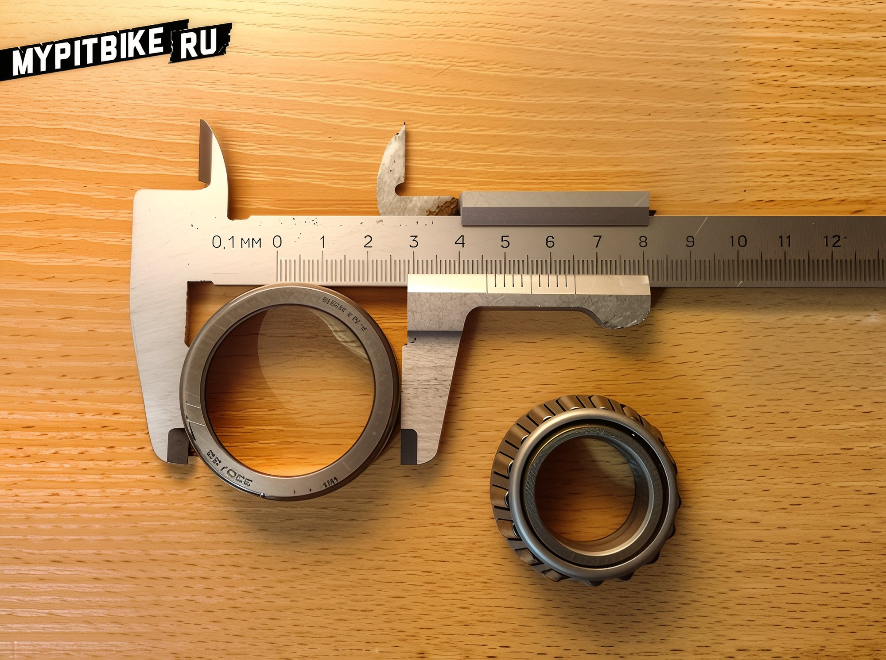
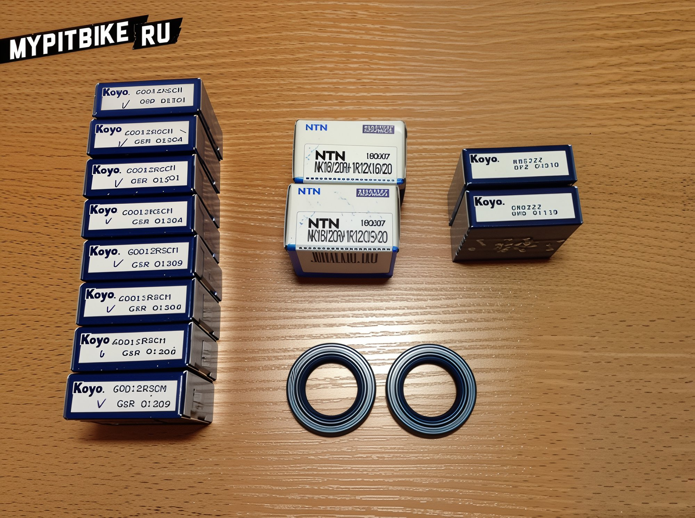

---
tags:
- chassis
---

# Dimensions and Markings of Bearings on the PitsterPro LXR

With the conclusion of the season, a decision was made to undertake a scheduled rebuild of the club's pit bike, as it was purchased second-hand, used in dusty conditions, and washed with high-pressure washers, which leads to the rapid deterioration of the bearings. This article will cover the dimensions of the bearings, recommended brands, where to purchase them, and how to properly reassemble everything.

Let's begin by noting that all mass-produced pit bikes, even those from renowned brands, are equipped with Chinese bearings from the factory. These bearings function adequately for a season or two, after which they gradually start to seize and fail. The primary reason is the near-total absence of lubrication inside the bearing.

The second most significant factor is the adherence to the correct torque of connections and the overall quality of the pressing and assembly of the pit bike.

In the early stages, the problem can be resolved in a simple and cost-effective manner: Purchase high-quality bearing grease. Carefully pry open the bearing's protective cover with a thin tool. Generously pack it with grease. Close it back and remove any excess.

The expensive and proper method: Purchase branded Japanese bearings. Repress them. Lubricate all axles. Assemble while observing the torque.

Here we arrive at the most crucial question: what are the bearing markings and how many should be purchased?

#### Wheels

- Ball bearing for the wheel hub of a pit bike with a 15 mm axle - **6202RS** (2 per wheel)
- The rear wheel hubs often have 3 bearings - two on the driven sprocket side.
- Manufacturers: all well-known companies, including domestic ones.
- Where to buy: a common size, available in auto parts stores, used in VAZ car generators.

#### Swingarm

- Original ball bearing in the swingarm - **6001RS** (6 pcs)
- Suitable bearing - **6001-2RS** (6 pcs)
- The swingarm has three mounting points, each with a pair of bearings and a sleeve between them.
- Manufacturers: SKF, NTN, Koyo, etc.
- Where to buy: in specialized bearing stores, usually in stock.

#### Progression Link

- Original ball bearing for the frame mounting point - **6001RS** (2 pcs)
- Suitable bearing - **6001-2RS** (2 pcs)
- Manufacturers: SKF, NTN, Koyo, etc.
- Where to buy: in specialized bearing stores, usually in stock.

- Needle bearing for the swingarm mounting point through links - **NK16/20R+1R12X16X20** (2 pcs)

According to bearing manufacturer catalogs, it consists of several parts: an outer race and an inner sleeve.
- Manufacturers: SKF, NTN.
- Where to buy: in specialized bearing stores.

- Seal covering the bearing for the swingarm mounting point - **22x35x5** (2 pcs)

- Original ball bearing for the lower shock absorber mounting point - **6902RS** (2 pcs)
- Suitable bearing - **6902ZZ** (2 pcs)
- Manufacturers: SKF, Koyo.
- Where to buy: in specialized bearing stores.

#### Triple Clamp (Steering Column)

- Original upper tapered bearing - **330/22** (1 pc)
    - Dimensions: Outer diameter - 46mm; Inner diameter - 22mm, Height - 15mm.

- Original lower tapered bearing - **330/23.5** (1 pc)
    - Dimensions: Outer diameter - 46mm; Inner diameter - 23.5mm, Height - 15mm.

These are the most problematic bearings due to their non-standard size, not matching any catalog's exact dimensions. Sold only as a pair.
- Manufacturer: Uncle Liao's Chinese factory.
- Where to buy: eBay ([example](http://www.ebay.com/sch/i.html?_odkw=TAPERED%20BEARING%20330%2F22&_osacat=0&_from=R40&_trksid=p2045573.m570.l1313&_nkw=TAPERED%20BEARING%20330%2F22%20330%2F23%2C5&_sacat=0)).

All bearings of "standard" sizes were purchased from Podshipnik.ru, where their specialist helped select everything according to catalogs, offering only original products without counterfeits, leaving a very pleasant impression.

We bought high-quality Japanese bearings from **Koyo** and **NTN**. The team at Moto50 handled the repressing, doing everything neatly and efficiently. The most challenging was the lower triple clamp bearing, which was tightly pressed onto the axle and inaccessible with any puller.

High-quality imported bearings come pre-packed with grease from the factory, whereas Chinese ones need to be lubricated manually - we used thick grease for wheel bearings, such as **Motul** blue or **Castrol** green. Additionally, during assembly, it is advisable to grease all axles and bolts used in the connections.

