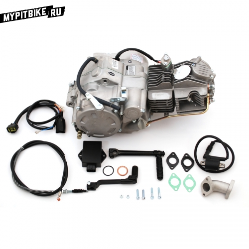

---
tags:
- engine
---
import YouTubeEmbed from '@site/src/components/YouTubeEmbed';

# Disassembling and assembling a pit bike engine

Sooner or later, our **engine will meet its end**. Whether it's a broken gear tooth, a disintegrated piston, or a worn-out kickstarter ratchet, you'll find yourself placing the pit bike on a stand, removing the engine, and figuring out the issue. In such cases, mechanics often say, "the engine is in a state of disarray."

Overall, repairing the engine yourself is not particularly difficult, provided you have ample time, tools, and a **set of pullers** for the clutch nut and generator. However, a significant challenge arises - the lack of spare parts. As an option, you can try to find interchangeable parts from Chinese moped engines (in respective stores) or order a specific part for your engine online. The second option is to purchase a **complete engine**. This is simpler but several times more expensive. We are not looking for easy solutions. So, before rushing to find spare parts, it's necessary to determine what exactly is broken, and for that, disassemble the engine. Describing it in words would be too verbose. Here's a video for you!

#### Disassembling the Pit Bike Engine

<YouTubeEmbed videoId="e0FM3hBy3rM" />

Try to either loosely attach all screws, bolts, and retaining rings from where you removed them or carefully place them in a box to avoid later confusion about which bolt goes where and why there are leftover parts after assembly! Disassembled? Found the malfunction. Let's search for spare parts. Then proceed to assembly.

#### Assembling the Pit Bike Engine

<YouTubeEmbed videoId="xo0k6fUHTC0" />

<YouTubeEmbed videoId="WyaYSz7yITw" />

And that's essentially it. Install the engine on the pit bike, fill it with oil, and go for a test ride.
