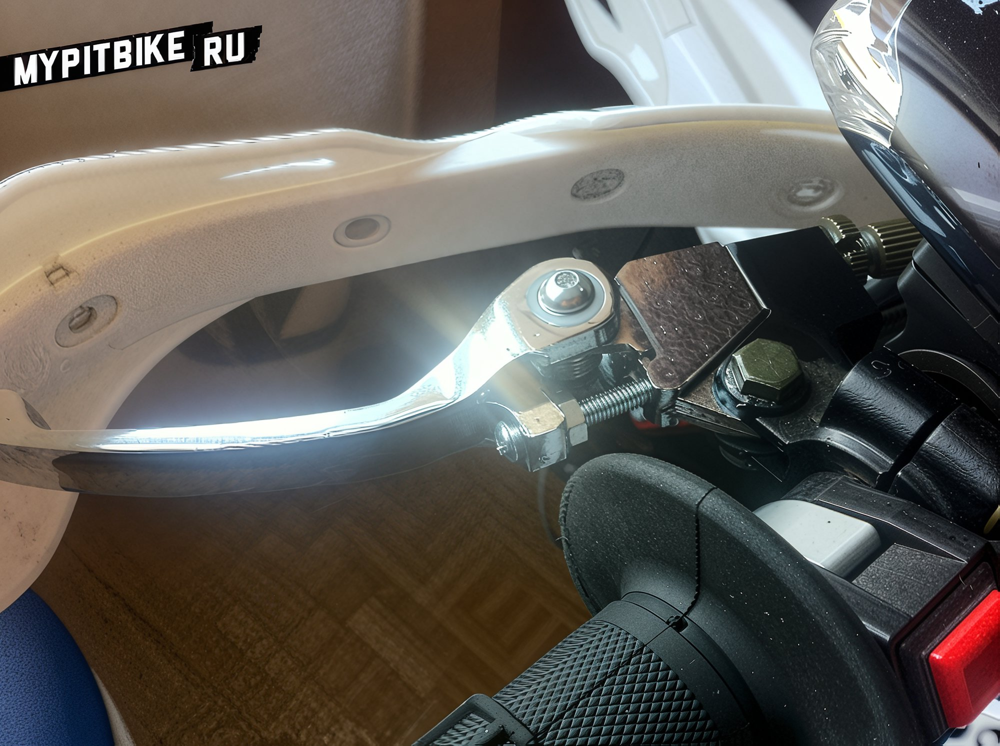

---
tags:
- controls
---

# Eliminating clutch lever play

The situation has become quite exasperating. At idle, the bike shakes, and when the clutch is engaged, it wobbles erratically. The solution is straightforward.

One must fabricate a washer of the appropriate thickness and place it between the lever and its mounting ears.

**A metal washer is unsuitable** as it would wear down the silumin lever mount; a plastic one is required.

1. Take an 18mm diameter trim clip (possibly from a Niva), and snip off the clips with pliers, leaving only the head.

2. Use an 8mm drill bit, secure the clip head, and drill a hole precisely in the center. Trim any burrs.

3. Next, take coarse sandpaper (around 200 grit) and, using circular motions, sand the washer to the desired thickness, periodically checking it against the fitting location.

Once the desired thickness is achieved, insert the washer between the lever and the lower mounting ear (from below), apply grease, and secure with a bolt. You may need to adjust the tightening force to avoid the lever binding in the mount. For added security, apply a drop of Loctite to the nut. Subsequently, it would be prudent to check the clutch cable tension.

**The free play of the lever should be around 1-2mm.** The entire process takes about 10 minutes. However, the clutch now feels significantly smoother.
