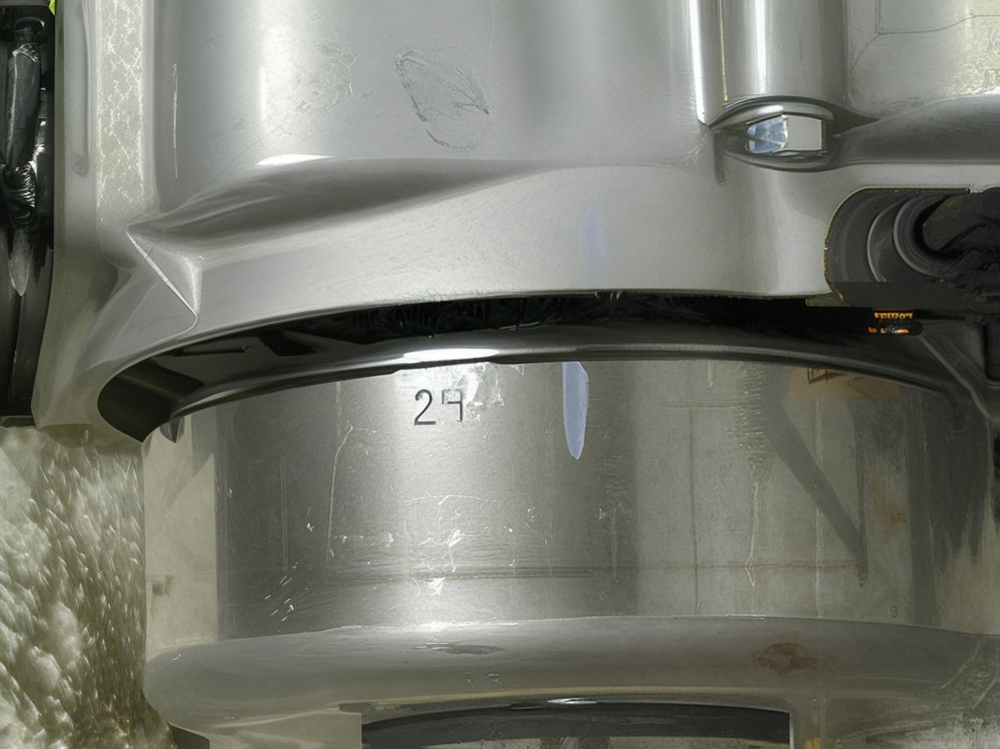
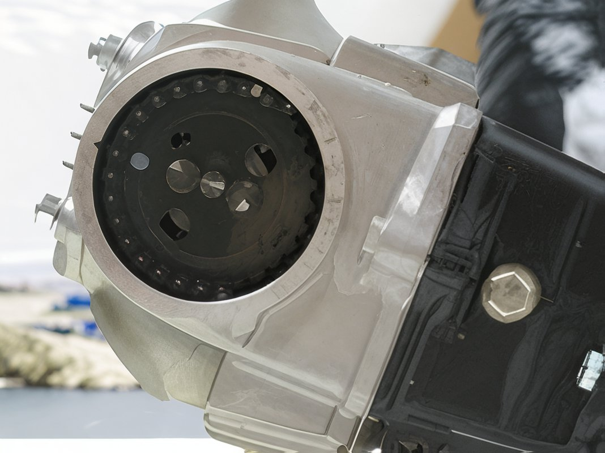
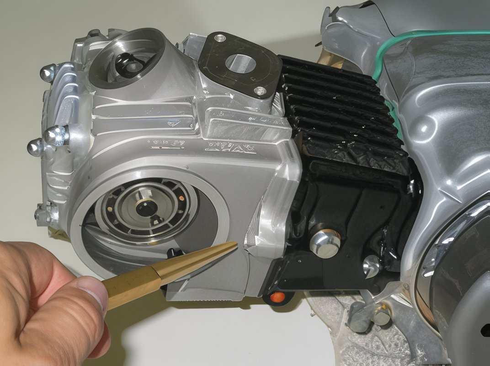
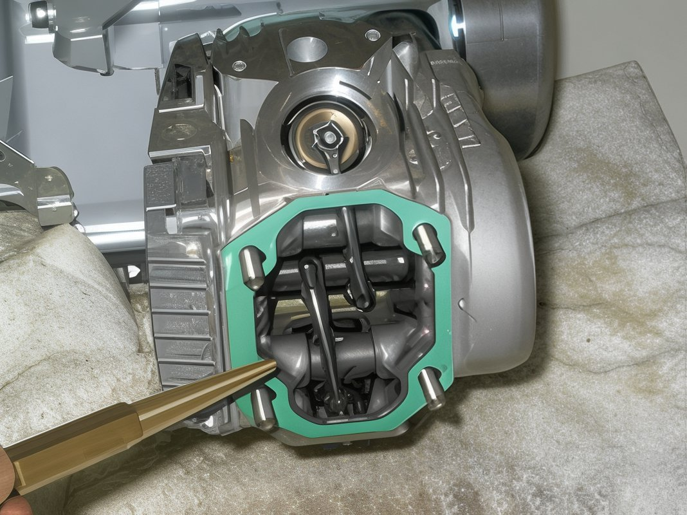
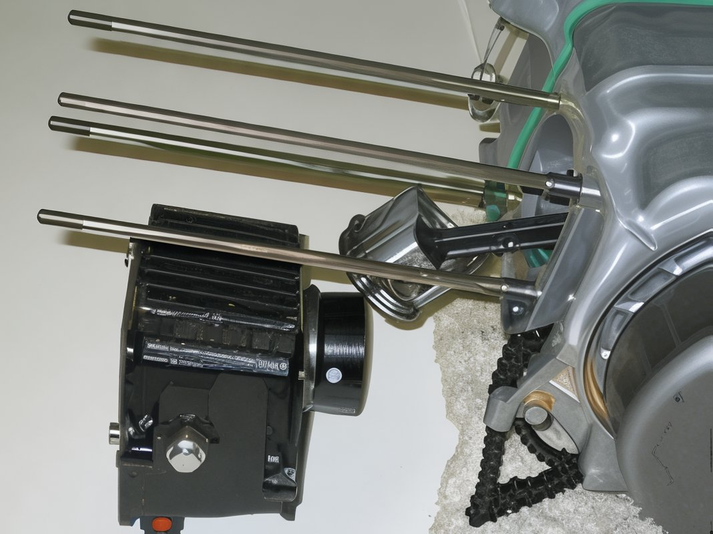
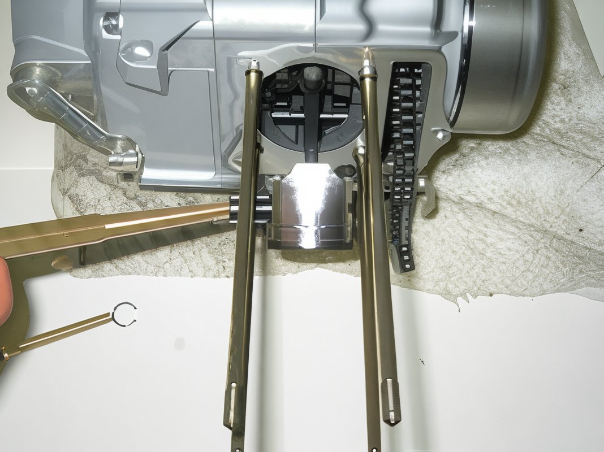
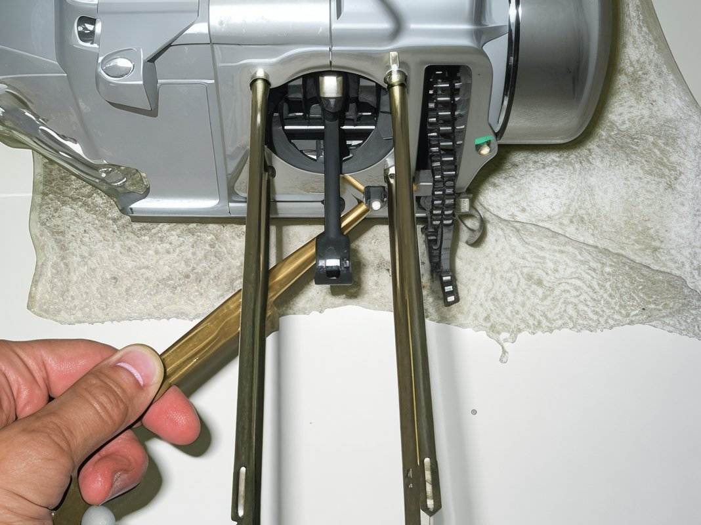

---
tags:
- engine
---

# Engine Disassembly Guide

## Introduction

To install a big bore kit, it is essential to disassemble the top end of the engine. Note that this procedure can be performed with the engine still mounted in the frame. The engine depicted in these images was removed solely for photographic purposes. Begin the disassembly by removing the following components:

1. Turn the fuel lever to the off position.
2. Detach the front fender using 10mm bolts.
3. Remove the manifold, carburetor, and air cleaner assembly with 8mm bolts.
4. Detach the exhaust system using 10mm and 12mm bolts.
5. Remove the spark plug.
6. Detach the shifter using a 10mm tool.
7. Remove the cam cover and extract the cam cover bolt with a 10mm bolt.

1. Detach the left side engine cover.

1. Remove the intake and exhaust tappet covers using a 17mm tool.

At this juncture, you are prepared to commence the disassembly of the top end. Proceed with caution and follow these steps:

1. Detach the cam gear. Ensure the "o" stamped on the cam gear is aligned at the 9:00 position while the "T" mark on the flywheel is at the 12:00 position. Once aligned, hold the flywheel steady and use an 8mm socket to remove the cam gear.

 

2. Remove the cylinder head side bolt with a 10mm wrench.

3. Detach the four cylinder head cover bolts using a 10mm tool. Note the position of the copper washer and headless nut.

4. Remove the cylinder head cover.

5. Detach the cylinder head.

6. Remove the cylinder side bolt using a 10mm tool.

7. Detach the cam chain roller bolt and the black cam chain roller using a 10mm tool.

8. Remove the cylinder, taking note of the knock pins' location.

 

9. Carefully extract the knock pins.
10. Insert a clean rag into the area behind the piston and the cam chain area.
11. Utilize a small flat screwdriver or a scribe to gently remove one of the c-clips located on either side of the piston. Carefully extract the c-clip and slide the wrist pin out of the piston.

12. Remove the piston.

13. Detach the lower o-ring and any residual gasket material. Ensure that no debris falls into the crankcase at any time.

Congratulations, the engine is now primed for reassembly.
