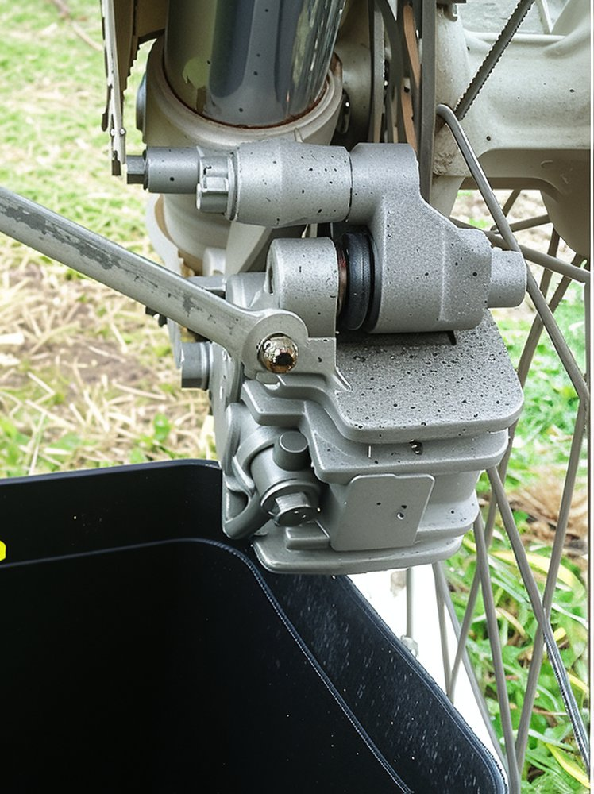

---
tags:
- brakes
---

# How to Bleed the Brakes on Your Dirt Bike

If you are unfamiliar with the process of bleeding brakes, this guide will simplify it for you. Replacing the brake fluid on your motorcycle is a straightforward yet crucial aspect of maintenance that should be performed regularly.

Over time, brake fluid absorbs moisture and air, which diminishes its effectiveness, leading to reduced braking performance. You can identify the need for bleeding your brakes by the 'spongy' sensation experienced when applying them. When functioning correctly, they should feel sharp and responsive.

- Ensure your motorcycle is clean, particularly around the brake fluid reservoir. It is essential to prevent any dirt from entering the lines. Remove the filler cap and replenish the reservoir with the recommended brake fluid, typically DOT 4 (this information is usually indicated on the cap).

* Locate the bleed nipple on your brake caliper. Remove the rubber cap and position an empty container beneath it to collect the old brake fluid.
* Pump the brake lever two or three times. Using an open-ended spanner, loosen the nipple while maintaining pressure on the lever. The old fluid will be expelled from the nipple, and the lever will become soft. Tighten the nipple before releasing the lever. Repeat this process until you observe the new fluid emerging.

  It is crucial to continuously top up the reservoir, ensuring no air enters the lines.
* Once the bleed nipple is tightened and the rubber cap is replaced, fill the reservoir to three-quarters full. Reinsert the rubber diaphragm and carefully secure the reservoir cap.

And there you have it! Bleeding brakes in four simple steps... a task any backyard mechanic can accomplish. The procedure is identical for the rear brake line.

**Here are a few additional tips to consider:**

* Apply WD-40 to the reservoir cap screws and allow it to penetrate. These screws can become tightly fastened over time due to vibrations, making them difficult to remove without stripping them—an exasperating experience!
* If the brakes still feel spongy or perform poorly, there may still be air in the lines. You might need to reverse bleed the lines using a syringe and rubber tube connected to the bleed nipple. Consulting with your local bike shop is advisable.
