---
tags:
- engine
- oil
---

# Maintaining the pit bike air filter

Hello everyone, we have gradually returned from our vacation and the scorching summer, ready to continue sharing our expertise in **maintaining our pit bikes**. Today, we will discuss and demonstrate a rather mundane procedure - the **cleaning and oiling of the air filter**, which, despite its simplicity, often leads to numerous issues and questions such as "the pit bike won't start" or "it's flooding," and so on. **What will you need?** (using a pit bike with a filter box as an example)

1. A ratchet with 10 and 8 mm sockets
2. A Phillips screwdriver
3. Rubber gloves
4. A plastic container
5. Gasoline or a special cleaning solution
6. Filter oil

Let's begin. Using the 10 mm socket, unscrew the two bolts securing the left plastic panel of the pit bike. 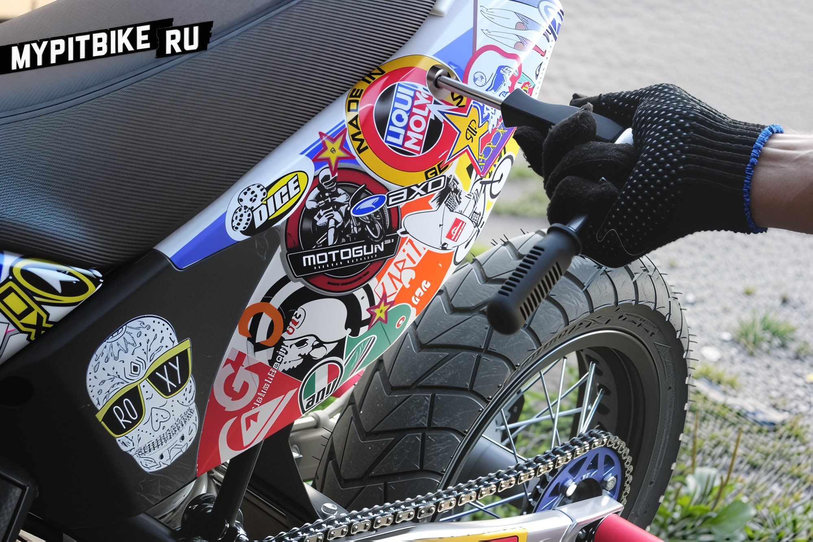 Remove the plastic.  Loosen the air duct clamp with a Phillips screwdriver.  Using the 8 mm socket, unscrew the two bolts securing the filter box under the seat. 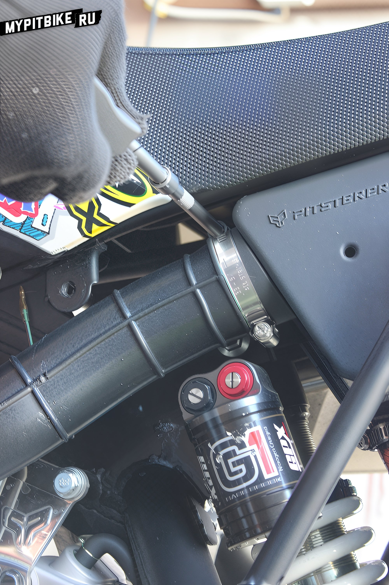 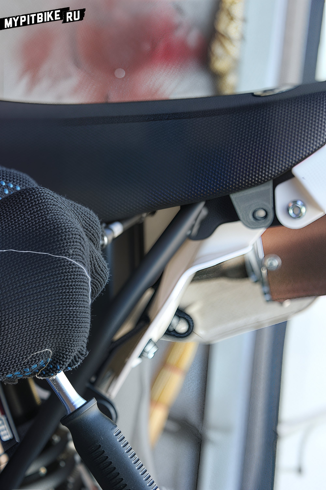 Carefully extract the filter box along with the duct from the pit bike frame. 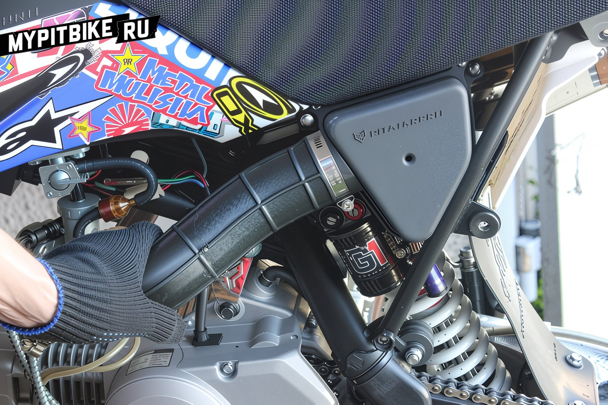 Unscrew the three bolts with a Phillips screwdriver. 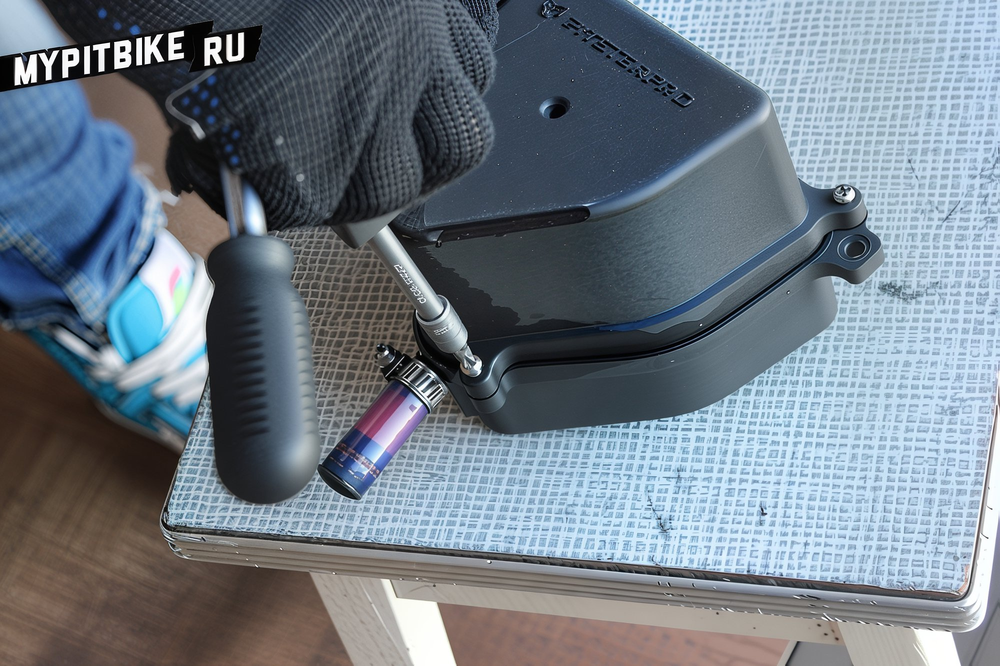 Disassemble, remove the metal mesh, and take out the foam filter. 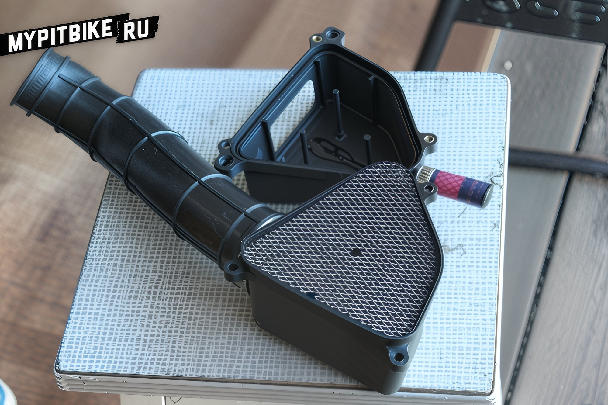 Take a plastic container, pour gasoline into it, and wash the foam, periodically squeezing out the dirt. 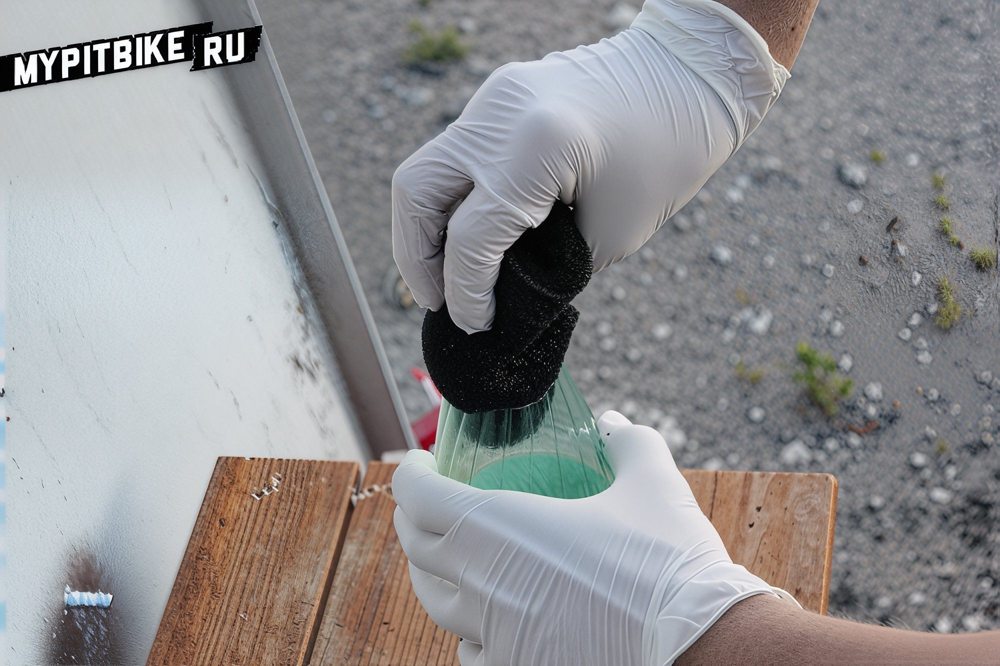 You can use a special air filter cleaning solution, such as the one included in the **K&amp;N Filter Care Service Kit**. 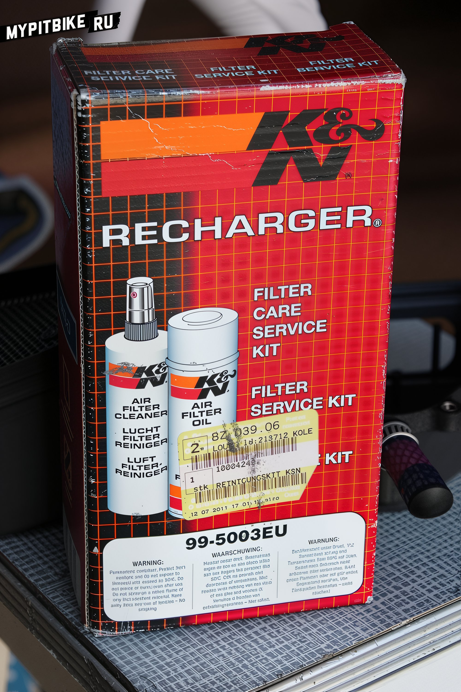 Air filter cleaning solution. 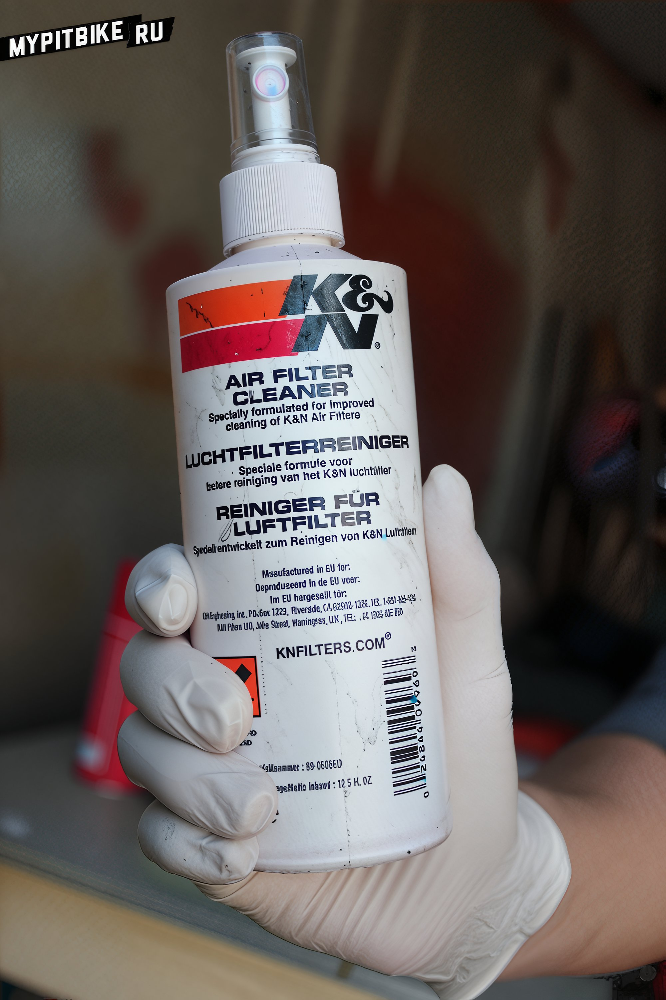  Once the filter is clean, thoroughly squeeze it out and allow it to dry completely. Take an air filter oil spray and evenly coat the filtering element. 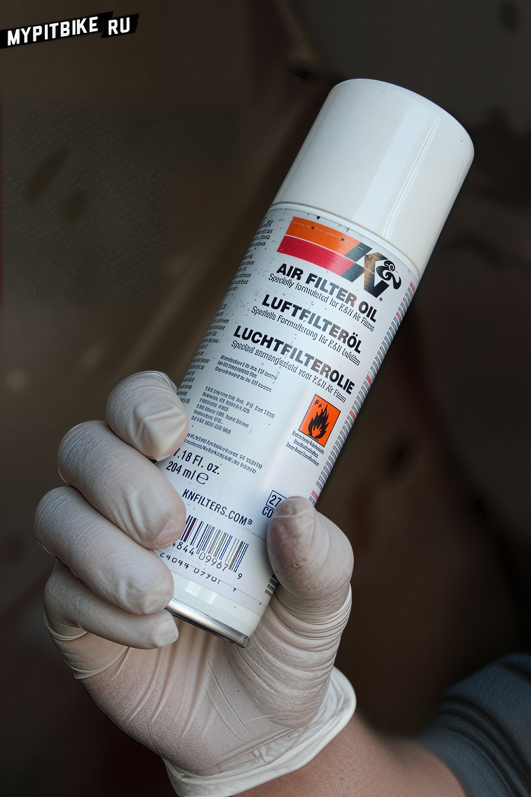 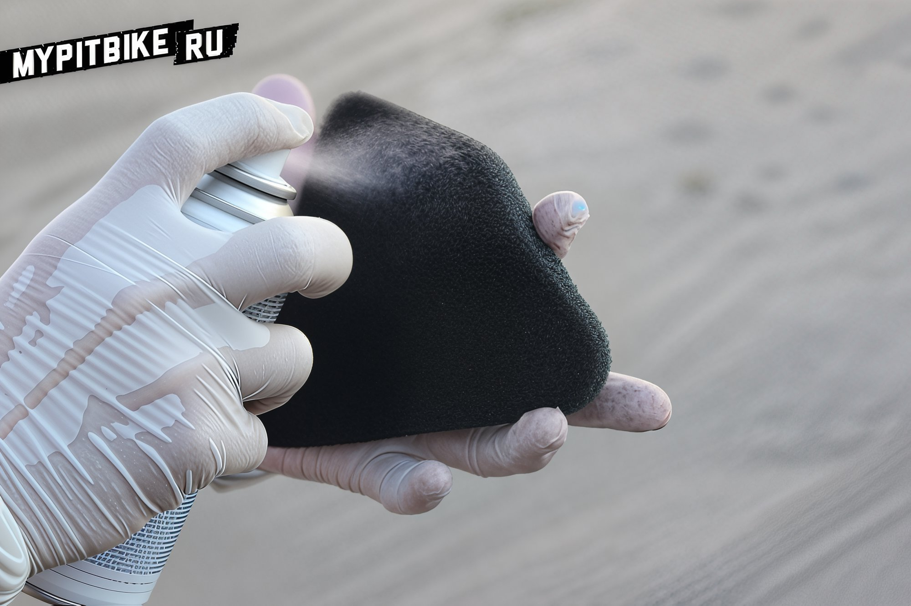 After oiling, squeeze out the excess oil, let it dry, and reassemble everything in reverse order. 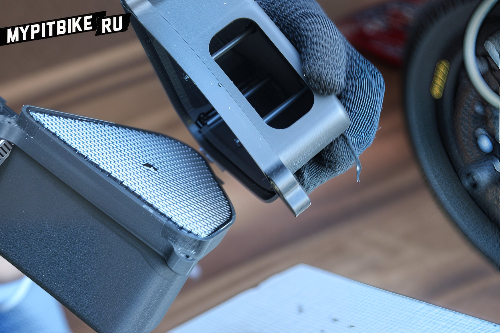 That's it, the filter is as good as new! After such a procedure, especially if the filter has never been oiled and was either freely breathable or clogged with dirt, the pit bike may react "strangely" to the throttle. If you haven't squeezed out enough excess oil, the engine may start with difficulty and constantly choke when the throttle is opened sharply. Just let it run for a while, the filter will "blow through" with the air stream, and the engine will start working as before. In particular cases, carburetor readjustment may be necessary, **initially monitor the mixture by the color of the spark plug**.
