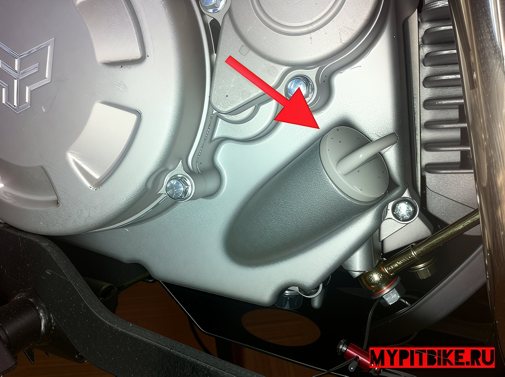
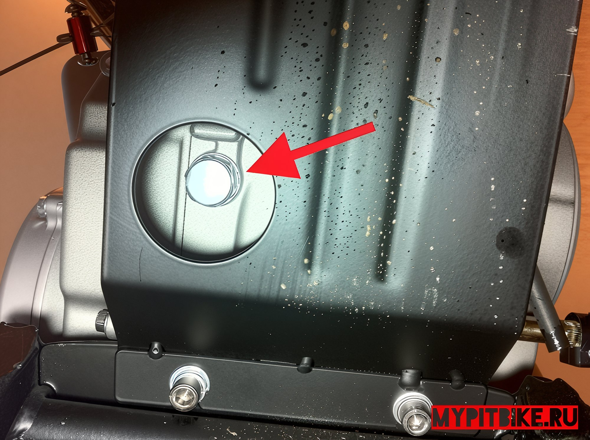
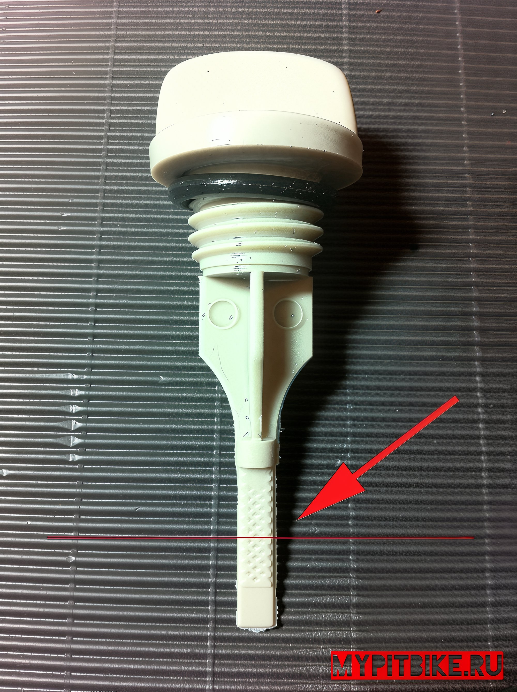

---
tags:
- engine
- oil
---

# Oil change

So, you've purchased a new pit bike and can't wait for the first start, or perhaps you have an old, well-used bike. There you stand, scratching your head, unsure of how to properly change the oil in the engine. Nowadays, it's crucial to change the oil on time because four-stroke engines are becoming increasingly powerful and high-performance.

Overfilling or underfilling the oil can equally negatively affect the engine's performance, so make sure you know the exact capacity for your engine. Opinions differ on whether to warm up the engine before draining the old oil or if it can be done cold. The main thing to remember is that if the engine was hot, the oil inside is also hot, so be extremely careful not to burn yourself when draining oil from a hot engine! First, you need to unscrew the dipstick, which also serves as the filler cap, to let in some air and facilitate the oil's exit through the drain hole.

Next, loosen the drain bolt at the bottom of the crankcase, visible through a special round hole in the metal crankcase guard, using a 17 mm open-end wrench.

Before completely unscrewing the drain plug, I advise placing a piece of cardboard or spreading old newspapers under the motorcycle to avoid staining the floor with used oil, as cleaning it later will be extremely difficult. Additionally, you'll need a container for the old oil, like an unused can or a 2-liter bottle with the top cut off. The container should hold up to one and a half liters.

Once everything is ready, unscrew the plug completely. At this point, be careful not to spill oil on yourself or drop the bolt or nut into the oil container. I prefer to leave the pit bike in this position overnight to ensure all the used oil drains into the container. However, if time is short, you can wait at least 15 minutes. To speed up the oil draining process, rock the motorcycle from side to side. Even when the oil stops flowing, tilting the motorcycle first to the left, then to the right, you'll see how much was still left inside.

Once the old oil is completely drained, screw the drain bolt back in with the nut. It's up to you to decide which oil to pour into the engine. Generally, synthetic oil is preferable for high-performance engines, while mineral oil is better for engines with high mileage, as it provides a thicker film and slightly restores compression.

The optimal choice for pit bike engines is semi-synthetic oil. You'll need an oil can with a capacity of at least 1 liter. The exact volume and type of oil required for the engine are best confirmed with the pit bike manufacturer. Typically, it is 900 ml. After pouring the required amount of oil into the engine, insert the dipstick with the cap back in, but do not tighten it. Ensure the motorcycle is on a level surface, without visible tilts to the side, and remove the cap with the dipstick. If the level is in the middle of the ribbed surface, everything is fine, and the oil level is correct.

Tighten the filler cap with the dipstick completely, and you're ready to hit the road. It's worth noting that after starting, the level will drop slightly, which is normal, as the oil is evenly distributed inside the crankcase.
