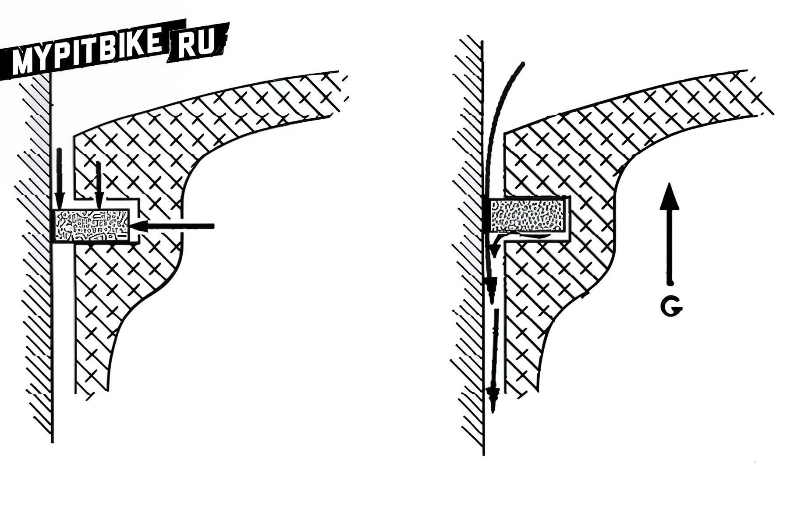
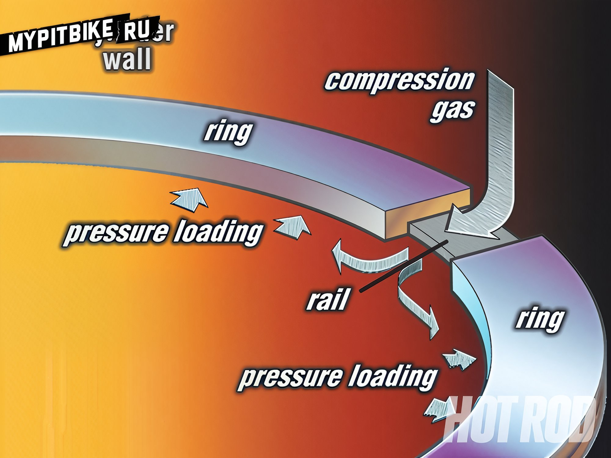
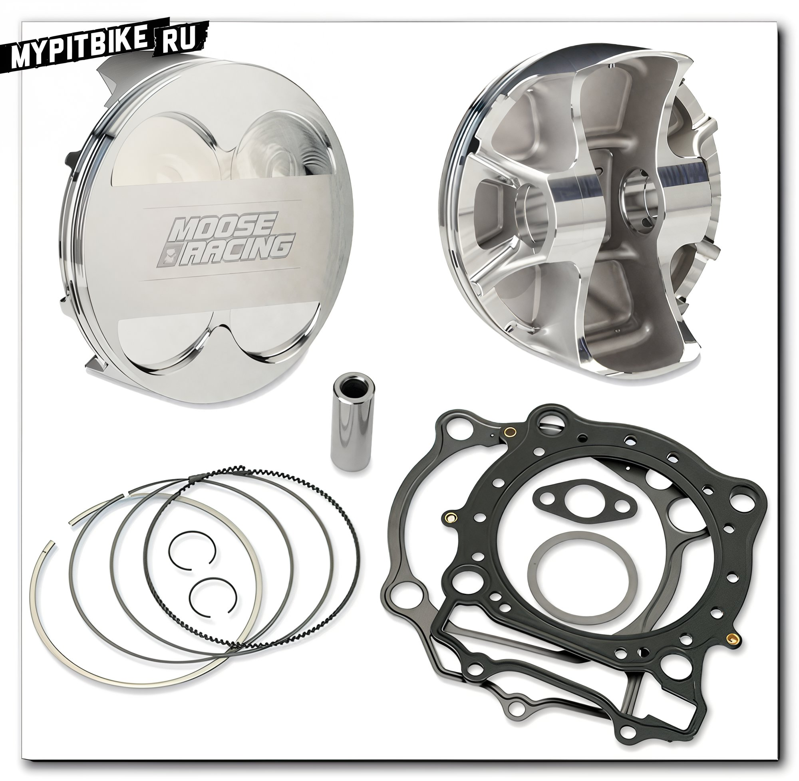
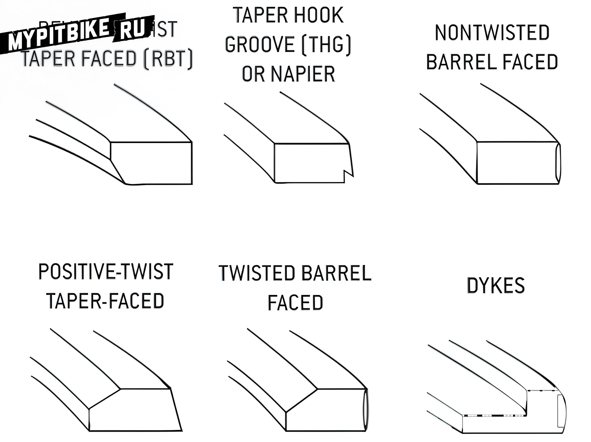
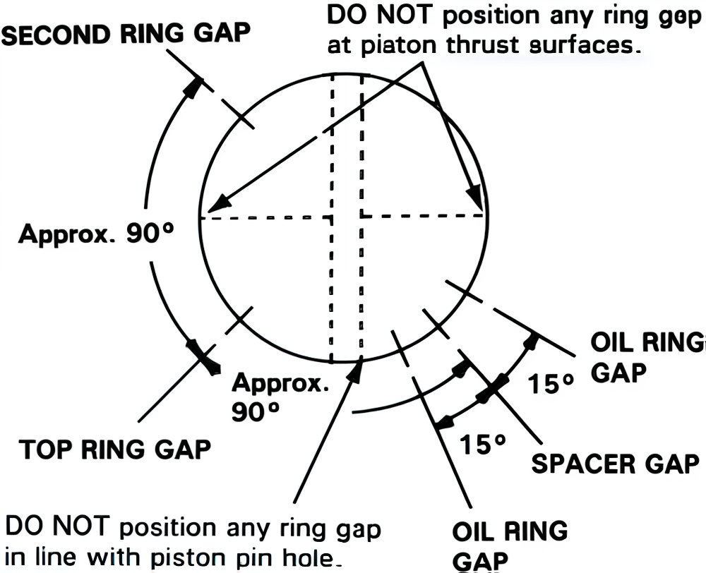

---
tags:
- engine
---

# Piston ring clearances

Measuring piston ring gaps is often a misunderstood and misleading aspect of their replacement process. It is crucial to identify the minimum and maximum ring gaps to ensure optimal results when installing a new set. The minimum ring gap must be considered to prevent the ends from butting as the ring expands when the engine reaches operating temperature.  

  

  

## Diagram of piston ring operation

Different thermal conditions and engine types require specific recommendations for thermal ring gaps:  

  

1. Urban, utility vehicles not subjected to high thermal stress (such as drag racing or nitrous oxide engines) generally have gaps with a coefficient of **0.0045 x Cylinder Diameter** for **single-ring** pistons (**two-stroke** engines), and **0.003 x CD** for the top ring / **0.0038 x CD** for the bottom ring for pistons with two rings (two-stroke engines).  
   This includes mopeds, mini motorcycles, scooters, road motorcycles, motocross bikes, ATVs, and jet skis operating on two-stroke engines.  
   For **four-stroke** engines, the recommended gap for the first ring is **0.004 x CD**, the second **0.005 x CD**, and oil rings (both) at least 0.015 x CD.  
   This also applies to utility motorcycles for cross-country, ATVs, and snowmobiles.

     

2. Racing, sports equipment, typically operating under increased thermal load, requires slightly larger minimum ring gaps than utility equipment:  
   Two-stroke - for one ring 0.005 x CD, for two 0.0045/0.0055 x CD  
   Four-stroke - Top ring 0.005 x CD, second ring 0.0055 mm x CD, and oil rings no less than 0.015 x CD  

For example: The cylinder diameter on a Yamaha Jog moped is 40 mm.  
The standard piston of this moped has two rings, so the first ring is 40 0.003, which means a recommended gap of 0.12 mm.  
The second ring is 40 0.0038, which means a recommended gap of 0.15 mm.

Example 2: The cylinder diameter on a Yamaha Tricker motorcycle is 74 mm.  
The recommended gap for the top ring is 74 0.004, and for the second ring 74 0.005.  
This means a gap of 0.29 mm for the first, 0.37 mm for the second, and 1.11 mm for the oil rings.  
Manufacturer's stated value: 0.19-0.31 minimum/maximum for the top ring, 0.30-0.45 minimum/maximum for the second ring.

  

## CD - cylinder diameter 

  

*Profile types.*

To measure the ring gaps, you will need a set of feeler gauges of the appropriate size and the working cylinder on which these rings were or will be installed.  
  

When using a non-new cylinder, measurements should be taken at the lowest part of the cylinder, as this part is not worn, which the rings are designed for. Measuring piston ring gaps in the worn part of the cylinder will show an increase in the gap directly proportional to the degree of wear. The illustration below demonstrates this.  

  

Illustrated is the effect of a worn cylinder's taper on piston ring gaps. If the cylinder is excessively worn, it should be bored.

Maximum piston ring gaps are a significant factor, indicating reduced compression, power loss, and critically weak oil control. This diagram shows the specifications for ring gaps outlined by SAE (Society of Automotive Engineers) as standards for piston ring manufacturers. An important fact to remember is that the manufacturer strictly adheres to these tolerances, and ring gaps are checked with sensors accurate to 0.0025 mm per CD. Any increase in cylinder diameter is used in the process, with anything beyond the designed size resulting in approximately 0.076 mm increase in ring gaps for every 0.025 mm increase in CD.

Manufacturers recommend a maximum of 0.076 mm wear per inch of CD, but not exceeding 0.30 mm in any case for successful and timely piston ring replacement. If the cylinder is worn beyond this, the diameter should be bored to accommodate larger rings of the corresponding size. Checking ring gaps can provide information about the approaching wear of the cylinder as well as help avoid errors when installing unsuitable rings.  

Rings should be installed in the correct order and position:  

  

Do not align the gaps with the piston rod and piston pin hole.  

  

Do not attempt to close the oil ring expander; its ends should fit freely.  

  

Unfortunately, different manufacturers have different recommendations for ring installation.  
How you install the rings is up to you.  

  

*Various types of piston ring ends.*  
