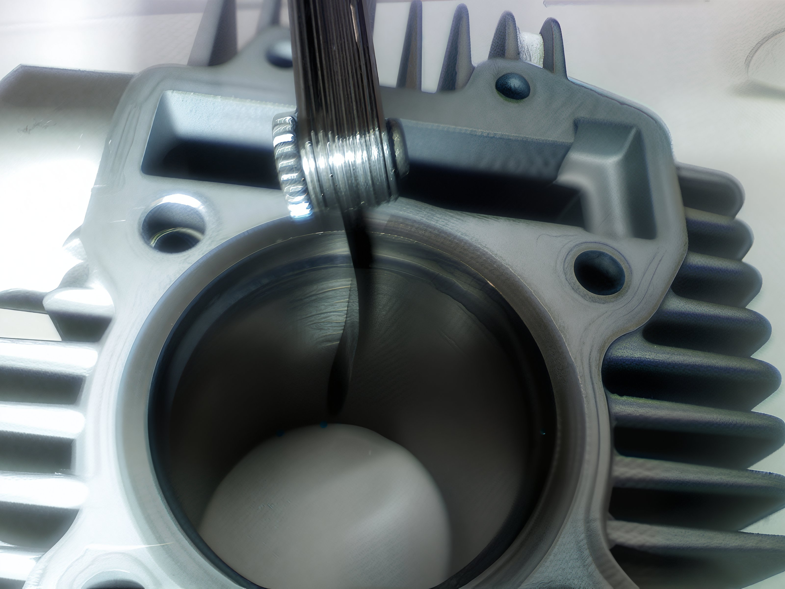

---
tags:
- engine
- piston
---

# Ensuring Proper Piston Ring End Gap

Ensuring the correct piston ring end gap is crucial to prevent potential engine damage. Although new rings are typically within specifications, it is prudent to verify their measurements.

## Procedure for Checking Ring End Gap

1. **Insert the Ring into the Cylinder**: Carefully place the ring inside the cylinder.
2. **Align the Ring**: Use the piston to square the ring within the bore.
3. **Measure the End Gap**: Employ a feeler gauge to ascertain the end gap.

### General Guideline

- The basic rule of thumb is to allow 0.004 inches of clearance per inch of bore diameter.

### Specifications

#### Honda 88cc

- **Top Ring**: 0.008 inches (0.2 mm)
- **Second Ring**: 0.010 inches (0.254 mm)
- **Oil Rings**: 0.008 inches (0.2 mm)

#### KLX110

- **Piston Ring End Gap**:
  - **Standard**:
    - Top: 0.15 to 0.30 mm (0.006 to 0.012 inches)
    - Second: 0.30 to 0.45 mm (0.012 to 0.018 inches)
    - Oil: 0.10 to 0.60 mm (0.004 to 0.024 inches)
  - **Service Limit**:
    - Top: 0.60 mm (0.024 inches)
    - Second: 0.80 mm (0.031 inches)
    - Oil: 0.90 mm (0.035 inches)

