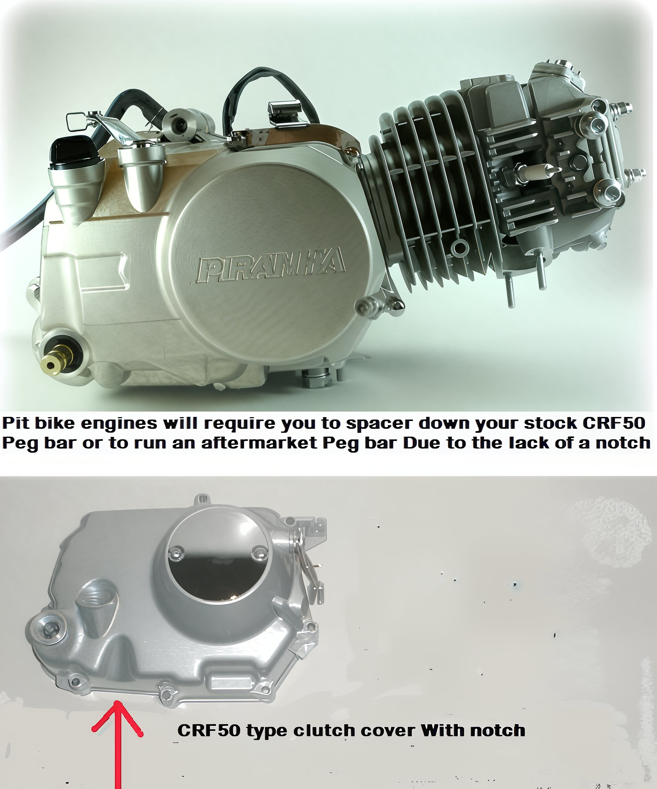
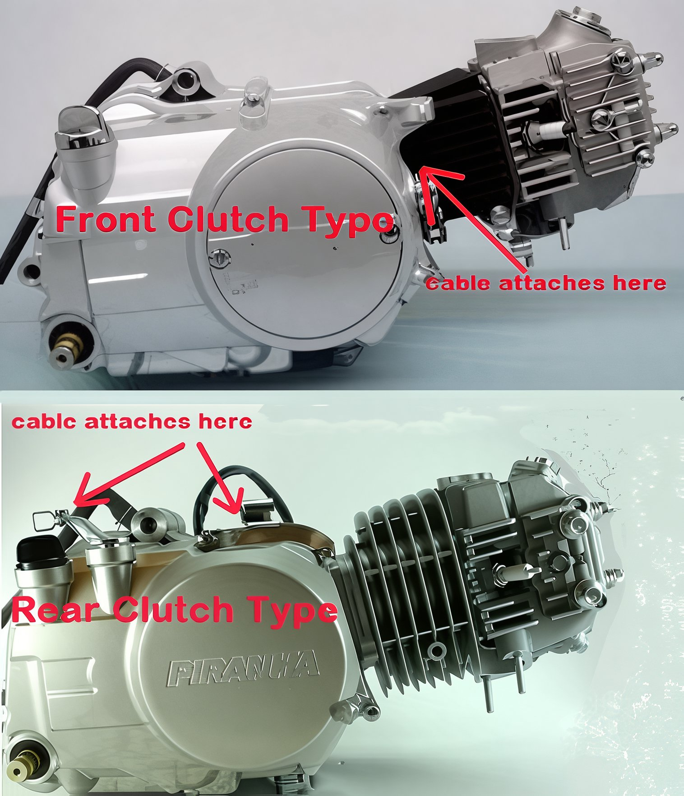

---
tags:
- engine
---

# Pit Bike Engine Installation Guide: Z50, XR50, CRF50, CT70 Honda & Chinese Models

## Pegmount Fit

To accommodate an aftermarket pit bike engine in a Honda 50, it is essential to utilize a spacer or an aftermarket pegmount/peg bar. The stock Honda engines feature a notch that allows a stock peg bar with an 'upsweep bend' to fit seamlessly. However, your aftermarket engine will lack this notch.

## Carburetor Clearance

Pit bike engines are equipped with larger carburetors, necessitating adequate clearance. Tank spacers can be custom-fabricated or acquired to elevate the tank. A 12-way carb kit is a rotating spacer that facilitates the adjustment of the carburetor for improved clearance. Note that stock CRF50/XR50 carb cables with molded-on carb caps are incompatible with aftermarket pit bike carburetors. Most pit bike engine setups will require the use of a POD filter instead of the stock airbox.

## Exhaust Pipe

All pit bike motors with round cam covers possess Honda-type ports and are compatible with CRF50, XR50, and CT70 stock and performance pipes. An exhaust gasket will be necessary.

## Wiring

Most kick-start (non-electric start) pit bike engines can accommodate Honda CRF50, XR50, and ZB50 ignitions and/or integrate with stock Honda CRF50, XR50, and ZB50 ignitions and components. Refer to the electrical section for further details.

## Sizing

Most pit bike engines ranging from 50cc to 110cc are comparable in size to the Honda CRF50 and XR50. Engines between 125cc and 160cc are approximately 15mm or 0.6 inches longer at the head. All our pit bike engines fit Honda CRF50, XR50, CT70, and Z50 models with sufficient clearance for the front wheel.

Our engines utilize the Honda bolt pattern and are compatible with Z50, XR50, CRF50, CT70, CL70, SL70, XL70, ATC70, TRX70, DAX70, TRX90, Extreme, SDG, Sikk, Pitster Pro, Coolster, Orion, Thumpstar, OGM, Pit Pro, G2Moto, Braaap, and SSR pit bikes.

## Clutch Cables

Please refer to the pit bike chassis parts - controls section for clutch cables and clutch levers. All the clutch levers we offer are compatible. You will need to select either a front or rear clutch cable. The Lifan 125 uses a front clutch, while all Piranha motors utilize a rear clutch.

## CT70 Petcock

A dual-feed petcock is required for the CT70, as the new carburetor does not include a petcock. The dual-feed petcock is compatible with ATC70, CT70, and Z50 models.

