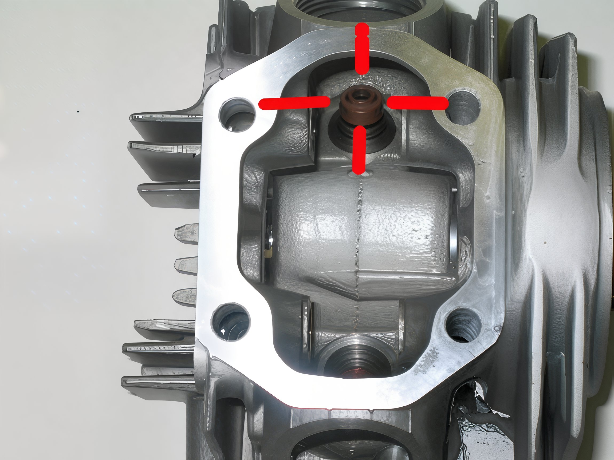
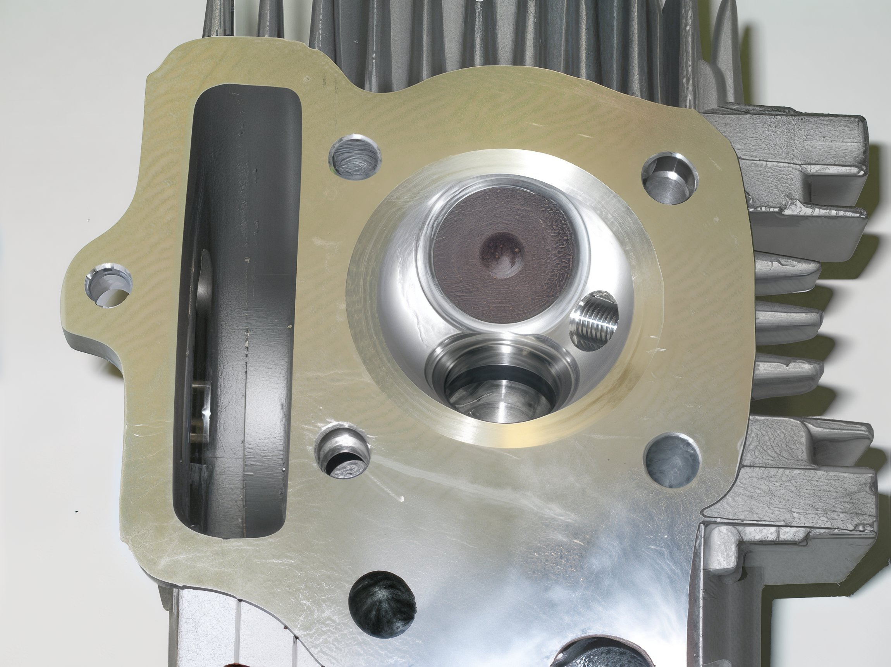

---
tags:
- engine
- valves
---

# Race Head Assembly

Important: Assembling the Race Head necessitates the use of a valve spring compressor. In the absence of this tool, it is highly recommended to entrust the installation of the valves to a professional at a Honda service center.

1. Affix a brown oil seal onto each valve guide. The seals should securely snap into position with moderate pressure.

   

2. Gently apply molybdenum disulfide paste to the intake valve (marked with "IN") and insert it into the intake (upper) guide.

   

3. Position the spring seat flush against the base of the head. Place the large spring atop the spring seat, nest the small spring within the large spring, and then position the spring retainer over the springs.

   

4. With the aid of a valve spring compressor, carefully compress the spring retainer to create sufficient space for the insertion of the valve keepers. Utilize tweezers to accurately position the valve keepers. Once in place, gradually release the compression on the valve spring retainer, ensuring the valve keepers are evenly distributed around the valve end.

   

5. Verify that the spring seat and valve keepers are correctly positioned. The spring seat should lie flat, and the valve keepers should be evenly spaced.
6. Replicate steps 2 through 5 for the exhaust valve.

   

7. To finalize the Race Head assembly, refer to the Big Bore Kit Installation instructions.
