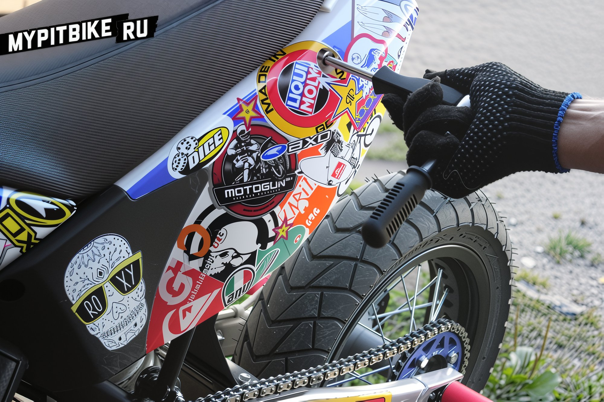
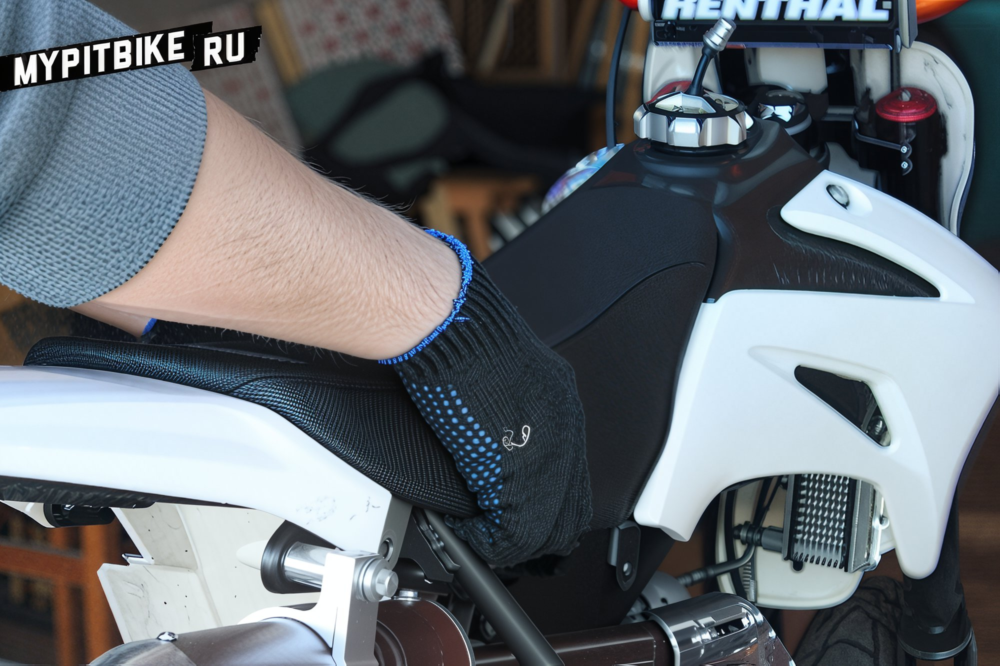
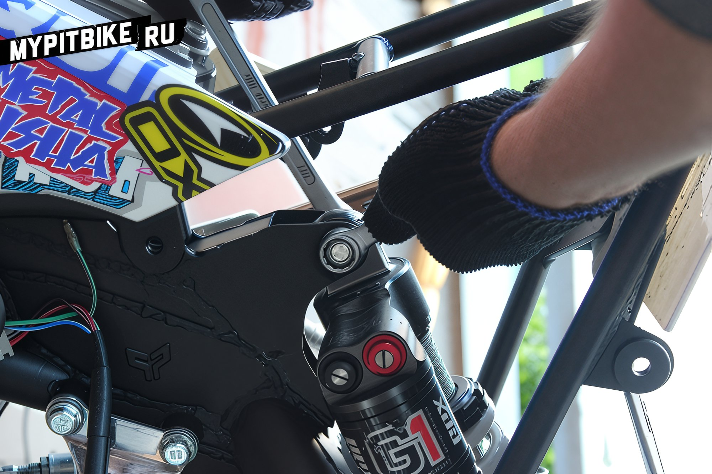
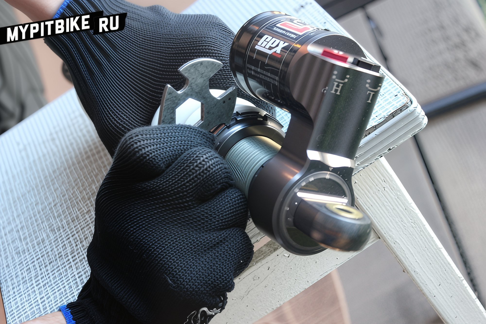
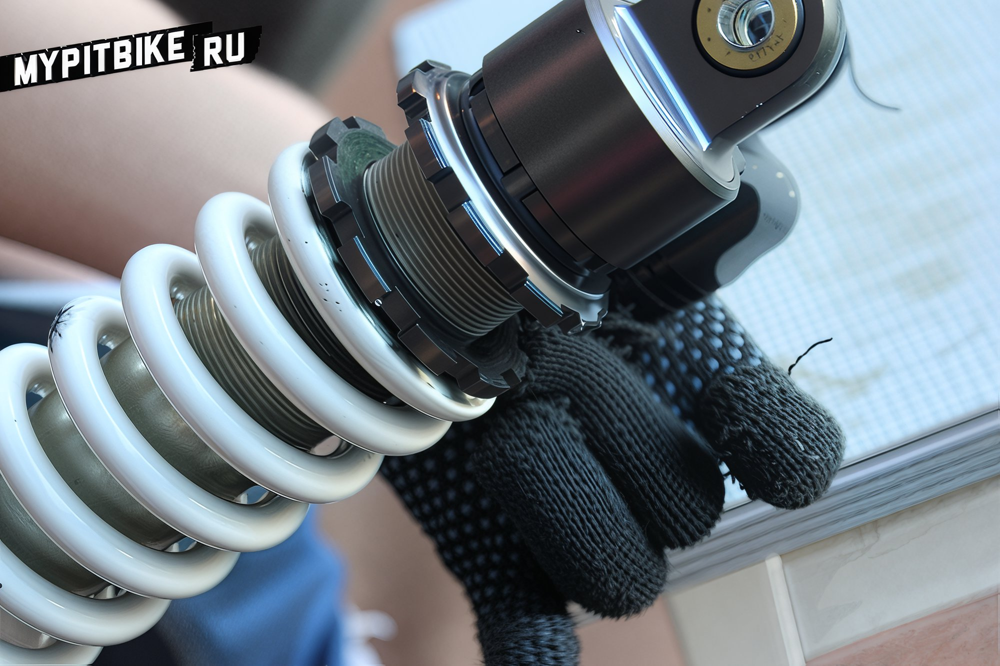
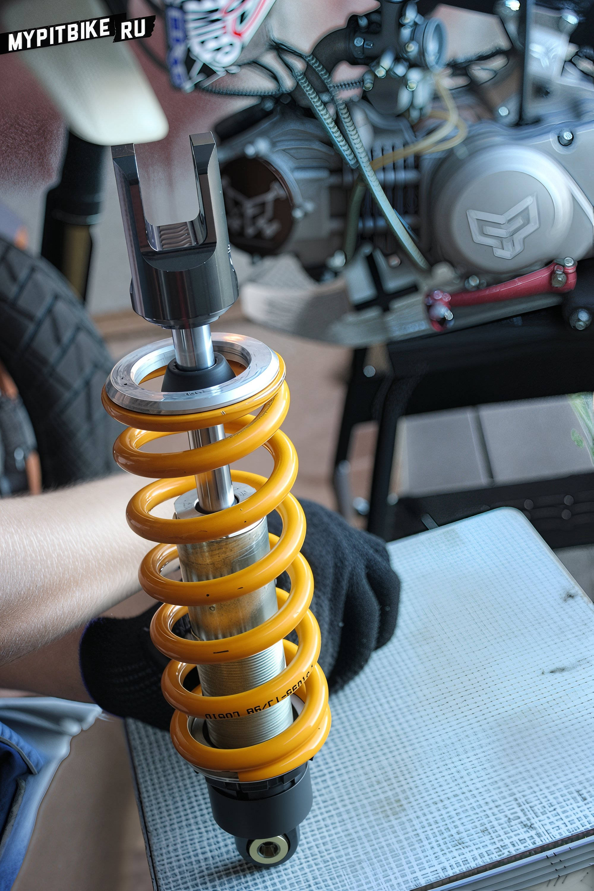
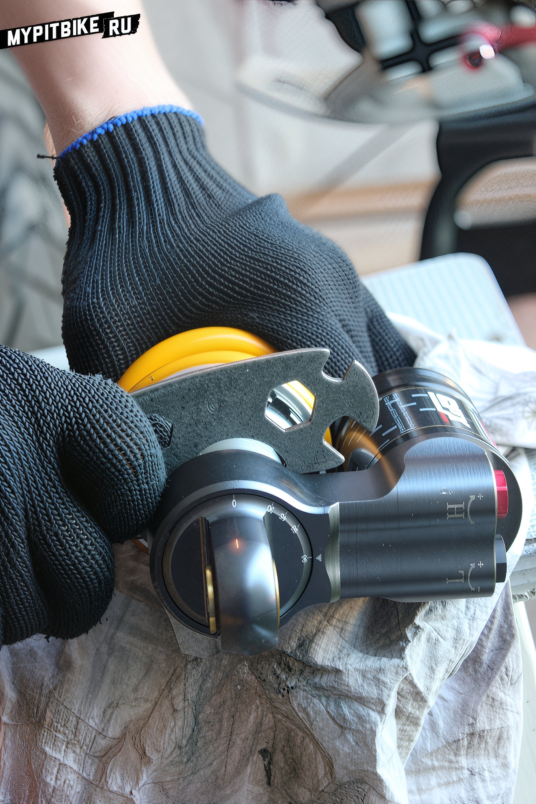
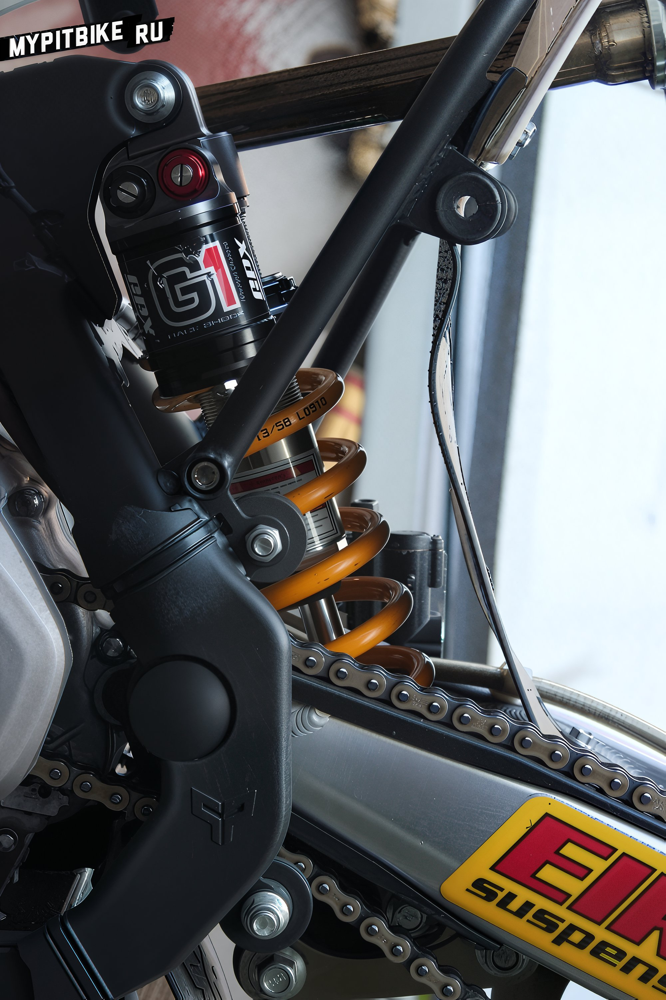

---
tags:
- suspension
- chassis
---

# Replacing the pit bike shock absorber spring

How to Replace the Rear Shock Spring on a Pit Bike with a Softer or Stiffer One: A Guide In this article, we will guide you through the process of replacing the rear shock spring on your pit bike, whether you desire a softer or stiffer ride. This modification may be necessary if you wish to fine-tune the suspension of your pit bike to better suit your weight and riding style.

The procedure is straightforward and requires only a standard set of tools. Begin by placing the pit bike on a stand, ensuring the rear wheel is off the ground.

Let's get started. First, remove the rear side panels to access the upper shock mount.

For convenience and to increase workspace, remove the pit bike seat.

Unscrew the lower shock mount from the linkage or swingarm.

Next, unscrew the upper shock mount from the pit bike frame.

Remove the shock absorber.

While the construction of pit bike shock absorbers may vary, the basic design is generally similar.

The spring is compressed, so to partially disassemble the shock, you need to loosen it by unscrewing two nuts.

Once the spring is loose on the shaft, remove the lower platform and extract the spring.

Here are our two springs. On the left is the stock spring from a GPX shock by PitsterPro, and on the right is a softer Ohlins spring.

In our case, since the spring is not entirely compatible with our shock and is larger in diameter, we use spacers.

Reinstall the lower platform and secure the spring on the pit bike shock with the adjustment nuts. 

 

Reattach the shock absorber to the pit bike.

That's it, the spring has been replaced, and you can now proceed with precise adjustments.
