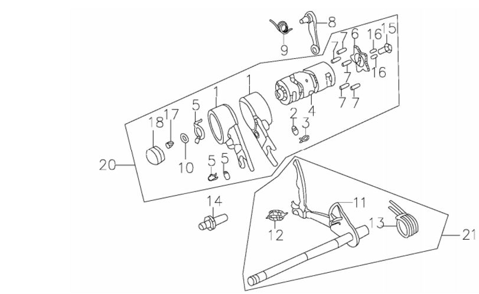
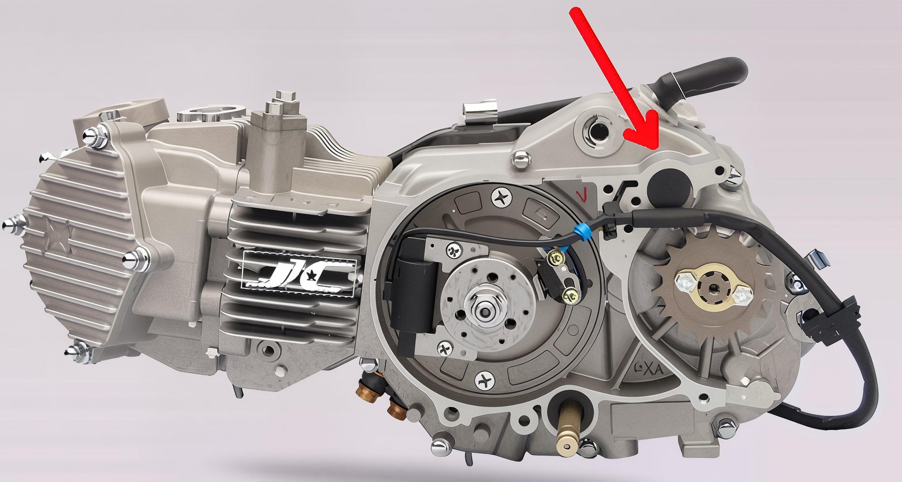

---
tags:
- engine
- clutch
---

# Resolving Gear Shifting Issues

A loose shift star and drum can lead to missed gear shifts. Although this is an uncommon issue, it is typically straightforward to resolve.

## Diagnosis and Solution

If you suspect a loose shift star, follow these steps:

1. **Remove the Clutch Cover**: Begin by removing the clutch cover and the small black plug located near the front sprocket.

2. **Inspect and Tighten Bolts**: Locate bolts #15 and #17, particularly the bolt at the center of the shift star. Ensure both ends of the shift drum are securely tightened.

## Visual Aids

