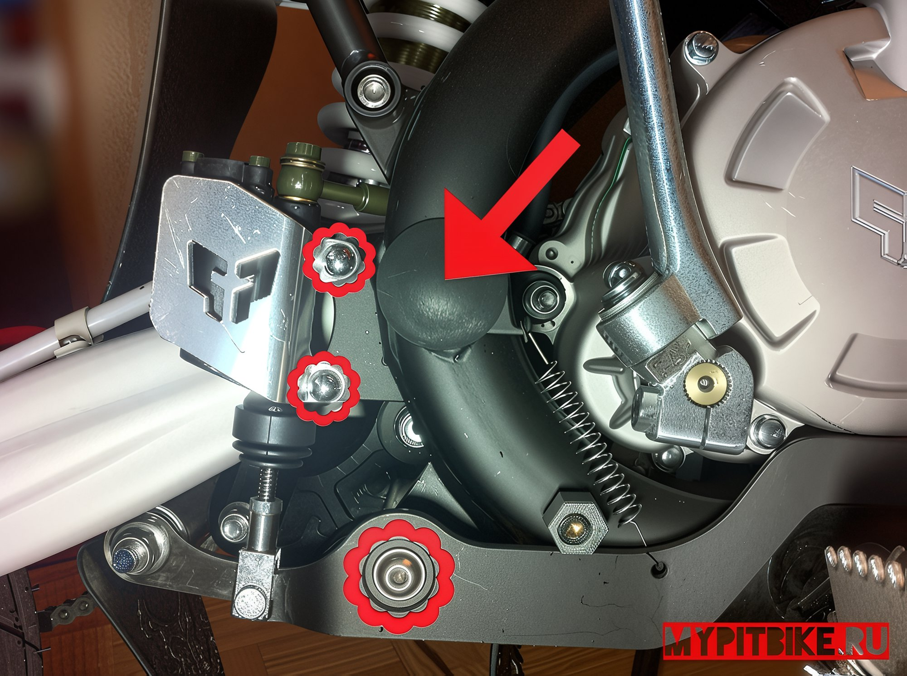
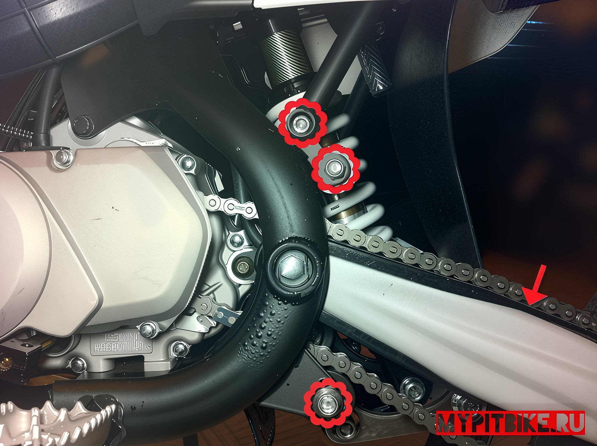
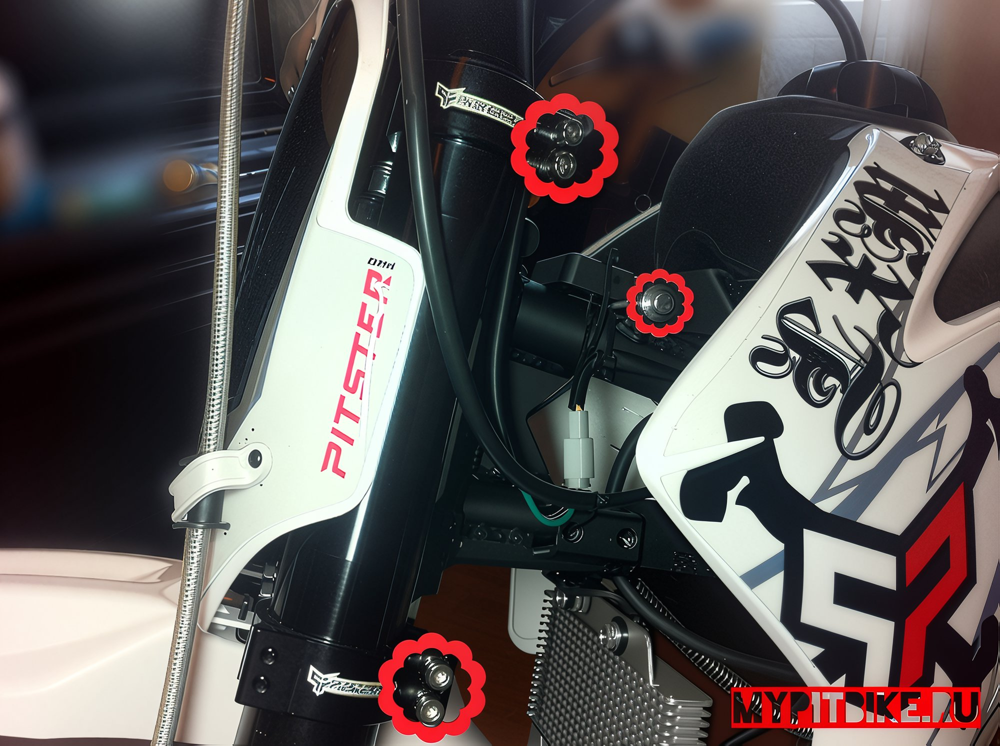
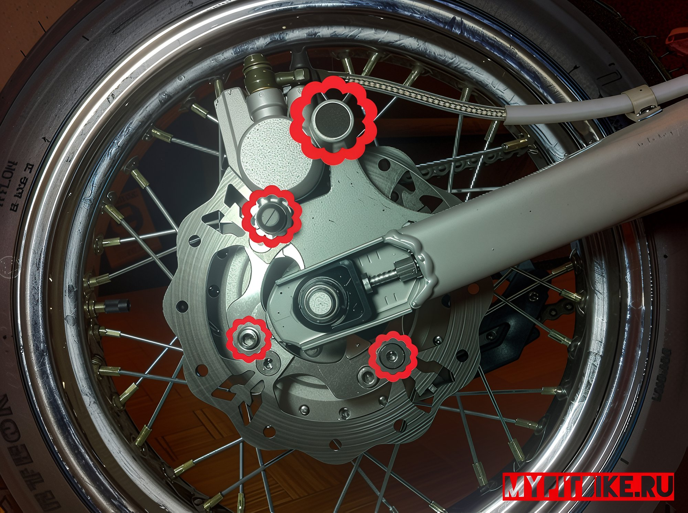
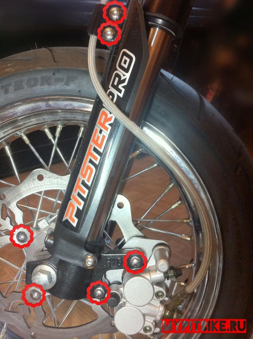
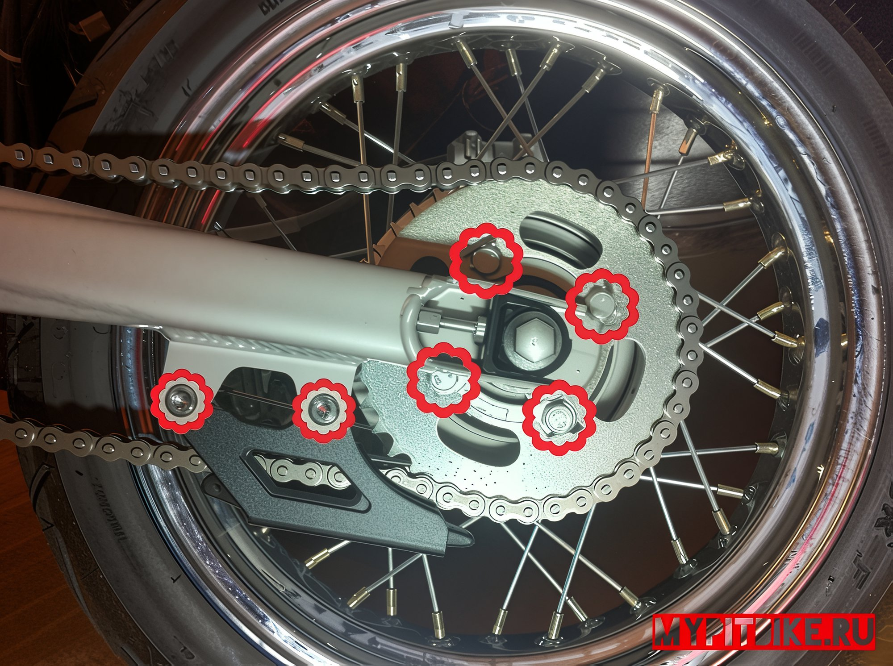

---
tags:
- chassis
- wheels
- brakes
---

# Tightening a pit bike

1. Check the brake fluid levels in both the front and rear brake reservoirs, as well as the engine oil level (the required volume is approximately 900 ml).
2. If necessary, replace the fluids. DOT4 is the preferred choice for brake fluid.
3. Verify the torque of all bolts to ensure everything is in its proper place and securely fastened.
4. Bolts securing the rear brake caliper, swingarm pivot nut, brake pedal bolt

   
   
5. Bolts securing the subframe, slider mounts, and chain guides

   

6. Fuel tank mounting bolt, all bolts securing the fork tubes to the triple clamp

   

7. Bolts securing the brake disc to the wheel hub, brake caliper mount to the spacer

   

8. All bolts securing the brake disc to the wheel hub, front brake caliper mount, bolts securing the fork guards

   

9. Bolts securing the sprocket to the rear wheel hub, two bolts securing the chain guard

   

10. The air filter should be clean and soaked with special oil.
11. We highly recommend applying threadlocker (Loctite) to all bolts, with particular attention to the list provided above.

## Torque Specifications

- Handlebar clamp bolts – 21 Nm
- Fork tube clamp bolts – 20 Nm
- Handlebar riser – 20 Nm
- Wheel axle nut – 54 Nm
- Subframe rods – 43 Nm
- Engine mounting bolts – 16 Nm
- Fastenings for fork guards, side panels, plastics, etc. – no more than 10 Nm
