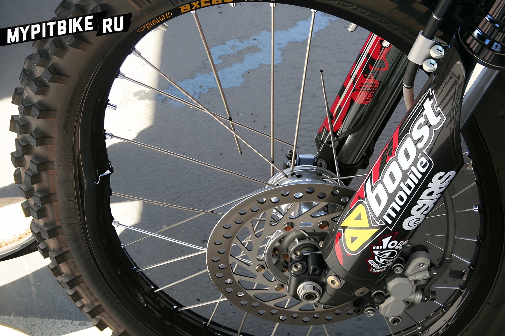

---
tags:
- wheels
---

# Tightening the spokes on a pit bike

It is crucial to maintain even tension on the spokes, as this will prevent rim distortion and broken spokes. How to properly tighten the spokes on a pit bike wheel?  We will need a special spoke wrench or an open-end wrench of 5mm or 6mm, depending on the size of the spoke nipple. Next, place the pit bike on a stand, suspending both wheels. Follow these two simple rules:

1. Tighten every other spoke, starting from the valve stem.
2. Apply even tension to each spoke. Do not overtighten.

*If they are seized, spray with WD40.* Here are the video tutorials http://www.youtube.com/watch?v=sJwGVdg4HRE http://www.youtube.com/watch?v=VQdPVv1GbZU
