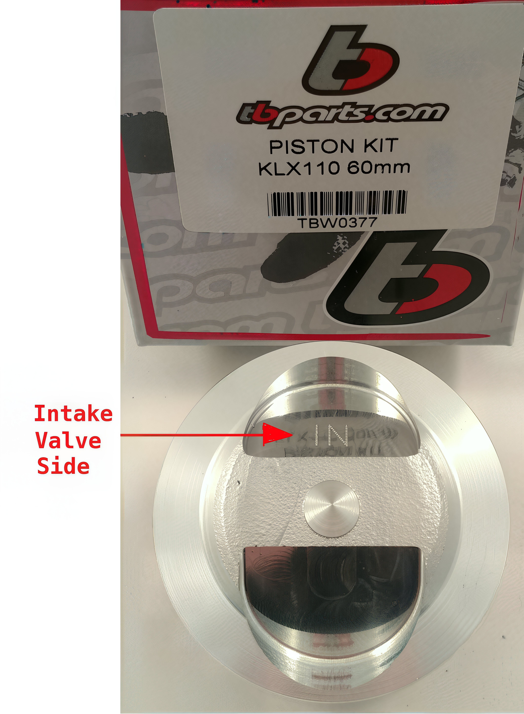

---
tags:
- engine
- piston
---

# Pitbike 4-Stroke Single Top End Assembly Guide

## Important Considerations

When assembling your Pitbike's 4-stroke single top end, consider the following expert tips:

- **Gasket Thickness**: Some big bore kits feature head and base gaskets that are thinner than the standard ones. In such cases, refrain from using the stock "O" rings. Instead, apply a thin layer of Yamaha bond or Honda4 semi-drying adhesive for optimal sealing.

## Flywheel and Camshaft Alignment

1. **Flywheel Positioning**: Set your flywheel to the "T" mark, indicating top dead center.
2. **Cam Sprocket Alignment**: Align the top cam sprocket mark to the 9 o'clock position.

## Valve Lash Adjustment

### Recommended Settings

- **KLX110, Honda 50-70, China 50-190, Daytona 190**: Adjust the valve tappets to 0.003" for both intake and exhaust.

### Race Heads & Camshafts

- **Valve Lash Settings**: Intake 0.003" & Exhaust 0.003". This gap between the valve tip and rocker tip is essential as it closes when the engine heats up.

## Camshaft Installation

For all applications:

- Install the camshaft with the lobes facing downward or towards the piston. This initial step, combined with aligning the camshaft and crankshaft timing marks, ensures proper engine timing.

## Additional Notes

- **Cam Mounting**: The 2-bolt cam mounting holes are offset drilled, allowing installation in only one orientation, preventing a 180-degree misalignment.

## Torque Specifications

- **50-110cc Round Cam Cover Type & Honda 50/70 (6mm studs)**: Torque the head to 110 in/lbs, run for one heat cycle, then re-torque.
- **125-150cc Round Cam Cover Type & Honda TRX90 (7mm studs)**: Torque the head to 140 in/lbs, run for one heat cycle, then re-torque.
- **KLX110 and KLX Head Type Motors (ZS155, 155HO, YX 150/160)**: Torque to 16 ft/lbs, run for one heat cycle, then re-torque 8mm studs.

## Piston Alignment

To determine the correct piston alignment side, refer to the image below:

