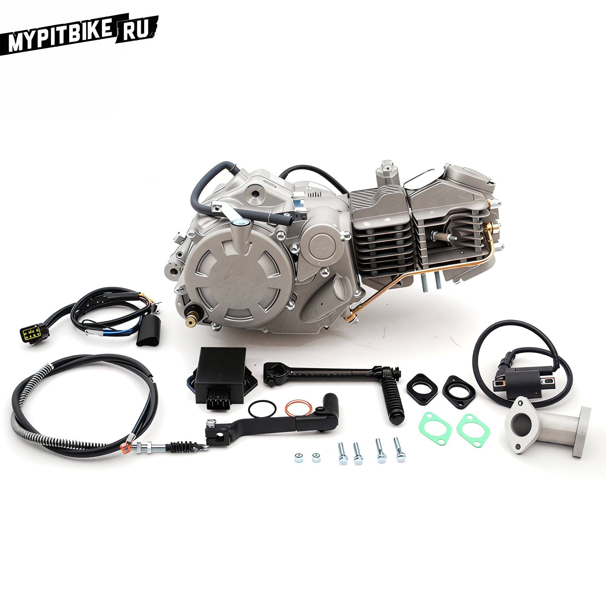
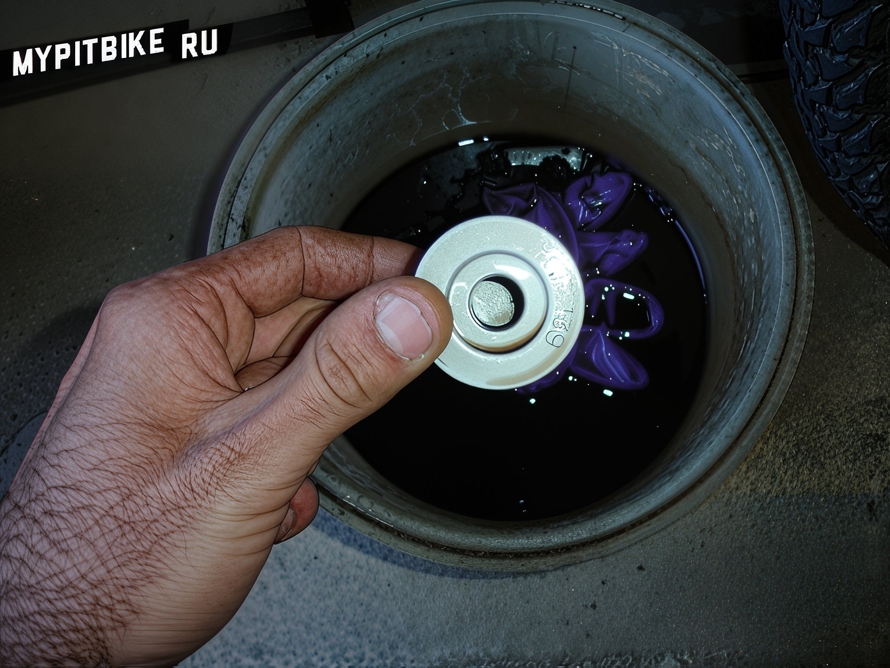

---
tags:
- engine
---

# Zongshen 155cc V2 with Oil Filter

Technical Specifications: Zongshen 155cc Version 2 with oil filter. Mountings are identical to CRF50/70 frames, suitable for all pit bikes.

- 4-speed gearbox (N-1-2-3-4)
- Start from any gear.
- 6-disc clutch.
- Removable oil filter.
- Updated camshaft.
- Daytona-style generator.
- The intake/exhaust angles correspond to KLX engines. KLX intake manifolds and mufflers are compatible.

**Piston Diameter and Stroke:** 60mm x 55mm (155.7cc)

Gearbox shafts and shift drum with forks are not compatible with other engine types like YX, Lifan. Different gear ratios, different shaft diameter, and consequently different inner bearing diameter. ZS and YX engine heads are interchangeable. Different intake and exhaust port angles.

**Oil Filter Size:** Diameter 44mm x Length 39mm x Inlet Diameter 13.5mm

  

Compatible with Suzuki DRZ400 filters. Filter marking **HIFLOFILTRO - HF139**

**Oil Replacement Marking:**

- Type API SE, SF, or SG API SH SJ with JASO MA Semi-synthetic
- **Viscosity:** SAE 10W-40 or 20W-50
- Manufacturer recommends **10W40 Motul 5100**

**Oil Change Frequency:**

- During break-in every 5-10 engine hours.
- After break-in every 20-30 engine hours.

**Spark Plug:**

- NGK C7HSA 4629
- Wrench: 16mm long socket

**Valve Clearances**

- Intake - .003" (0.08mm)
- Exhaust - .005" (0.13mm) or .004" (0.1mm)

**Carburetor (standard PitsterPro from Pitmoto):**

- Sheng Wey. Diameter 26mm. Jet thread M5. Stock fuel jet 95. Insufficient for this engine.
