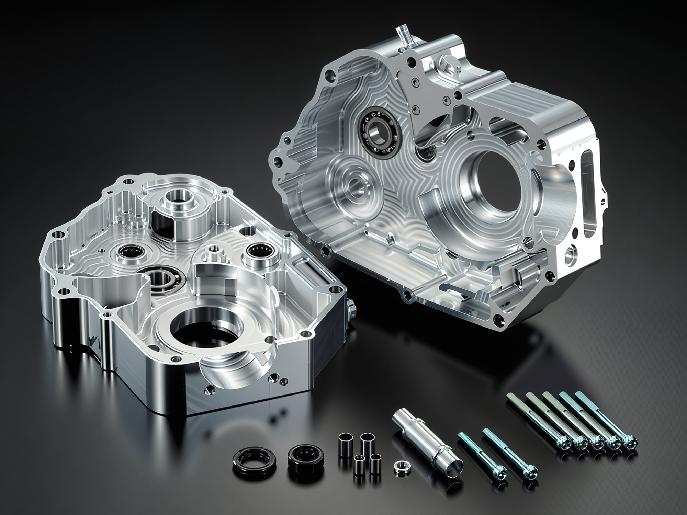
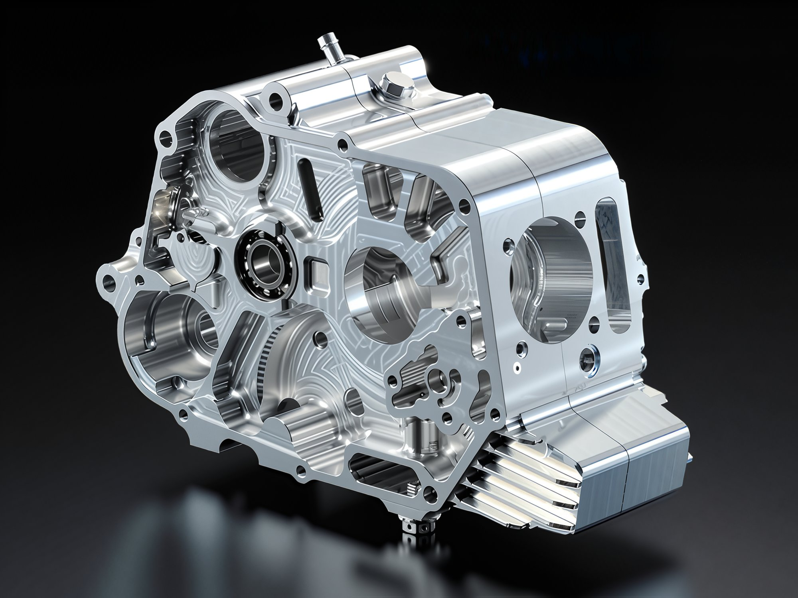
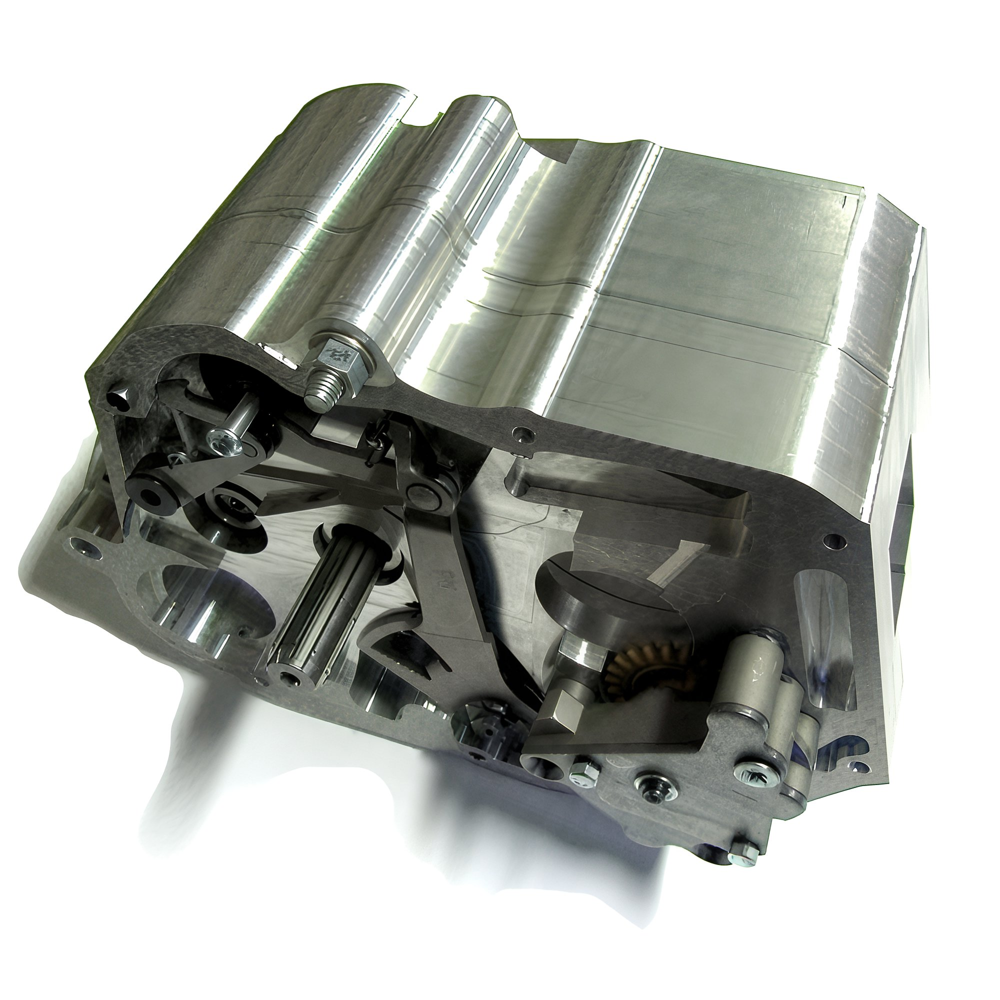

# Aluminum crankcase for pit bike

In recent times, several companies have begun producing limited edition engine cases, meticulously crafted from a solid block of aluminum using a computerized machine, a process known for its precision and referred to by the abbreviation CNC. As is well-known, aluminum is an exceptionally lightweight and durable metal, and in the pursuit of reducing the weight of professional pit bikes for racing, this material is utilized wherever feasible. The company **G-Craft** has unveiled its latest innovation, the **G-Craft Case**.         **The price has not yet been disclosed.** The Japanese company **Daytona**, a major player in the world of pit bike tuning, offers its own manufactured engine case. **The price is substantial - 1100 euros.**   The Italian company **Bucci Moto**, which recently assembled a [water-cooled engine for a pit bike](http://mypitbike.ru/blog/tuning/37.html), offers its clients a self-manufactured engine case. **The price of this masterpiece is 1500 euros.**  
