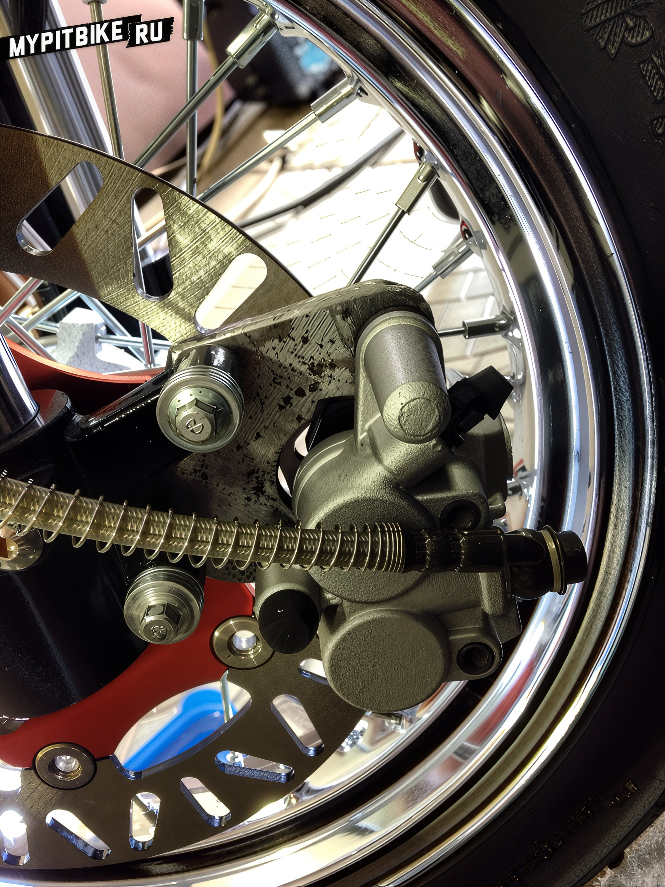
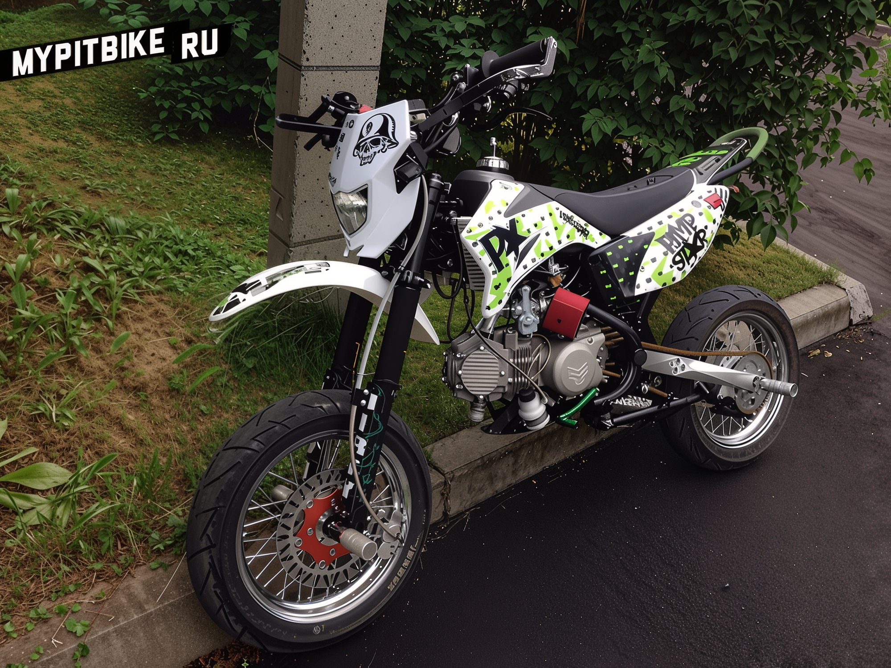

# Brake disc 240mm for pitster pro 160

The metal, with a thickness of 8mm, is cut and adjusted, utilizing the same fasteners. The disc fits perfectly! No modifications were necessary, as I used the stock four countersunk screws.

  

 

  

  

  

  

  

  
