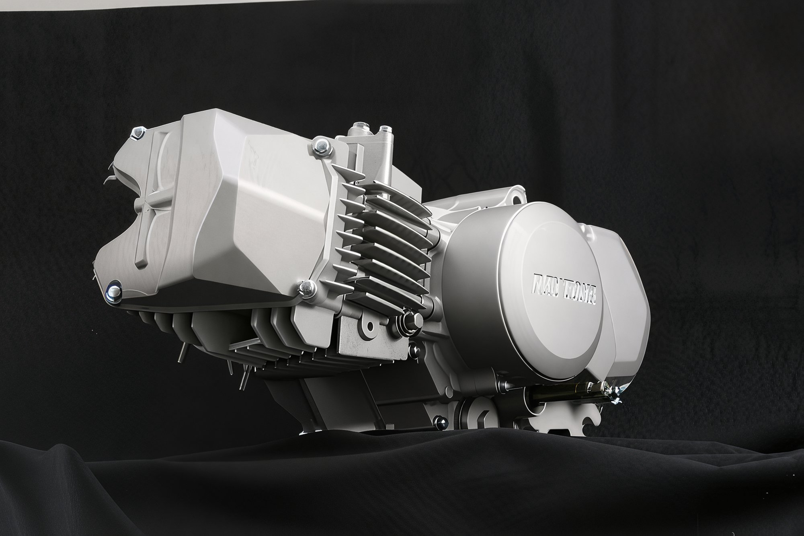
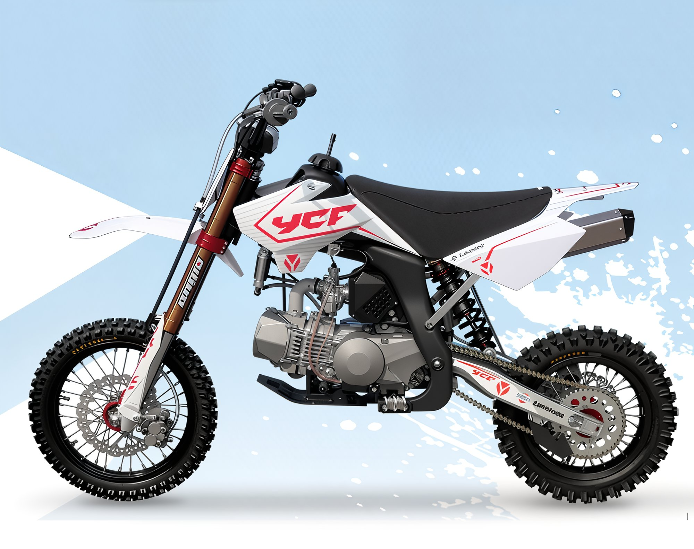

import YouTubeEmbed from '@site/src/components/YouTubeEmbed';

# Engine: Daytona Anima 190F 4V

A true powerhouse in the pit bike engine lineup.

The renowned Japanese company **Daytona**, famous for its pit bike tuning kits, has unveiled its latest innovation - a 4-valve engine for pit bikes, boasting a record-breaking displacement of **190 cc.**

The updated engine lineup, named **Anima**, includes engines with the following displacements:

- **Anima 150F** - 4-valve head, displacement of 150 cc.
- **Anima 190F** - 4-valve head, displacement of 190 cc.

Engines with a displacement of 150cc are already available for retail, while the senior model is undergoing final testing and is expected in March 2012. Esteemed pit bike manufacturers such as **YCF** and **BBR** have already announced the launch of new motorcycles equipped with the Daytona Anima 150F engine.

**Technical Specifications of Anima 190F:**

- Air-cooled, 4-stroke, 4-valve
- Horizontal layout (fits Honda CRF 50 frame and other pit bikes)
- Displacement: 187.2 cc
- Bore and stroke: 62 mm x 62 mm
- Valve size: 24.5 mm (2 intake) and 21 mm (2 exhaust)
- HYVO 94-link timing chain
- Ceramic cylinder coating
- Six-disc wet clutch
- Gear shift pattern: 1-N-2-3-4
- Primary drive 67/18
    - 1st gear - 34/13
    - 2nd gear - 26/15
    - 3rd gear - 25/21
    - 4th gear - 22/24
- CDI ignition system and AC generator

**Estimated cost: $1500**

And just listen to how it sounds!

<YouTubeEmbed videoId="L-6ssU4dW2Q" />
