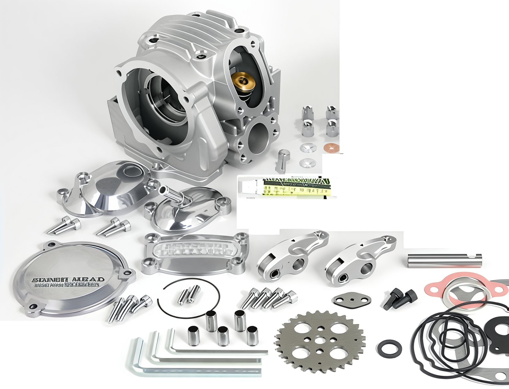
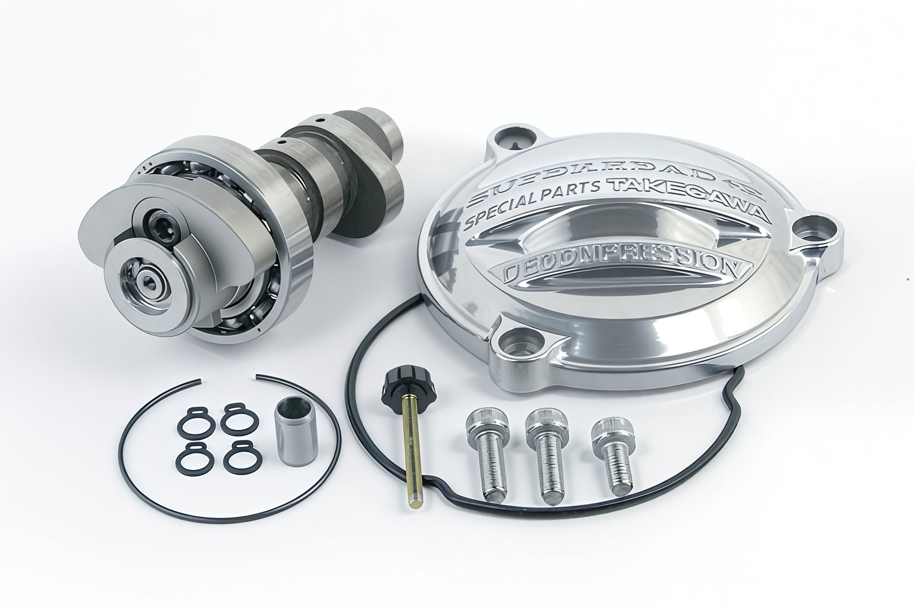

# Engine head tuning

The latest innovation from the esteemed company **BBR** is a four-valve engine head. Judging by the photograph, it is designed for KLX engines. Additional information is currently unavailable. We will keep an eye on updates. The price remains undisclosed.

Another experimental development featuring a transition to liquid cooling, the installation of an enlarged cylinder, and a four-valve cylinder head.

A kit from the renowned Japanese company, a major producer of various tuning parts, **Takegawa**. **Takegawa Superhead R.**

**Price approximately 1300 euros.**

Another well-known Japanese manufacturer of tuning components, **Yoshimura**, is most recognized here for their exhaust kits.

**The price of the kit is unknown.**
