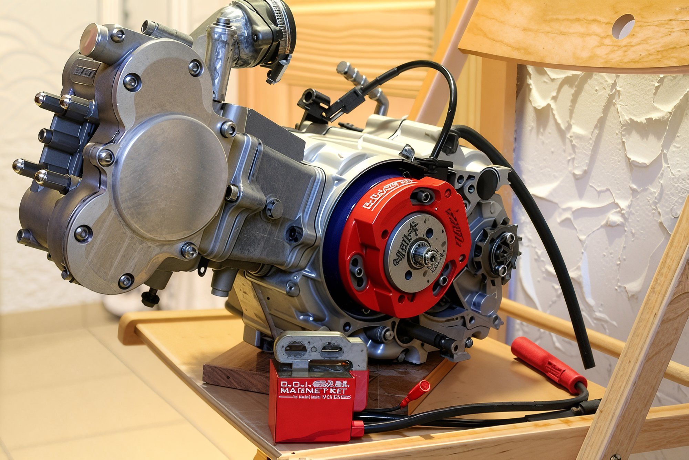
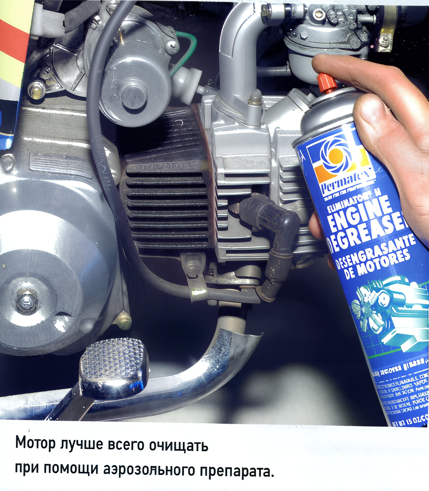
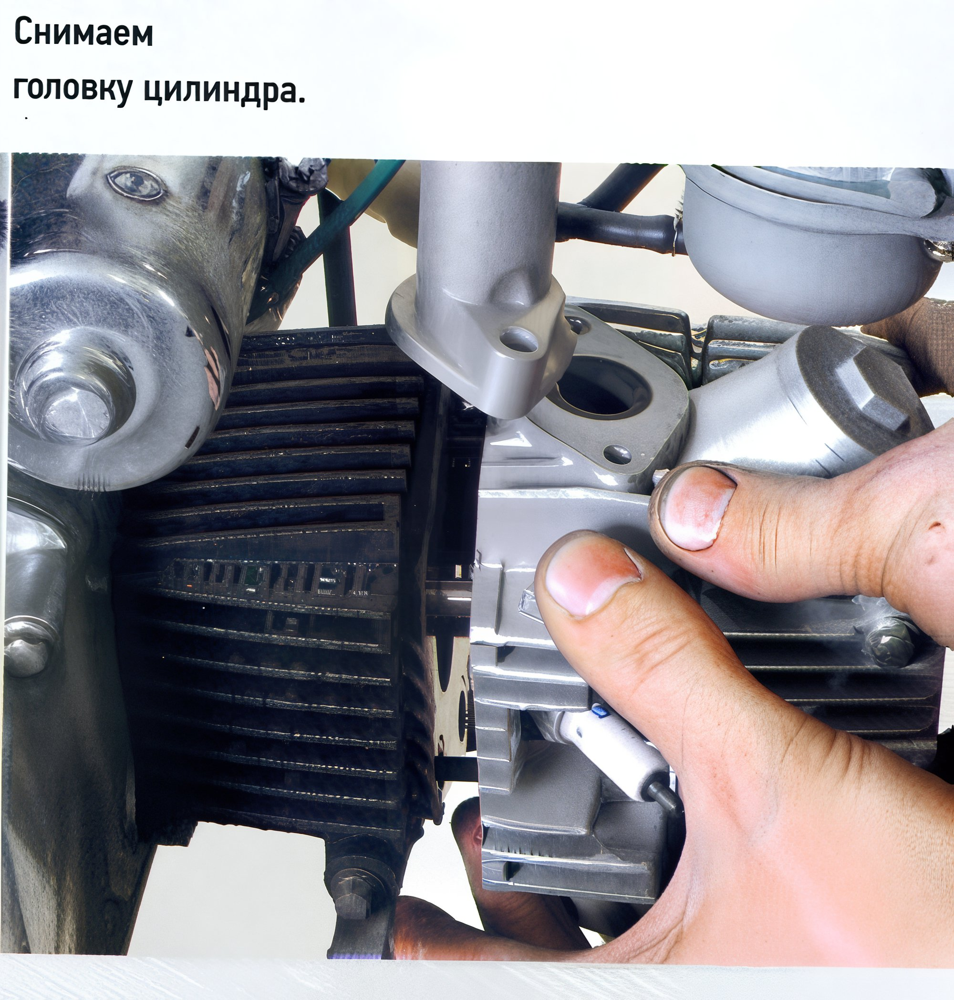
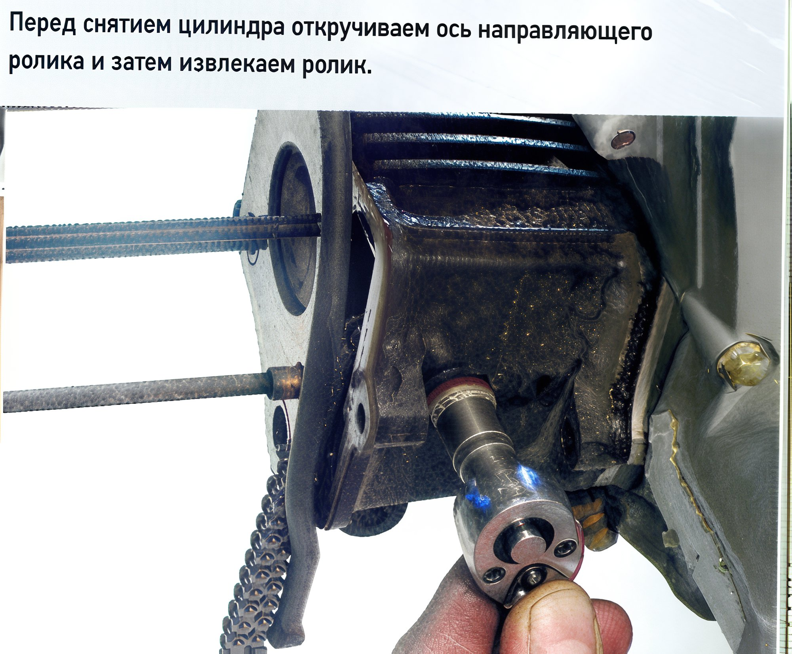
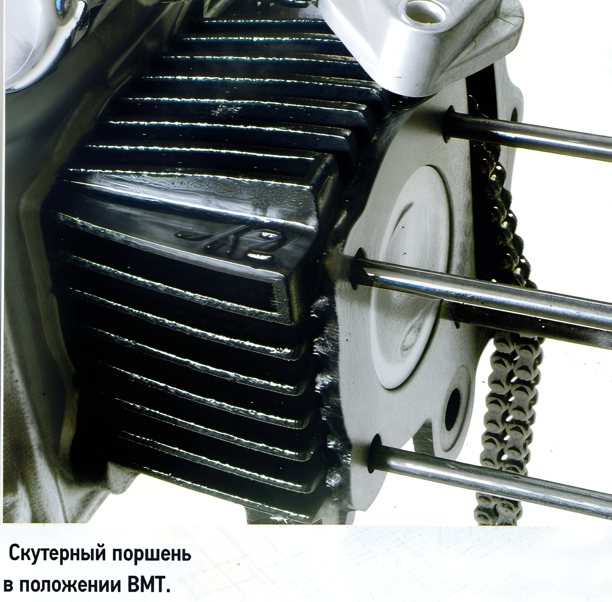
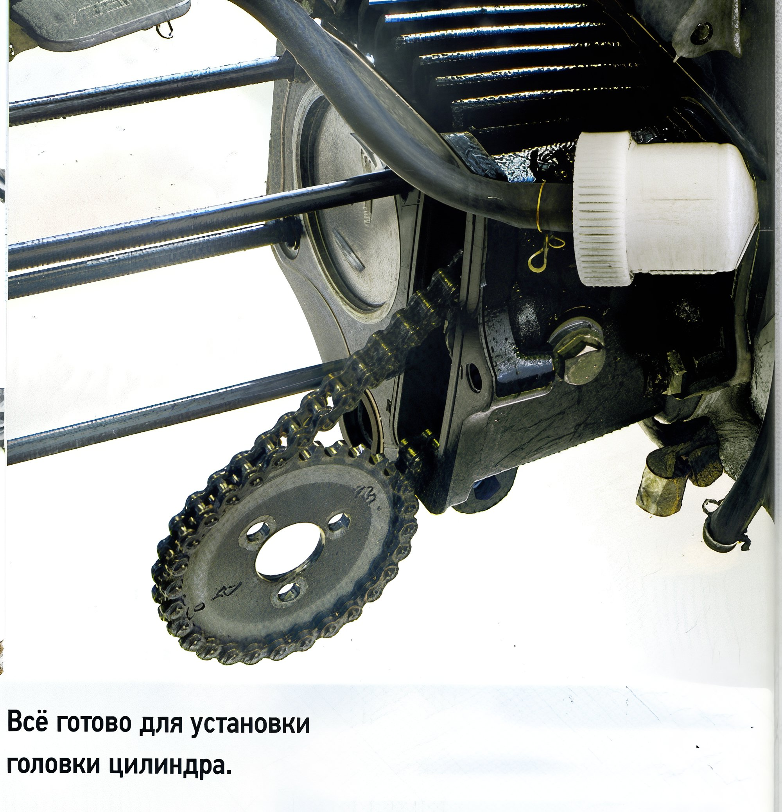

# Engine tuning for honda cub

Today, the Russian market is flooded with "fifty-fifties" (50cc engines). There are countless options for used Japanese models and new Chinese models, but almost all of them come with the old, reliable, yet not very powerful, four-stroke Honda engine. Adding a fresh horsepower to this weak team isn't too difficult or costly.  It's no secret that the world's most common motorcycle engine was designed by Honda half a century ago for the legendary scooterette "Super Cub." However, today we're not discussing this famous veteran (strangely enough, the most massive machine in the world bypassed Russia), but its numerous Chinese clones, which are plentiful on our market: they are installed on mopeds sold under a dozen brands, children's quads, mini-bikes, motocross bikes, and scooterettes. Mostly, we receive units with 50cc engines (designated by the Chinese as standardized 139RM), falling into the coveted "moped" category. This makes life easier for sellers, as they don't need to bother with vehicle passports or meticulous certification.  The "fifty-fifty" dimensions are 39 x 41.5 mm (cylinder diameter x piston stroke), and in its stock configuration, it can produce between 1.75 and 3.5 hp, depending on the degree of tuning. Best case scenario, mopeds, scooterettes, and mini-bikes with this engine accelerate to 65-75 km/h, with the worst case being only 50 km/h. Not everyone is satisfied with such modesty, leading them to seek out "remedies," best described with the captivating and brief word, "tuning." Ignoring the moral-legal nuances of the issue (tuning "fifty-fifties" is largely overlooked), we'll discuss how to make the first move in this direction with minimal replacements and costs.  In general, "Cub" tuning abroad is as inexhaustible as an atom, and even the first "kits" (parts sets) have already reached us. However, let's not rush to do everything at once: the simplest and most effective step is increasing the cylinder diameter to 47 mm (maintaining the same piston stroke, meaning no crankshaft change), resulting in a displacement of 72cc. Several kits from different manufacturers are available for this. Aside from the unavoidable cylinder and piston replacement, a cylinder head and carburetor replacement is also required. These two components double the cost of the kit (a new cylinder head costs approximately 3500 rubles). It's impossible to avoid replacing the "head" because the combustion chamber volume of a 50cc is small, and the tuning piston comes into contact with it.  It might seem inevitable to buy an expensive kit, but Evgeny Kuzmin from the workshop at the St. Petersburg showroom "S-Moto" found a way to avoid replacing the cylinder head and carburetor. He uses a piston not from a tuning kit but from a scooter. It turns out that Chinese four-stroke scooter engines (also cloned from Honda) have tuning pistons of the same diameter and pin size, but with a lower piston height. Additionally, the scooter piston has a slightly concave top, allowing its use in "Cub" engines. There are additional advantages: the piston and pin are lighter than stock, making them suitable for higher RPMs and better load resistance.  The work described below applies to almost all Chinese "Cub" clones, regardless of manufacturer. At least, we aren't aware of any "contraindications" or "incompatibilities." Typically, parts from all manufacturers are fully interchangeable, with no size groups for cylinder-piston groups and timing chains, and thus no need for selective assembly. Essentially, components from any manufacturer should fit any such engine. However, exceptions exist for almost every rule, so measuring parts is advised. Below we cover work on a scooterette engine, where there's no need to detach the engine from the frame, only to remove some panels. Another preparatory step is cleaning the engine. Speed up the process using an aerosol engine cleaner. Apply the cleaner, let it soak, then rinse with water. Pay special attention to ensuring no dirt remains on the top horizontal surface where the cylinder meets the engine case, as sand from there can directly enter the crankcase.  During disassembly of the timing chain and cylinder-piston group (CPG), it's helpful to store fasteners and parts in separate compartments to prevent reassembly confusion. For example, use an egg carton or, as I did, make a block by taping together cut baby food jars—very convenient. Another important tip: "Cub" engines (and any engines) have numerous small parts that look similar but differ in details, and a mix-up could have dire consequences. To prevent this (especially when working on a previously untouched unit), we recommend sketching or photographing the arrangement of parts and noting the disassembly sequence—including where screws, bolts, and washers came from.  The most typical and costly mistake when working on a four-stroke engine is incorrect timing chain installation. If the timing is off, the engine won't start (not a big deal), but worse, the valves might meet the piston! That's why manufacturers mark parts with special guides. Two pairs of marks exist: one on the generator rotor and case, the other on the drive gear and cylinder head. To easily rotate the crankshaft using a socket wrench on the rotor nut (after removing the generator cover hatch), it's worth removing the spark plug.  Several marks exist on the rotor—look for the "T" (Top Dead Center or TDC), positioned precisely in the center of the inspection hatch in the upper part of the case. The second set of marks becomes visible when removing the characteristic round cover on the head (unscrewing the bolt with the head located on the opposite side—there are two bolt heads there, but the needed one is closer to the spark plug). The stamped circle on the camshaft drive sprocket should align with a small notch oriented forward. Due to the 2:1 ratio in the timing chain drive, not every TDC position will align with the correct timing phase. If the marks are not visible, rotate the crankshaft an additional turn.  With marks aligned, proceed with disassembly in order. Unscrew the three bolts securing the timing gear (a 9mm socket is needed). For easy loosening of exhaust pipe nuts without damaging the threads, apply penetrating oil. Unscrew the intake pipe bolts and tie it to the frame along with the carburetor. No further detachment of "accessories" is necessary. Now, unscrew the four cap nuts on the head end, attaching the head to the cylinder and the cylinder to the case. Note the torque needed to loosen them—you'll need the same (but no more) torque for retightening (though we highly recommend using a torque wrench or even a fishing scale with a mark-off handle for accuracy). Underneath are the first details: not all washers are the same—one is copper. Remember its place—lower right stud, through which oil flows to lubricate head parts. The liberated head cover has an arrow (as the stud holes are asymmetrical), and during reassembly, it should point downward. Another detail: guiding bushings between the cylinder and case, and between the cylinder and head, vary in height. Their positions are easy to recall: since the head gasket is thicker, the bushings there are longer.  Sideways, remove the timing gear sprocket from the chain, unscrew, and extract the guide roller axle. Under the head of the roller is an aluminum washer, which also shouldn't be mixed with others. Between the head and cylinder, find a sealing ring and centering bushing on the lower right channel. The same sealing appears between the cylinder and case. Install new seals in position during reassembly. Carefully pull the cylinder off the studs, then extract the piston pin and remove the piston. Before using an awl or screwdriver to pry the piston pin circlip, shield the case "mouth" with clean cloth, just in case...  Let's move on to preparatory operations. First, clean the mating surface of the case, as well as the two head surfaces where covers were removed—old gasket fragments often remain, or even the entire gasket. In any case, replace gaskets; to remove the old ones, use a modern product—aerosol "Gasket Remover." Spray the agent, let it "work" for 10–15 minutes, then easily scrape the old gasket off with a scraper or utility knife blade.  When installing a new piston, pay attention to the "Inlet" marking, which must face upward. Lubricate the piston pin, piston, and rings thoroughly with engine oil. The cylinder later—first, degrease it: remove conservation lubricant and wipe off abrasive residue with a gasoline-dampened cloth. Insert the first circlip into the piston (experienced mechanics advise cutting off the tab to ensure security, preventing the tab end from coming out and scratching the cylinder surface), then the pin and second circlip. Stagger the piston rings: oil scraper ring halves at 180°, compression ring gaps also at 180°.  The rest of the assembly process follows in reverse order. A couple of "pitfalls" exist: first, remember the guiding bushings of varying heights and the new rubber rings. Second—crucial—when threading the timing chain back into the cylinder cavity, ensure the chain aligns properly on the plastic gear deep in the case responsible for tensioning the chain. Otherwise, the chain might skip, risking gear destruction or even chain breakage (and valve damage).  With the head on the studs (don't forget the guide roller beforehand), install the timing gear sprocket: pull it up from the lower window, against the tensioner force. Check timing mark alignment (as above)—two tooth error risks valve damage. While the motor's cold, check valve clearances: they should be between 0.05–0.07 mm. Tighten the cylinder head nuts evenly in a crisscross pattern over two to three passes. Final torque is checked using a torque wrench, approximately 10–14 Nm. Exact values can be found in the specific manufacturer's manuals. And don't forget—fill with new oil if the old was drained. In general, "Cub" engines are incredibly tolerant regarding oil quality—mainly, there needs to be oil. After tuning and under extreme heat or city conditions, use motorcycle oils with a viscosity no less than 10W/40. Finally, post-tuning compression increases to 10.6-10.8, necessitating 95-octane fuel usage.
