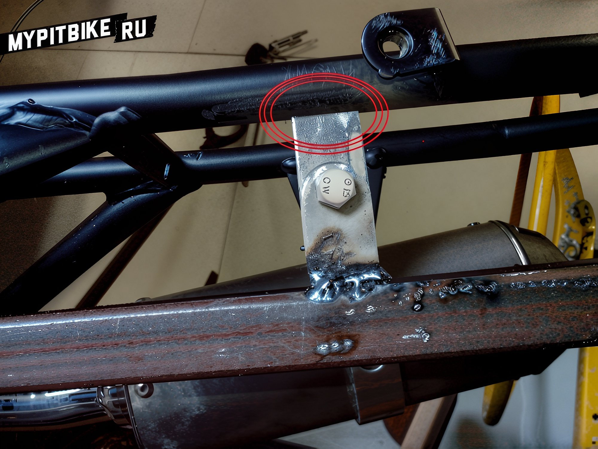
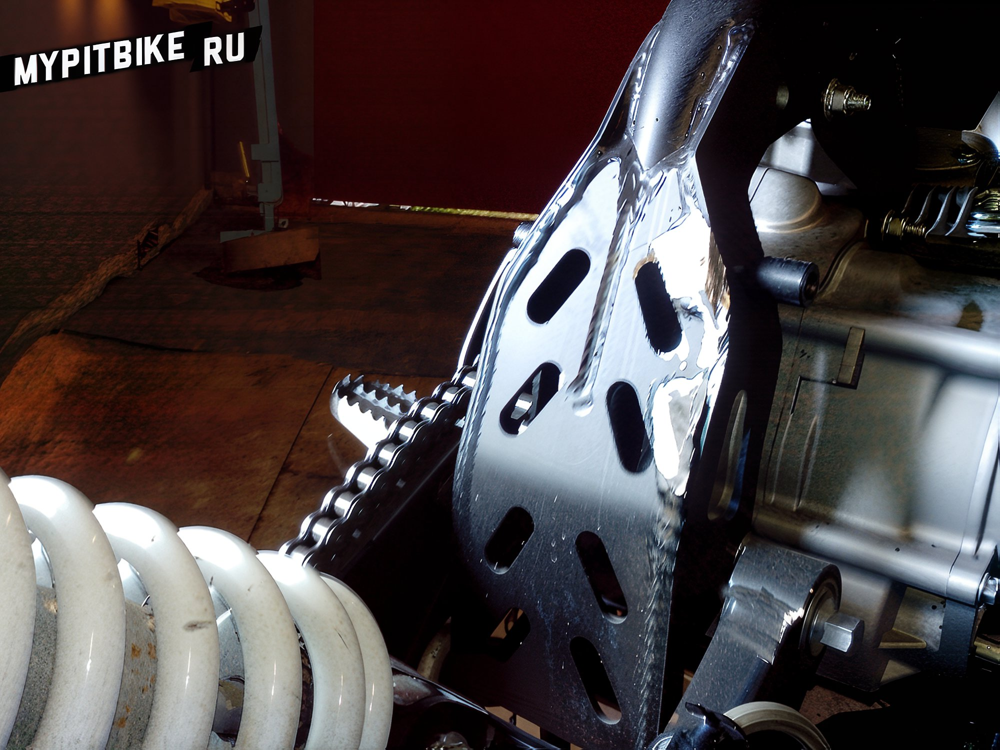
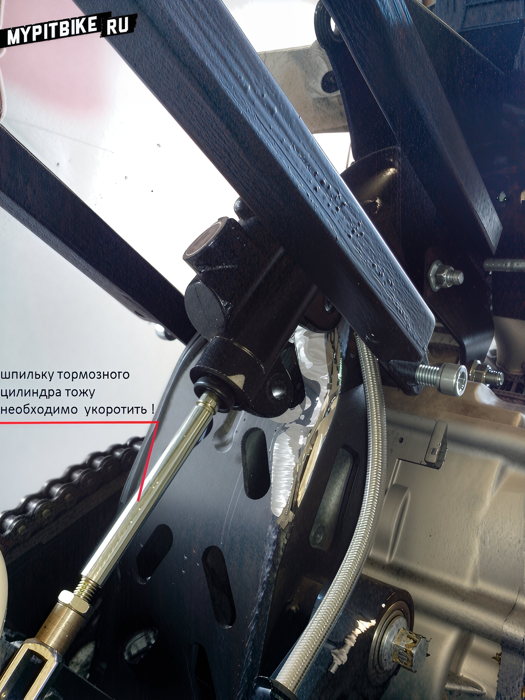
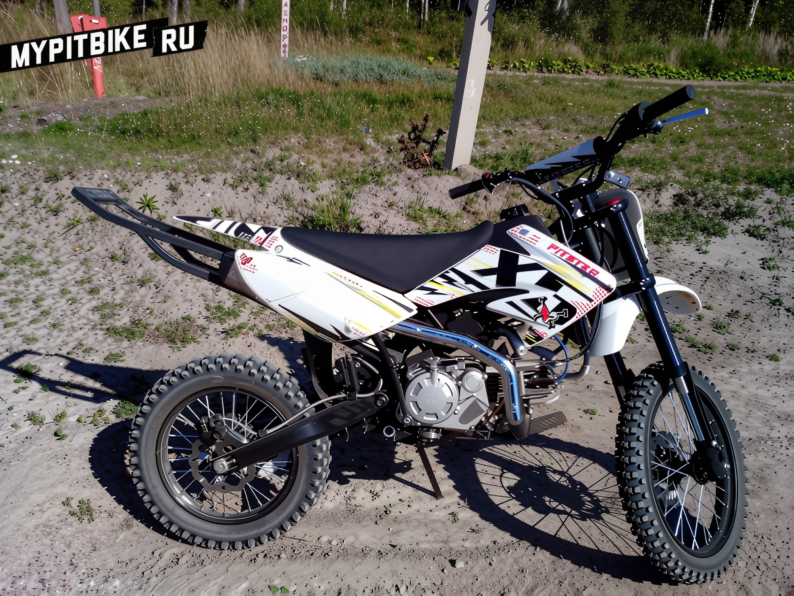
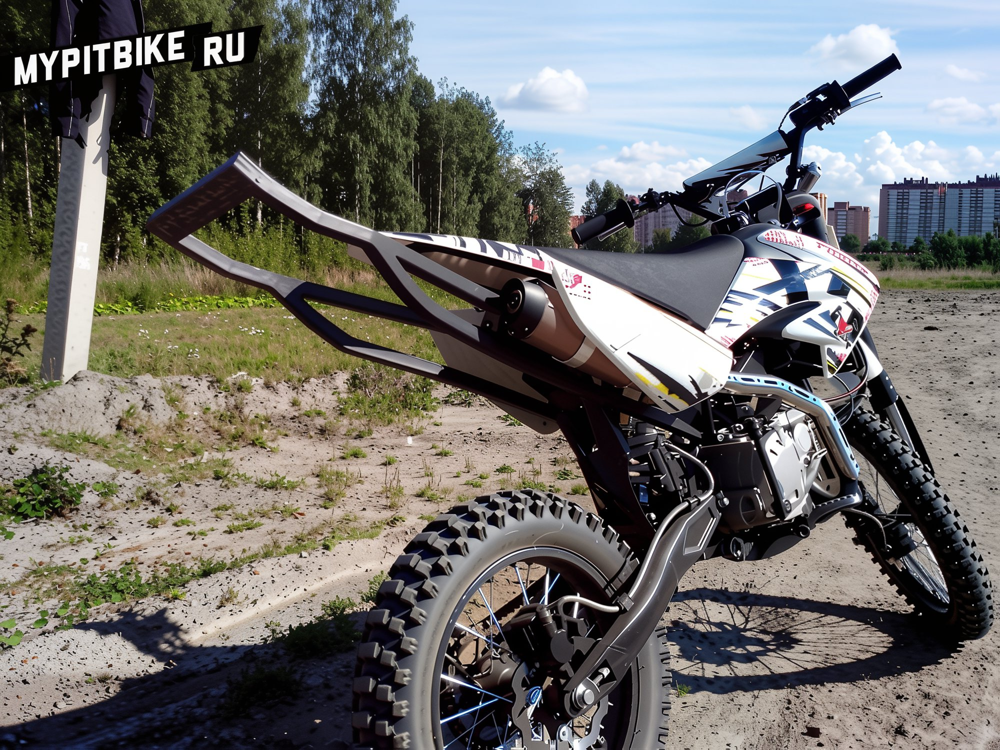

---
tags:
- chassis
- stunt
---

# Example of creating a removable clamp

Hello, I spent a long time searching for how and where to make a bracket. Ultimately, I decided to craft it myself using materials available in my garage.

**To create the bracket, you will need:**

1. Metal profile 20x20 mm (1.5 mm thick), approximately 5 meters (I didn't provide exact measurements as I adjusted as I went along). I recommend purchasing two 3-meter lengths.
2. A piece of 20x40 profile, about 20 cm long.
3. Four M8 bolts (to replace the factory ones), and an M6 bolt and nut.
4. Welding equipment, paint, grinding discs, etc.

First, disassemble the pit bike and determine the length of the profile pieces you need to cut.  

  

Once you have determined the sizes, weld "ears" longer than 5 cm (I cut them from a 3 mm thick angle). It is advisable to weld them along the length of the profile, not just at the ends.  

  

Drill 8.5 mm holes in them, and don't forget the chamfers! Here's what you get:  

  

Secure the profiles under the factory frame, trimming it beforehand:  

  

Now, let your imagination take over! At this stage, you can shape the metal into any form you desire.

  

Once you have settled on the geometry of the metal, PLEASE PAY CLOSE ATTENTION TO THE MOUNTING OF THE MUFFLER AND ADDITIONAL MOUNTING OF THE FACTORY FRAME *AND BRAKE CYLINDER*!  

  

The photo shows only the additional frame mounting (in the red circle, it needs to be welded). Note that the bracket has movement (downward), which I realized too late.

**After everything was welded, I had to redo the brake cylinder mount!**

Cut off the factory cylinder mount:  

  

  

To make a new one, I covered the cut-off with aluminum tape and trimmed it as needed:  

  

The mount was cut from a 3 mm thick sheet:  

  

  

Shorten the brake cylinder stud by about 1 cm.  

  

  

Weld the bracket:  

  

It is advisable to have it welded by someone who **understands** the **art of craftsmanship**. I entrusted it to a colleague, hoping it would be welded with argon (I wanted neat weld seams), but by chance, someone else welded it with a semi-automatic, resulting in such seams that I considered discarding this **mess**: 

  

  

I had to grind it down with an angle grinder for about 2 hours... I regretted not welding it myself the entire time. Then, paint it, and here's the result!  

  

Install it:  
  

  

  

Once again, I emphasize that the hassle with the brake cylinder can be avoided if everything is planned in advance.

**BEFORE WELDING THE BRACKET, INSTALL:**
- THE MUFFLER
- FRAME
- BRAKE CYLINDER
- SHOCK ABSORBER WITH SPRING
- AND JUST IN CASE, THE PLASTIC.

P.S. Always use personal protective equipment (PPE), and if you are outsourcing the welding, ensure it is done by someone who understands the **ART OF CRAFTSMANSHIP**!
