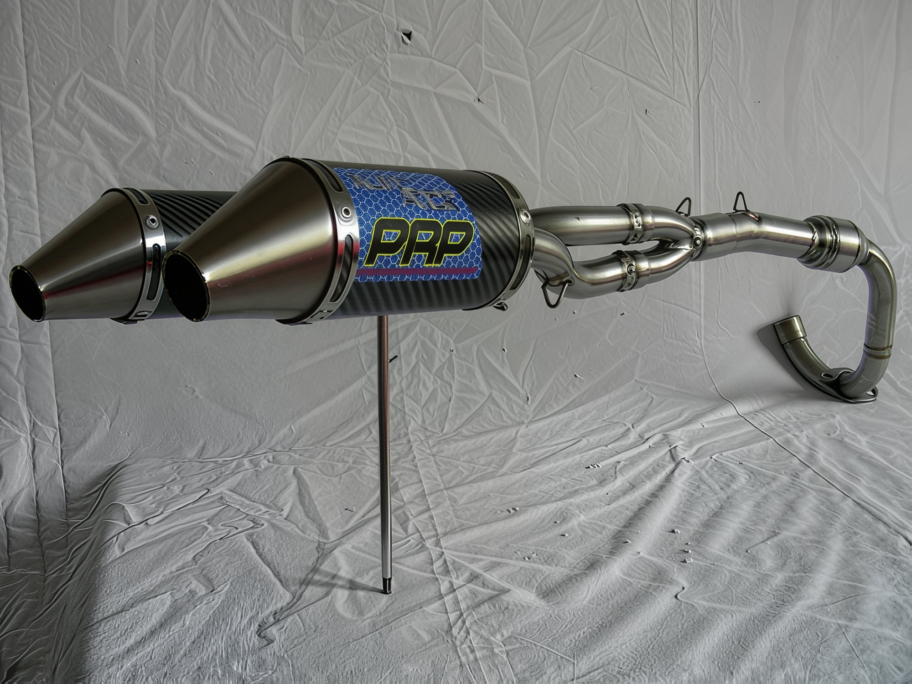
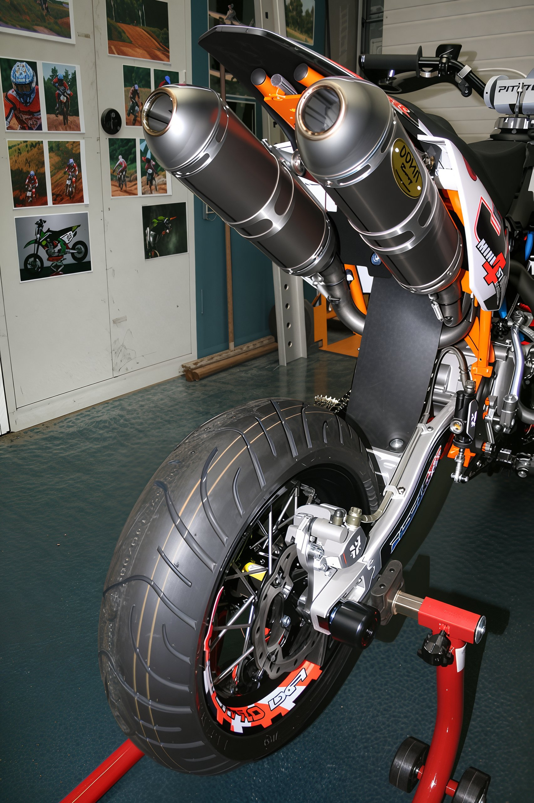

# Exhaust system tuning

Possible options for tuning the pit bike exhaust. Prices are listed in euros.  Akrapovic canister for pit bike. **Price: 450 euros.**   FMF silencer for pit bike. **Price not specified.**  Leo Vince X3 pipe for pit bike. **Price: 130 euros.**  Dual exhaust system PRP. **Price: approximately 400 euros.**  Carbon canister TCS Performance for pit. **Price: 300 euros.**  Dual exhaust system Doma Exhaust for PitsterPro pit bike. **Price unknown.**
