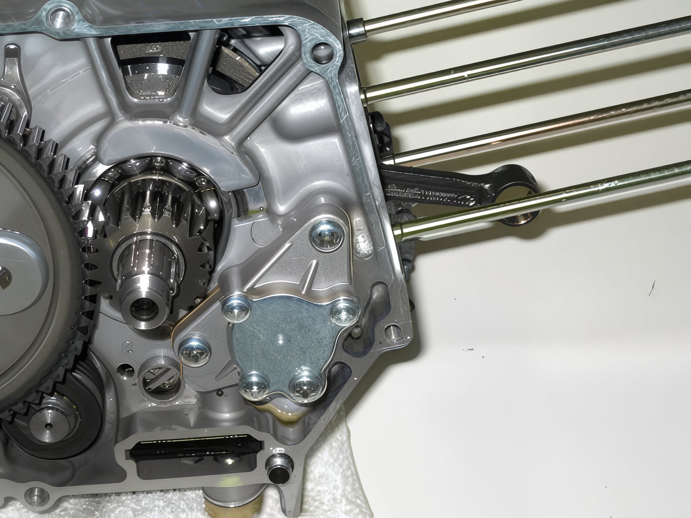
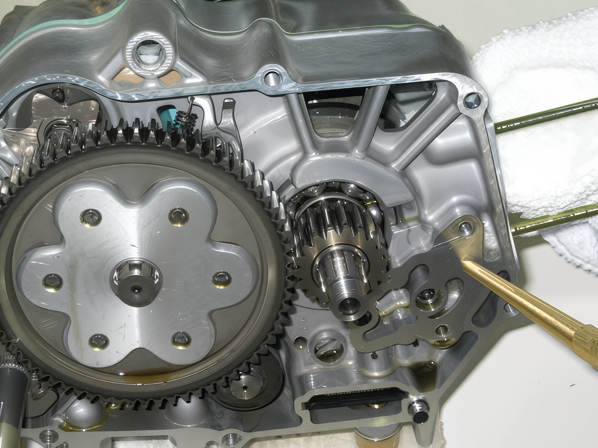

---
tags:
- engine
- oil
---

# High Volume Oil Pump Installation Guide

## Introduction

Installing a high volume oil pump is a crucial enhancement for your engine, as it significantly increases the oil flow to the top end. The optimal time for this installation is during the bore kit setup, which can save considerable time. Note that a 2mm drill bit is essential for this procedure. The following instructions presume the top end has already been disassembled.

## Instructions

1. **Drain the Engine Oil**  
   Ensure the engine oil is completely drained if not done already.

2. **Remove the Right Side Engine Cover**  
   Detach the cover to access the internal components.

3. **Disassemble the Clutch Linkage**  
   Utilize a clutch nut tool to remove the clutch nut and disassemble the clutch assembly, allowing access to the oil pump.

4. **Loosen Oil Pump Screws**  
   Carefully use an impact driver to loosen the screws securing the oil pump.

   

5. **Remove the Old Oil Pump**  
   Extract the existing oil pump to prepare for drilling the oil passage.

   

6. **Access the Oil Passage**  
   Either remove the lower left engine stud or employ a drill bit extension to reach the oil passage.

7. **Enlarge the Oil Passage**  
   With a 2mm drill bit, cautiously enlarge the oil passage. Avoid drilling too deeply into the engine; only the hole needs enlargement.

   

8. **Clean the Drilled Area**  
   Use compressed air and a rag to ensure all metal shavings are thoroughly removed.

9. **Install the New Oil Pump and Gasket**  
   Align the notch on the oil pump with the corresponding notch on the engine case and secure it in place.

   

10. **Verify Oil Pump Functionality**  
    Rotate the sprocket to confirm the oil pump is operational.

11. **Reassemble the Clutch Assembly**  
    Reinstall the clutch components securely.

12. **Reattach the Right Side Engine Cover**  
    Secure the engine cover back in place to complete the installation.
