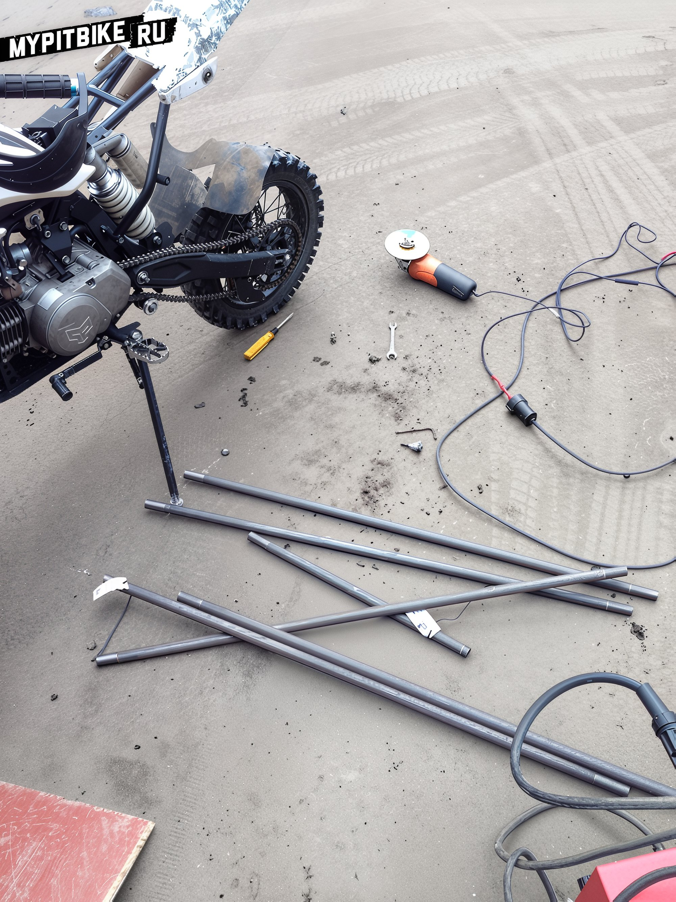
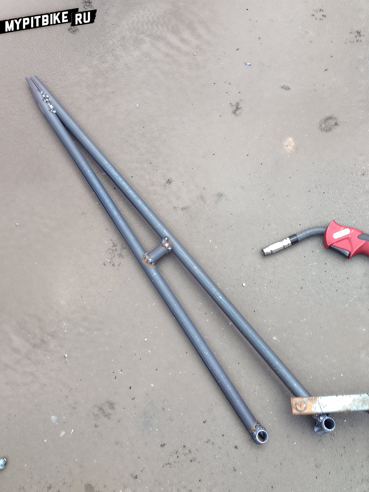
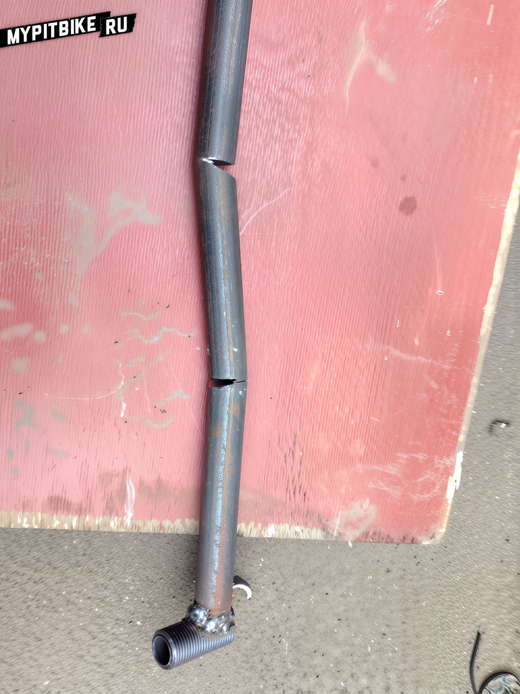
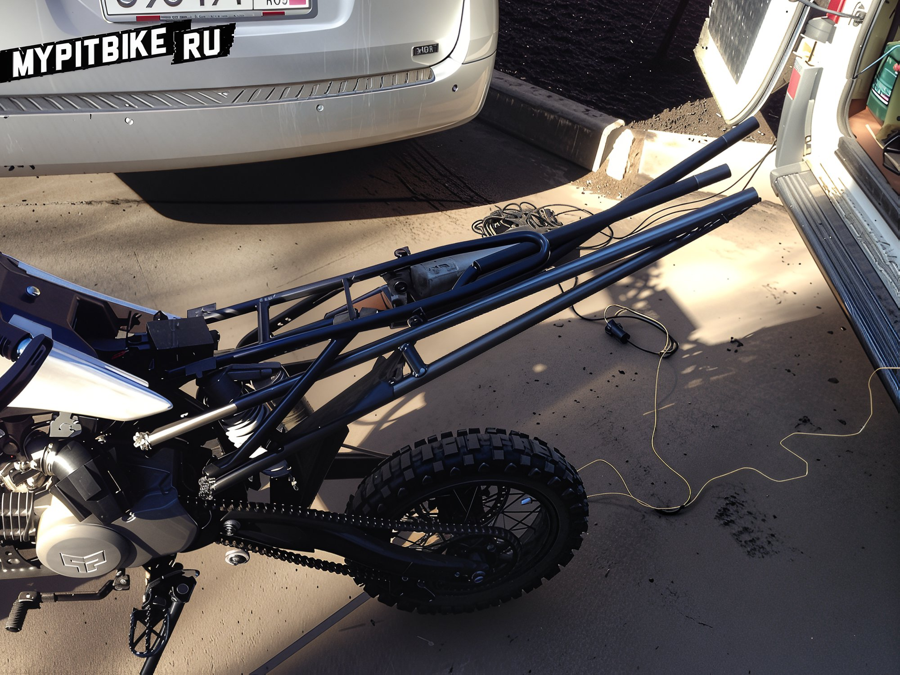

# How to weld a bracket for a pit bike

Hello everyone. I have once again decided to acquire a two-wheeled companion and start a blog. Previously, I had a variety of bikes, including Chinese, Japanese, Korean, American, etc. The most memorable was the Rox, on which I began my first lessons in stunting. Like a typical novice stunt rider, I started with a crash cage, which was extremely simple on the Rox: two welds, four bolts, nuts, washers, and three pieces of metal from a fence. After a two-year break from motorcycles and my constant lamenting about wanting to ride again, my girlfriend gifted me a PitsterPro 155cc for the upcoming 2014, for which I am immensely grateful. 

After a short ride, I realized I was intensely drawn to stunting. As soon as the snow melted, I returned to my old ways. I've been handy with tools since childhood, and with a grinder and welding equipment at my disposal, I thought, why not weld the crash cage myself? I bought 5 meters of tubing and eagerly set to work. I made many mistakes, redoing certain aspects multiple times, and I will continue to make adjustments (it turned out a bit long, and the angle is too large). I learned from my mistakes and am very pleased with the work I've done. I believe the second attempt will be much easier (the first lesson has been learned). I encourage everyone who has the opportunity to try it themselves; it's not as difficult as it seems.

  
  
  
  
  
  
  

