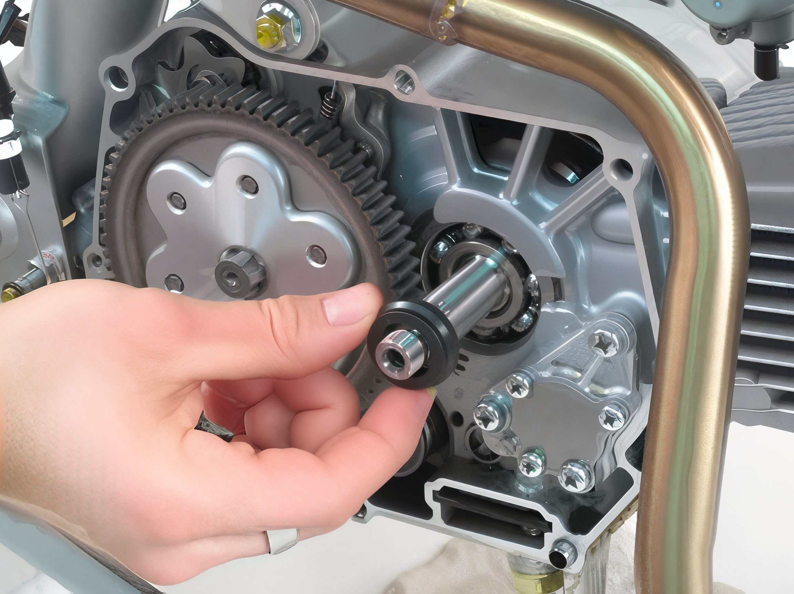
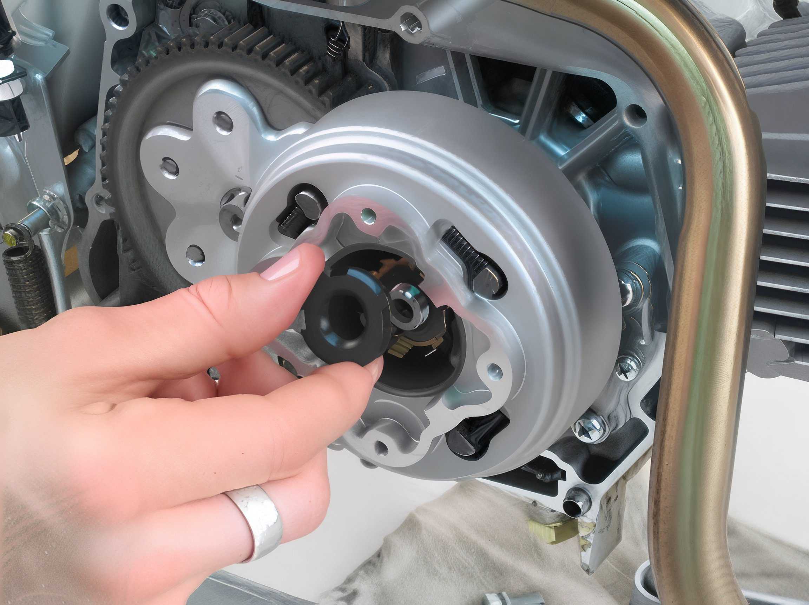
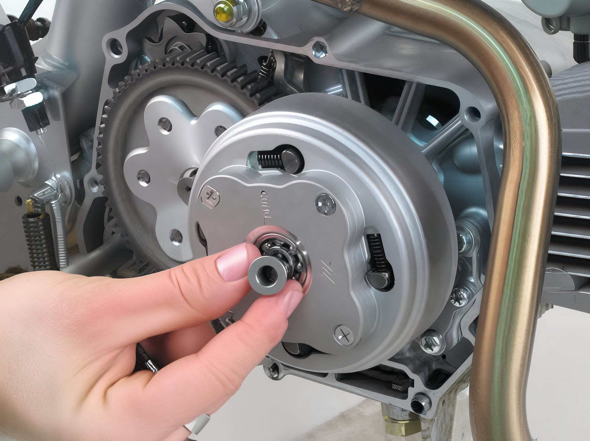
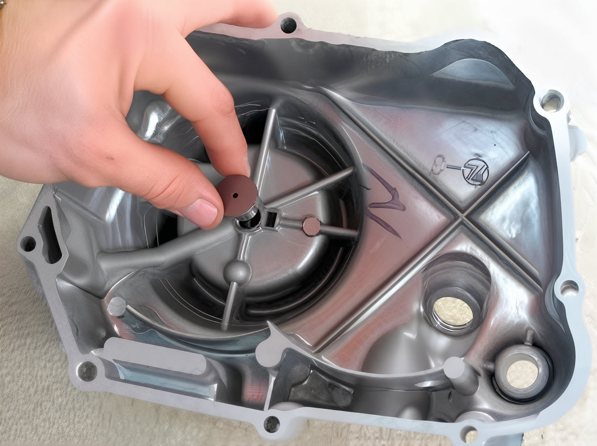
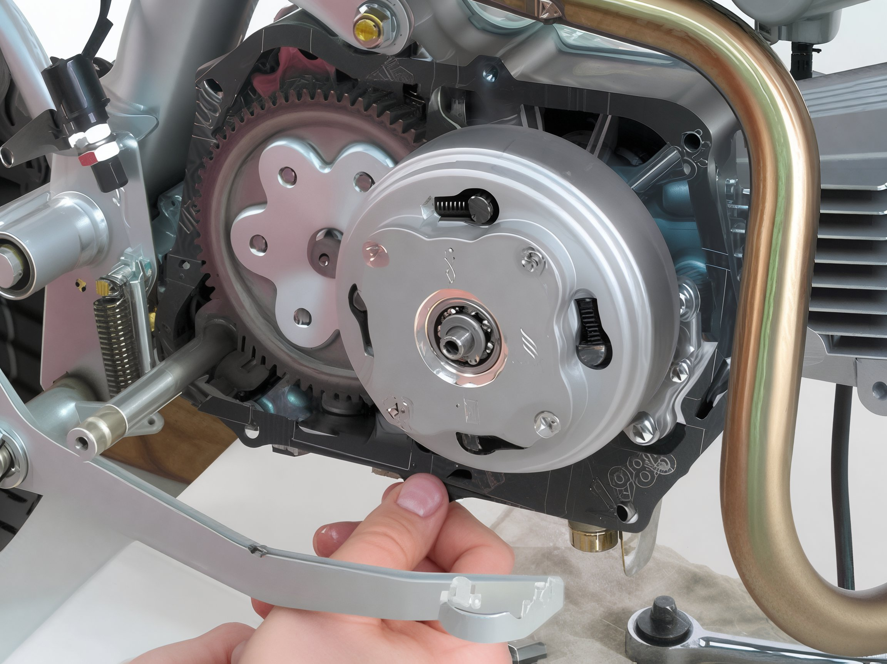

---
tags:
- clutch
---

# Installing and Adjusting Manual Clutches on CRF50/70

## Introduction

One of the most significant performance enhancements you can make to your XR or CRF 50 is to replace the stock semi-automatic clutch with a fully manual clutch. By incorporating a manual clutch, you can anticipate your 50 to accelerate more aggressively out of corners and achieve a quicker start from the line. For this guide, we have chosen the reliable 3-plate manual clutch kit from Honda Trail Bikes. This kit includes everything necessary except for the clutch lever and perch. With some time and patience, the Trail Bikes clutch is relatively straightforward to install and is well worth the effort.

## Installation Steps

### Step 1

Drain the engine oil and remove the foot peg mount. Once the oil has been drained, use an 8mm socket to remove the clutch cover bolts and detach the cover.

### Step 2

Utilize a Phillips head screwdriver (or an impact driver) to remove the four screws from the outer clutch cover.

### Step 3

Employ a small flat blade screwdriver to open the tabs on the lock washer. Use a clutch nut tool and a strap wrench to remove the black retaining nut. Extract the clutch assembly.

### Step 4

Remove the primary drive gear.

### Step 5

Extract the dimpled bushing.

### Step 6

Use snap ring pliers to carefully remove the snap ring. Detach the large driven gear.

### Step 7

Remove the stepped collar.

### Step 8

Utilize a 10mm socket to remove the two bolts securing the stopper plate and stopper arm. Pay close attention to the alignment of the stopper plate and stopper arm.

### Step 9

Carefully remove the gearshift spindle assembly.

### Step 10

Install the new gearshift spindle assembly. Ensure that the shift shaft seal on the left side of the bike remains in place while inserting the new gearshift spindle assembly.

### Step 11

Install the new large driven gear.

### Step 12

Install the new stepped collar. The tapered portion of the collar should face away from the engine.

### Step 13

Install the new dimpled bushing.

### Step 14

Install the new primary drive gear.

### Step 15

Install the new clutch assembly. Note that the backside of the clutch assembly locks onto the primary gear. Ensure that the clutch assembly is secured in place before proceeding. Install the new lock washer.

### Step 16

Install the new cup washer. Ensure that the tapered end of the washer faces away from the engine.

### Step 17

Install the new retaining nut. Use a strap wrench and a clutch nut tool to tighten the retaining nut to 31 ft-lb. After tightening, use a small flat blade screwdriver to bend the arms of the lock washer into place.

### Step 18

Install the new outer cover.

### Step 19

Install the new bearing into the outer cover.

### Step 20

Install the new oil passage bushing into the bearing.

### Step 21

Install the new spring into the bushing.

### Step 22

Install the new oil passage tube over the spring and into the bushing.

### Step 23

Flip the new clutch cover over and insert the clutch actuator into place.

### Step 24

Install the new clutch cover gasket over the two existing dowel pins to secure it in place.

### Step 25

Install the new clutch cover and secure it with the new Allen head bolts included in the kit.

### Step 26

Install a new seal over the kick-start lever.

### Step 27

Remove the chrome cover plate and the Phillips head bolt. Remove the clutch actuator plate assembly. Install the new oil seal, ensuring it is fully seated. Replace the clutch actuator plate assembly.

### Step 28

Loosen the locknut on the clutch adjuster screw. Tighten the screw until there is minimal to no play in the clutch actuator plate. Connect the included clutch cable to the clutch arm and route the cable up to the clutch lever. Ensure there is a slight amount of play at the clutch lever. If not, loosen the clutch adjuster locknut and readjust the clutch adjuster screw.

### Step 29

Install the chrome clutch cover and use a cloth to polish it to a mirror-like finish. Step back and admire your new clutch setup. Now, venture outside and master riding third-gear wheelies.

