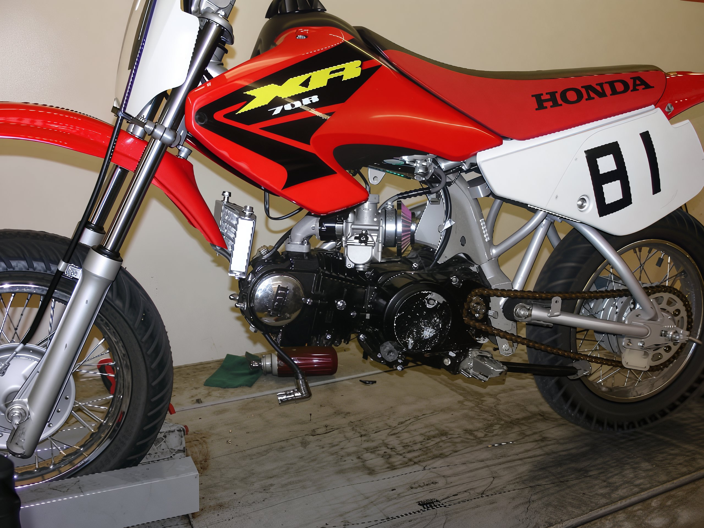
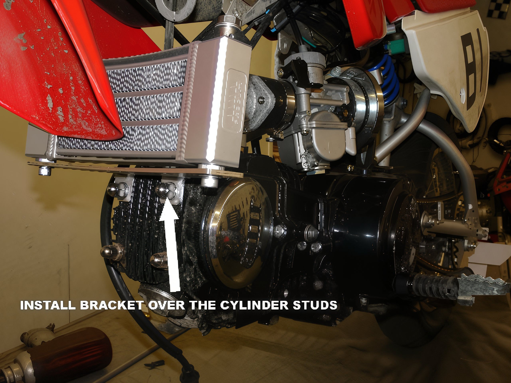
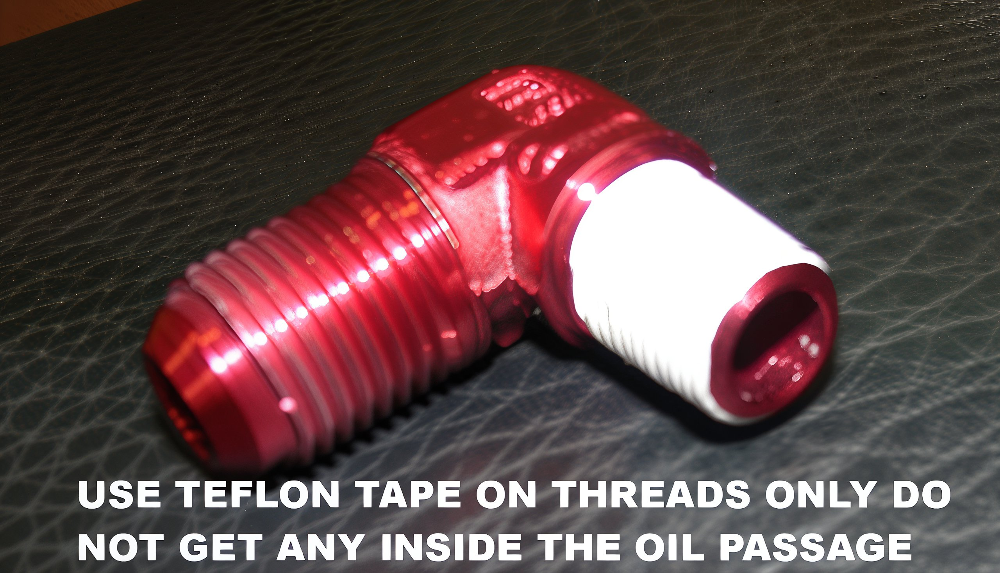
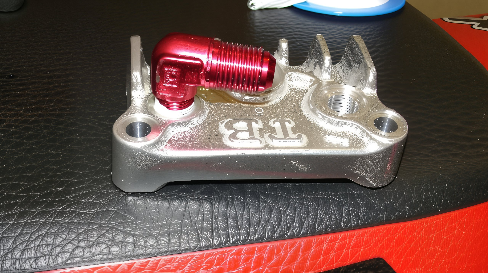

---
tags:
- cooler
- oil
---

# Trail Bikes Oil Cooler Kit Installation Guide

The Trail Bikes Oil Cooler Kit is a premium accessory crafted to enhance the cooling efficiency of your Honda horizontal engine or its clone. Air-cooled engines tend to operate at higher temperatures when modified or subjected to demanding conditions such as racing. This kit enhances your engine’s longevity and reliability by circulating the engine oil through a cooler, thereby reducing the oil temperature. It is highly advisable to thoroughly review the installation instructions prior to commencing the process.

**WARNING**  
The installation of aftermarket accessories, such as this oil cooler kit, may void your manufacturer’s warranty. Trail Bikes assumes no responsibility for such voids.

**WARNING**  
This guide serves illustrative purposes only. All engine work should be executed by a trained professional mechanic in accordance with factory recommendations. Improper installation could lead to significant engine damage. Use this guide solely for reference. Any instructions provided are suggestions for the professional mechanic.

**Step 1.** Unbox the oil cooler and inspect the two mounting brackets included in the kit. The bracket attached to the cooler is designed to slip over your cylinder studs, as depicted in the illustration above.

The alternative bracket is intended to attach to the frame, as shown in the illustration below. The brackets in this kit are versatile and can be adapted to various applications. You will need to determine the most suitable option for your setup. If feasible, we recommend utilizing the frame-mounted bracket configuration.

Identify a location on the bike towards the front where air will flow across the cooler as the bike moves forward. Once a suitable spot is found, attach your chosen mounting bracket. Only hand-tighten the cylinder studs or the hose clamp provided for the other mounting bracket. At this stage, you will "mock up" the installation to ensure the oil cooler lines are sufficiently long to reach the cooler without requiring extreme bends that could impede oil flow. (Note that the cooler can be installed upside down if necessary, with the oil lines positioned at either the top or bottom of the cooler.)

Turn the wheel from lock to lock and fully compress the suspension to ensure nothing will contact the cooler or the lines. If everything appears clear, proceed to step 2.

**Step 2.** Secure the oil cooler in the selected location using your chosen mounting bracket. The illustration above shows the cooler mounted with the bracket that slips over the cylinder studs. Be sure to re-torque the cylinder studs to your manufacturer's specifications if you choose this method. The torque rating is 8 ft-lbs for a factory Honda engine.

The illustration below demonstrates the oil cooler mounted to the frame using the other provided bracket. This bracket is attached to the frame with a hose clamp and is the **preferred choice if applicable**. For a more robust and reliable mount, you can also drill and tap a hole in the frame. The bracket already has a clearance hole. **This is the preferred mounting method if applicable**.

**Step 3.** Remove the right-hand side cylinder head cover (located near the spark plug and secured with three bolts). The center bolt extends through the head to the opposite side; hold the cover on the opposite side when removing the long center bolt.

Once the head cover is removed, discard the old gasket and clean any oil from the sealing surface on the head.

Select the new gasket from the two provided in the kit. Ensure the gasket aligns with the holes and passages on your application.

Prepare the oil cooler taps for installation into the new head tap plate provided with the kit. Use the Teflon tape included in the kit on the threads to ensure an oil-tight seal, as shown in the illustration below. It is unnecessary to use Teflon tape on the compression fitting side of the taps. When wrapping the threads with Teflon tape, apply it in the same direction as the taps would thread into the new head tap plate. The tape should cover the threads but must not obstruct the end where oil flows through.

Prepare the new oil cooler head tap plate to replace the right-hand side cylinder head cover by installing the oil cooler taps. Pay close attention to the angle of installation to ensure they face the direction selected during the "mock-up" in Step 1. Avoid over-tightening the taps. Ensure the taps are positioned so that when attaching the oil cooler line, the lines clear the cooling fins on the new head tap plate. Minor adjustments can be made once everything is in position.

**Step 4.** Ensure all sealing surfaces are clean and apply the chosen gasket. Install the head tap plate on the engine and torque the bolts to the manufacturer's specifications. The torque rating is 8 ft-lbs for a factory Honda engine. Once the head tap plate is installed, proceed to step 5.

**Step 5.** Route the oil lines to the oil cooler and head tap plate. At this stage, only hand-tighten the lines and determine the optimal routing for your application. Minor adjustments to the taps may be necessary to achieve the best routing. It is crucial to ensure no severe bends in the oil lines that could restrict oil flow. The lines must attach to the cooler at a nearly perpendicular angle (90-degree angle) to ensure the banjo fittings form a seal. If not installed at a perpendicular angle, the end of the line will bottom out on the cooler rather than the sealing surface for the banjo fitting. Once the correct routing is determined, tighten all connections.

**Step 6.** Review the complete installation to ensure all lines are routed without severe bends and all connections are secure. Turn the wheel from lock to lock and fully compress the suspension to ensure nothing will contact the cooler or the lines. Check the oil dipstick to ensure the oil level is full. You are now ready to start your engine.

Start the engine for a brief period (approximately 10 seconds) and inspect all connections for any signs of leakage. Shut the engine off after the 10-second interval. Oil pressure should have built up, and some oil should now be in the cooler, causing the crankcase to be low on oil. ***If the oil level does not appear to have decreased, there may be an oil flow problem, and severe damage could occur if the engine is restarted. Recheck all connections and installation if the oil level in the crankcase is not dropping.*** If the oil level has lowered by a few ounces, add the necessary oil to bring the crankcase oil level back to full. Once the oil level is restored and there are no leaks, start the engine and allow it to run for a little longer, then shut off the motor and verify the oil level again. Repeat this process until the oil level remains consistent, indicating the correct level for the new increased oil capacity with the addition of the new Trail Bikes oil cooler.

**Step 7.** Recheck all oil connections, the chosen mounting bracket, and re-torque the cylinder studs if this mounting method was selected. Re-torque the cylinder head cover and check for oil leaks once more. If everything appears satisfactory, proceed to start the engine again. After the engine has warmed up, you should feel some warmth by touching the oil cooler. At this point, rev the engine a few times to ensure there are no oil leaks.

If the installation was executed correctly, the cooler will provide reliable service, extend the life of your engine, and enhance performance during long or heavy-duty runs that generate significant heat.

**IMPORTANT NOTE**

To verify the installation is correct and that the oil is flowing as intended (highly recommended for non-OEM Honda engines, such as popular Chinese replicas), please follow these steps.

Check for oil flow and pressure in critical areas of the engine. First, verify oil flow through the cooler. The simplest method is to slightly loosen the fittings on the cooler, checking one at a time, and shield yourself with a rag as oil may squirt out (perform this at your own risk). If oil pressure is present at each end of the cooler, you can be confident that the flow to and through the cooler is adequate.

Next, ensure the cam is receiving oil with the new cylinder head cover (this is particularly important for Chinese replica engines with the "short" cam, as the boss on the Trail Bikes cylinder head cover does not extend as far as the factory Chinese cylinder head cover). Remove the top cylinder head cover and look for a substantial amount of oil on the camshaft lobes and rocker arm area. You can also remove the cylinder head valve caps to see if oil squirts out of the rocker studs (again, perform this check at your own risk, as hot oil will squirt out under pressure if everything is installed correctly). Recheck the oil level, as some will be lost during these checks, and then enjoy your bike again, knowing that the power won't diminish as much after running the motor hard, as it did when it was solely air-cooled.
