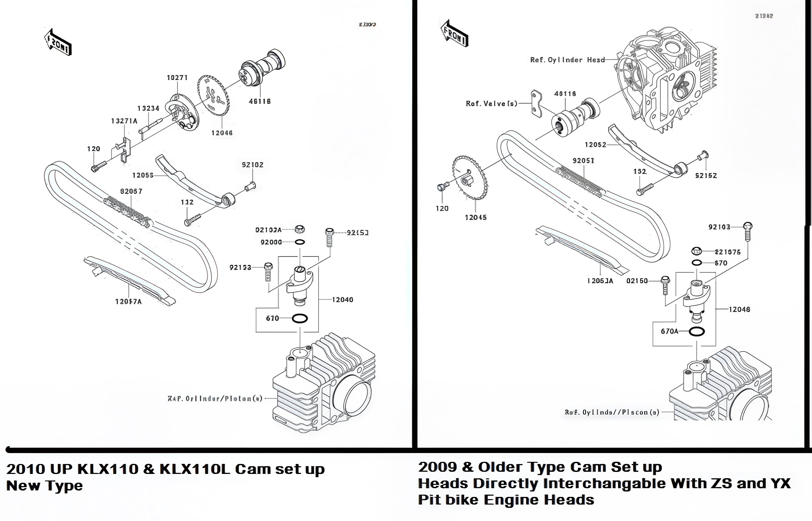
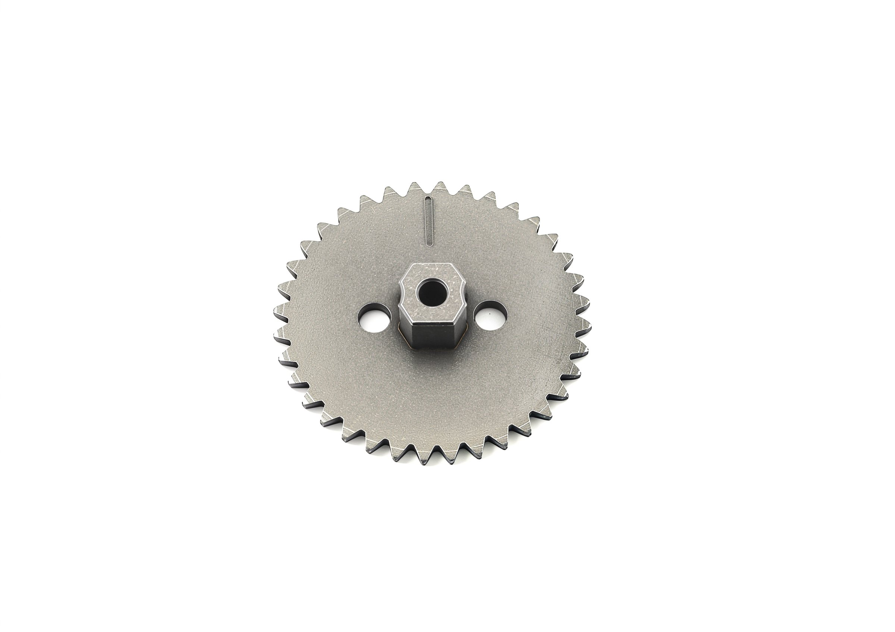
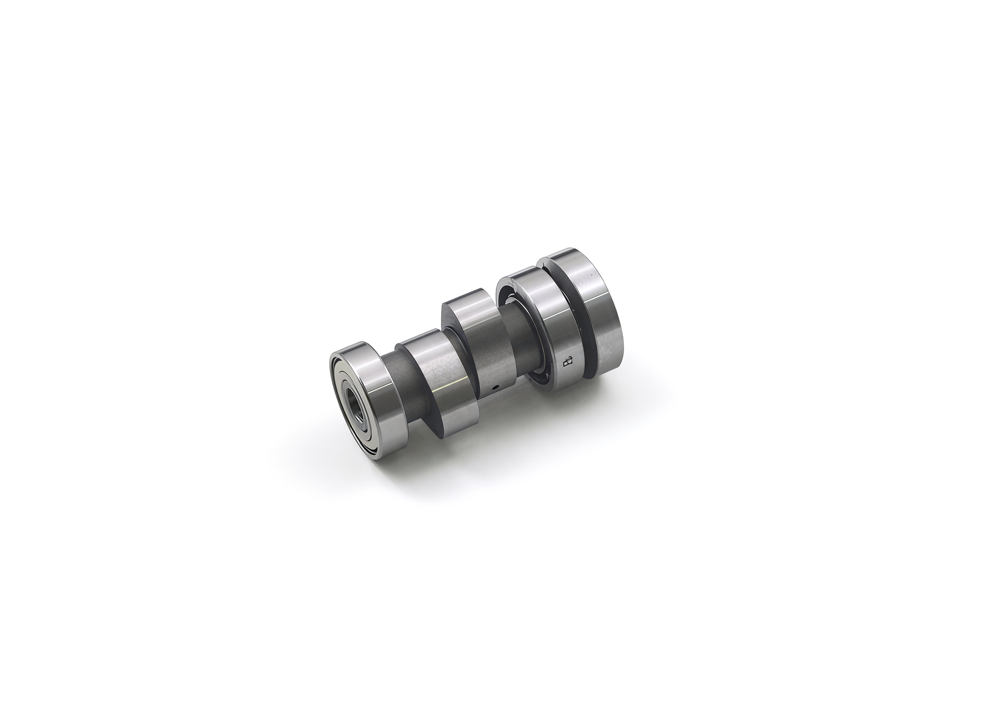

---
tags:
- engine
- valves
---

# KLX110 & DRZ110 YX/ZS TB Race Head & Cam Information

TB Race heads for KLX110 and DRZ110 have been available in three distinct versions. Below are the methods to identify the type installed on your motorcycle:

1. **Old Discontinued V1 Head**: Offers solid performance and features the TB logo. It utilizes the stock KLX cam and tappet covers.
2. **V2 Roller Rocker Heads**: Recognized by the TB logo, this is the best-performing type, offering ultimate top-level performance with roller bearings on the rocker arms at the cam side.
3. **New ZS V1 Race Head**: Lacks the TB logo and does not accommodate stock KLX cam and tappet covers. Special covers are included.

We highly recommend using genuine TB Parts performance heads, particularly the V2 Roller Heads, and pairing them with TB matching pistons to ensure proper valve clearance.

Pit bike heads from YX 150cc, YX 160cc, and ZS 155cc are compatible with older KLX110 models, offering improved cams, valve sizes, and performance enhancements over stock options.

YX/ZS aluminum cylinders with iron liners can be machined to fit the KLX110 by reducing the skirt outer diameter. However, they are slightly shorter, necessitating thicker base gaskets and careful checking of piston-to-head clearance. This modification is not recommended.

For a budget-friendly 143cc build with excellent results, we consistently use a 60mm cylinder and piston kit along with pit bike YX/ZS heads on the KLX110.

When installing performance heads on KLX110 models from 2010 onwards, use the following adaptor gear. Note that the de-compression feature will not be utilized as in the stock configuration.

## TB Cam Sprocket for KLX110 & DRZ110 (2010 and Up)

The cam sprocket enables the use of any KLX110 Race Heads on models from 2010 onwards.

## TB Race Cam for KLX110 (2003-2009)

The TB Race Camshaft is designed for the V1 Race Head and stock KLX110 heads (not compatible with the V2 head). This YX-type cam offers greater lift and duration than any previously tested cam, performing exceptionally well with the regular Race Head. It fits stock KLX110 and DRZ110 heads, but ensure proper valve clearance.

**Note:**
This product is intended for use with the TB 143cc piston, which has appropriate valve relief. Exercise caution and verify valve clearance if installing with other pistons.
